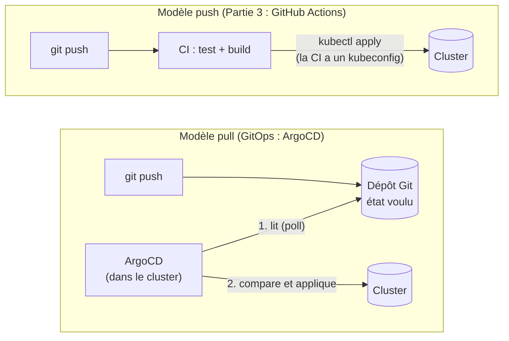
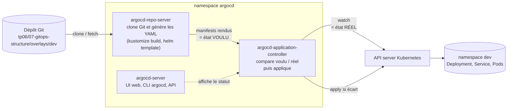
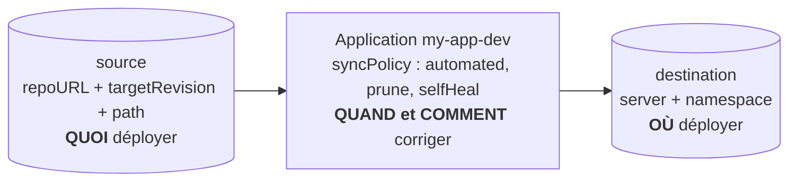
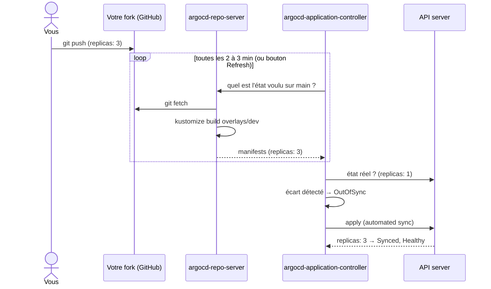
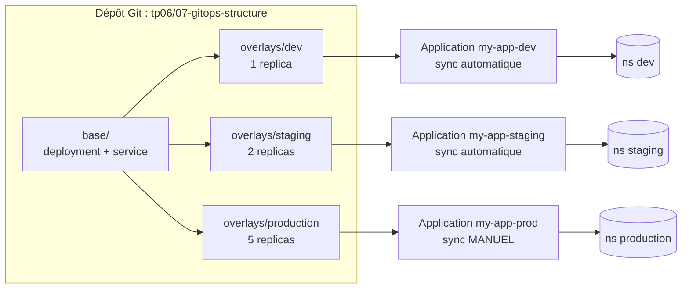

# TP6 - Mise en Production et CI/CD avec Kubernetes

## Objectifs du TP

À la fin de ce TP, vous serez capable de :
- Déployer et gérer des applications avec Helm
- Exposer vos applications avec la **Gateway API** (et connaître l'Ingress classique pour le CKAD)
- Mettre en place un pipeline CI/CD avec GitHub Actions
- Implémenter des stratégies de déploiement avancées (Blue-Green, Canary)
- Gérer les environnements (dev, staging, production)
- Appliquer les bonnes pratiques de mise en production
- Automatiser les déploiements Kubernetes
- Utiliser GitOps avec ArgoCD
- Implémenter le versioning et les rollbacks automatiques

## Prérequis

- Avoir complété les TP1 à TP5
- Un cluster Kubernetes fonctionnel (**minikube** ou **kubeadm**)
- Connaissance des concepts de base de Kubernetes
- Compte GitHub (pour le CI/CD) **OU** voir l'alternative Tekton ci-dessous

**Note pour kubeadm :** Les outils CI/CD (Tekton, ArgoCD) fonctionnent de manière identique. Pour les registry d'images, référez-vous au [guide kubeadm](../docs/KUBEADM_SETUP.md) pour configurer un registry Docker interne.
- Compréhension de Docker et des conteneurs

> **Note importante** : Si vous ne souhaitez pas créer de compte GitHub, consultez le fichier [ALTERNATIVE_SANS_GITHUB.md](./ALTERNATIVE_SANS_GITHUB.md) qui explique comment mettre en place un pipeline CI/CD complet avec **Tekton**, directement dans votre cluster Kubernetes, sans aucun service externe.

## Choix de votre solution CI/CD

Ce TP propose **deux approches** pour le CI/CD :

### Option 1 : GitHub Actions (recommandé pour la découverte)
- **Avantages** : Interface intuitive, intégration GitHub, gratuit pour usage personnel
- **Inconvénients** : Nécessite un compte GitHub
- **Documentation** : Voir Partie 3 de ce README

### Option 2 : Tekton (recommandé pour l'apprentissage Kubernetes)
- **Avantages** : Kubernetes-native, aucun compte externe, contrôle total
- **Inconvénients** : Plus technique, nécessite plus de configuration
- **Documentation** : Voir [ALTERNATIVE_SANS_GITHUB.md](./ALTERNATIVE_SANS_GITHUB.md)

**Les deux approches couvrent les mêmes fonctionnalités** : tests automatiques, build Docker, scan de sécurité, et déploiement sur Kubernetes.

## Partie 1 : Introduction à Helm

### 1.1 Qu'est-ce que Helm ?

**Helm** est le gestionnaire de packages pour Kubernetes. Il permet de :
- Packager des applications Kubernetes
- Partager des configurations
- Gérer les versions et releases
- Simplifier les déploiements complexes

**Concepts clés** :
- **Chart** : Package Helm (collection de fichiers YAML)
- **Release** : Instance d'un Chart déployé
- **Repository** : Collection de Charts
- **Values** : Configuration paramétrable

### 1.2 Installation de Helm

```bash
# Télécharger et installer Helm
curl https://raw.githubusercontent.com/helm/helm/main/scripts/get-helm-3 | bash

# Vérifier l'installation
helm version

# Ajouter des repositories populaires
helm repo add stable https://charts.helm.sh/stable
helm repo add bitnami https://charts.bitnami.com/bitnami
helm repo update

# Lister les repositories
helm repo list

# Rechercher des charts
helm search repo nginx
helm search repo wordpress
```

### 1.3 Utiliser un Chart Helm

**Exercice 1 : Déployer une application avec Helm**

```bash
# Chercher le chart WordPress
helm search repo wordpress

# Voir les informations du chart
helm show chart bitnami/wordpress
helm show values bitnami/wordpress

# Installer WordPress
helm install my-wordpress bitnami/wordpress \
  --set wordpressUsername=admin \
  --set wordpressPassword=admin123 \
  --set mariadb.auth.rootPassword=secretpassword

# Lister les releases
helm list

# Voir le status
helm status my-wordpress

# Obtenir les informations de connexion
helm get notes my-wordpress

# Accéder à WordPress
kubectl get svc my-wordpress
minikube service my-wordpress --url
```

**Exercice 2 : Gérer les releases**

```bash
# Voir l'historique
helm history my-wordpress

# Mettre à jour la release
helm upgrade my-wordpress bitnami/wordpress \
  --set replicaCount=2

# Rollback
helm rollback my-wordpress 1

# Désinstaller
helm uninstall my-wordpress

# Vérifier la suppression
helm list
kubectl get all
```

### 1.4 Créer votre propre Chart

**Exercice 3 : Créer un Chart personnalisé**

```bash
# Créer un nouveau chart
helm create my-app

# Structure du chart
tree my-app/
# my-app/
# ├── Chart.yaml          # Métadonnées du chart
# ├── values.yaml         # Valeurs par défaut
# ├── templates/          # Templates Kubernetes
# │   ├── deployment.yaml
# │   ├── service.yaml
# │   ├── httproute.yaml
# │   ├── _helpers.tpl
# │   └── NOTES.txt
# └── charts/             # Dépendances

# Examiner les fichiers
cat my-app/Chart.yaml
cat my-app/values.yaml
```

Modifier `my-app/Chart.yaml` :

```yaml
apiVersion: v2
name: my-app
description: Une application web simple
type: application
version: 0.1.0
appVersion: "1.0"
keywords:
  - web
  - demo
maintainers:
  - name: Your Name
    email: your.email@example.com
```

Modifier `my-app/values.yaml` :

```yaml
replicaCount: 2

image:
  repository: nginx
  pullPolicy: IfNotPresent
  tag: "1.25-alpine"

service:
  type: ClusterIP
  port: 80

# HTTPRoute Gateway API — nécessite qu'un Gateway ("main-gateway" par défaut) soit déjà
# provisionné dans le cluster (voir tp06/02-gateway-api/02-gateway.yaml). L'ancien champ
# `ingress:` (ingressClassName + annotations nginx.ingress.kubernetes.io/*) a été retiré :
# ingress-nginx est retiré depuis mars 2026, plus de correctifs de sécurité.
gateway:
  route:
    enabled: false
    parentRefs:
      - name: main-gateway
        namespace: default
    hostnames:
      - myapp.local
    paths:
      - path: /
        pathType: PathPrefix

resources:
  limits:
    cpu: 100m
    memory: 128Mi
  requests:
    cpu: 50m
    memory: 64Mi

autoscaling:
  enabled: false
  minReplicas: 2
  maxReplicas: 5
  targetCPUUtilizationPercentage: 80

nodeSelector: {}
tolerations: []
affinity: {}
```

Modifier `my-app/templates/deployment.yaml` (avec configurations de sécurité) :

```yaml
apiVersion: apps/v1
kind: Deployment
metadata:
  name: {{ include "my-app.fullname" . }}
  labels:
    {{- include "my-app.labels" . | nindent 4 }}
spec:
  {{- if not .Values.autoscaling.enabled }}
  replicas: {{ .Values.replicaCount }}
  {{- end }}
  selector:
    matchLabels:
      {{- include "my-app.selectorLabels" . | nindent 6 }}
  template:
    metadata:
      labels:
        {{- include "my-app.selectorLabels" . | nindent 8 }}
    spec:
      securityContext:
        runAsNonRoot: true
        runAsUser: 101
        fsGroup: 101
        seccompProfile:
          type: RuntimeDefault
      containers:
      - name: {{ .Chart.Name }}
        image: "{{ .Values.image.repository }}:{{ .Values.image.tag | default .Chart.AppVersion }}"
        imagePullPolicy: {{ .Values.image.pullPolicy }}
        securityContext:
          allowPrivilegeEscalation: false
          readOnlyRootFilesystem: true
          runAsNonRoot: true
          runAsUser: 101
          capabilities:
            drop:
            - ALL
        ports:
        - name: http
          containerPort: 80
          protocol: TCP
        livenessProbe:
          httpGet:
            path: /
            port: http
          initialDelaySeconds: 10
          periodSeconds: 10
        readinessProbe:
          httpGet:
            path: /
            port: http
          initialDelaySeconds: 5
          periodSeconds: 5
        resources:
          {{- toYaml .Values.resources | nindent 12 }}
        volumeMounts:
        - name: tmp
          mountPath: /tmp
        - name: cache
          mountPath: /var/cache/nginx
        - name: run
          mountPath: /var/run
      volumes:
      - name: tmp
        emptyDir: {}
      - name: cache
        emptyDir: {}
      - name: run
        emptyDir: {}
```

> **Note de sécurité** : Ce deployment inclut les bonnes pratiques de sécurité Kubernetes :
> - `runAsNonRoot: true` - Exécution en tant qu'utilisateur non-root (nginx UID 101)
> - `readOnlyRootFilesystem: true` - Système de fichiers racine en lecture seule
> - Volumes `emptyDir` pour les répertoires nécessitant l'écriture (/tmp, /var/cache/nginx, /var/run)
> - `allowPrivilegeEscalation: false` - Pas d'élévation de privilèges
> - `capabilities: drop: ALL` - Suppression de toutes les capabilities Linux
> - `seccompProfile: RuntimeDefault` - Profil Seccomp par défaut

Les autres templates générés par `helm create` sont déjà fonctionnels (`service.yaml`, `httproute.yaml`, `hpa.yaml`, `_helpers.tpl`). Vous pouvez les consulter avec :

```bash
cat my-app/templates/service.yaml
cat my-app/templates/httproute.yaml
cat my-app/templates/hpa.yaml
cat my-app/templates/_helpers.tpl
```

Le fichier `_helpers.tpl` contient les fonctions Helm réutilisables (comme `my-app.fullname`, `my-app.labels`, `my-app.selectorLabels`) utilisées dans les templates.

**Exercice 4 : Déployer votre Chart**

```bash
# Valider le chart
helm lint my-app

# Générer les manifests (dry-run)
helm template my-app ./my-app

# Installer le chart
helm install my-release ./my-app

# Vérifier le déploiement
kubectl get all
helm list

# Mettre à jour avec des valeurs personnalisées
helm upgrade my-release ./my-app \
  --set replicaCount=3 \
  --set image.tag=1.26-alpine

# Créer un fichier de valeurs personnalisées
cat > custom-values.yaml <<EOF
replicaCount: 3
image:
  tag: "1.26-alpine"
resources:
  limits:
    memory: 256Mi
  requests:
    memory: 128Mi
EOF

# Utiliser le fichier de valeurs
helm upgrade my-release ./my-app -f custom-values.yaml

# Packager le chart
helm package my-app
# Crée: my-app-0.1.0.tgz
```

### 1.5 Helm avec plusieurs environnements

Créer `values-dev.yaml` :

```yaml
replicaCount: 1

image:
  repository: nginx
  tag: "1.25-alpine"
  pullPolicy: Always

resources:
  limits:
    memory: 128Mi
    cpu: 200m
  requests:
    memory: 64Mi
    cpu: 100m
```

Créer `values-prod.yaml` :

```yaml
replicaCount: 3

image:
  repository: nginx
  tag: "1.25-alpine"
  pullPolicy: IfNotPresent

resources:
  limits:
    memory: 512Mi
    cpu: 500m
  requests:
    memory: 256Mi
    cpu: 200m

autoscaling:
  enabled: true
  minReplicas: 3
  maxReplicas: 10
  targetCPUUtilizationPercentage: 70
```

```bash
# Déployer en dev
helm install my-app-dev ./my-app -f values-dev.yaml

# Déployer en prod
helm install my-app-prod ./my-app -f values-prod.yaml

# Lister les releases
helm list
```

## Partie 2 : Exposer vos applications avec la Gateway API

> **⚠️ ingress-nginx est retiré depuis mars 2026.** Le Kubernetes Steering Committee a annoncé
> la retraite du projet **ingress-nginx** (plus aucun correctif, y compris de sécurité) — c'est
> justement le contrôleur qu'installait `minikube addons enable ingress` et que ce TP utilisait
> jusqu'ici. **L'API Kubernetes `Ingress` elle-même reste valide** et fait toujours partie du
> programme CKAD (§2.7 ci-dessous la couvre pour l'examen), mais ne déployez plus ingress-nginx
> nulle part, y compris en local. Ce TP utilise désormais la **Gateway API**, avec **NGINX
> Gateway Fabric** comme contrôleur.

### 2.1 Ingress vs Gateway API — Comprendre l'évolution

Kubernetes propose deux approches pour exposer des services HTTP/HTTPS :

#### Ingress (API stable, mais son contrôleur historique est retiré)

Un **Ingress** expose les routes HTTP/HTTPS depuis l'extérieur vers les services internes.
L'API `networking.k8s.io/v1 Ingress` reste supportée par Kubernetes — c'est le contrôleur
ingress-nginx qui a cessé d'exister, pas l'API.

**Avantages** :
- Un seul point d'entrée
- Load balancing
- SSL/TLS termination
- Name-based virtual hosting
- Path-based routing

**Limites de l'Ingress** :
- Un seul objet `Ingress` par contrôleur — difficile à partager entre équipes
- Les fonctionnalités avancées (timeout, retry, header matching) passent par des annotations propriétaires à chaque contrôleur — c'est justement l'`configuration-snippet` d'ingress-nginx (injection de config nginx arbitraire) qui illustre le risque de sécurité de ce modèle
- Pas de notion de séparation des rôles (qui gère les routes vs qui gère le contrôleur)

#### Gateway API (stable depuis K8s 1.31 — la voie recommandée)

La **Gateway API** est le successeur de l'Ingress, conçu pour les environnements multi-équipes et multi-tenants. Elle introduit une hiérarchie de rôles claire :

```
GatewayClass  ← Créé par l'admin infrastructure (type de contrôleur)
    └── Gateway  ← Créé par l'admin cluster (point d'entrée + TLS)
            └── HTTPRoute  ← Créé par les équipes applicatives (règles de routage)
```

**Avantages sur l'Ingress** :
- **Séparation des rôles** : les équipes app gèrent leurs HTTPRoutes sans toucher au Gateway
- **API standardisée** : les fonctionnalités avancées (headers, CORS, timeouts, pondération de trafic) sont des champs typés de la spec, validés par l'API — pas des annotations libres propres à chaque contrôleur
- **Multi-protocoles** : HTTP, TCP, TLS, gRPC natifs (vs plugins pour Ingress)
- **Portable** : un seul manifest fonctionne avec NGINX, Envoy, Istio, etc.

| Aspect | Ingress | Gateway API |
|--------|---------|-------------|
| Stabilité | Stable | Stable (K8s 1.31) |
| Contrôleur historique | ingress-nginx (retiré mars 2026) | NGINX Gateway Fabric (activement maintenu) |
| Séparation rôles | Non | Oui |
| Header matching | Via annotations | Natif |
| CORS | Via annotations | Natif (canal standard depuis v1.5) |
| Retry/Timeout | Via annotations | Natif |
| Répartition de trafic (canary) | Via annotations + 2 objets | Natif (`backendRefs[].weight`) |
| Rate limiting / sticky sessions | Via annotations | Extension propre à l'implémentation (policy attachment) |
| Multi-cluster | Non | Oui (extensible) |
| Migration | — | `ingress2gateway` tool disponible |

### 2.2 Installation de la Gateway API et de NGINX Gateway Fabric

```bash
# 1. Installer les CRDs de la Gateway API (canal standard)
kubectl kustomize "https://github.com/nginx/nginx-gateway-fabric/config/crd/gateway-api/standard?ref=v2.7.2" | kubectl apply -f -

# 2. Installer NGINX Gateway Fabric via Helm (registre OCI officiel)
helm install ngf oci://ghcr.io/nginx/charts/nginx-gateway-fabric \
  --create-namespace \
  --namespace nginx-gateway \
  --set nginx.service.type=NodePort

# Vérifier l'installation
kubectl get pods -n nginx-gateway
kubectl get gatewayclass

# La GatewayClass "nginx" doit apparaître avec ACCEPTED=True
```

> Sur minikube, exposez le service NodePort avec `kubectl port-forward` ou `minikube service`,
> comme vous le faisiez avec le service `ingress-nginx-controller`. Pour un cluster kubeadm/
> cloud, préférez `nginx.service.type=LoadBalancer`.

### 2.3 Créer un Gateway et une HTTPRoute simple

**Exercice 5 : Déployer une application avec la Gateway API**

Créer `01-app-deployment.yaml` :

```yaml
apiVersion: apps/v1
kind: Deployment
metadata:
  name: web-app
spec:
  replicas: 2
  selector:
    matchLabels:
      app: web-app
  template:
    metadata:
      labels:
        app: web-app
    spec:
      securityContext:
        runAsNonRoot: true
        runAsUser: 101       # nginx
        fsGroup: 101         # rend les emptyDir ci-dessous inscriptibles par nginx
        seccompProfile:
          type: RuntimeDefault
      containers:
      - name: nginx
        image: nginx:alpine
        ports:
        - containerPort: 80
        securityContext:
          allowPrivilegeEscalation: false
          readOnlyRootFilesystem: true
          capabilities:
            drop:
            - ALL
        volumeMounts:
        # nginx écrit son cache et son PID au démarrage : sans ces volumes il
        # refuse de démarrer en racine lecture seule.
        - name: cache
          mountPath: /var/cache/nginx
        - name: run
          mountPath: /var/run
        resources:
          requests:
            memory: "64Mi"
            cpu: "50m"
          limits:
            memory: "128Mi"
            cpu: "200m"
      volumes:
      - name: cache
        emptyDir: {}
      - name: run
        emptyDir: {}
---
apiVersion: v1
kind: Service
metadata:
  name: web-app-service
spec:
  selector:
    app: web-app
  ports:
  - port: 80
    targetPort: 80
```

Créer `02-gateway.yaml` — le Gateway est une ressource d'infrastructure, provisionnée une seule
fois et partagée par toutes les HTTPRoutes des exercices suivants (rôle "admin cluster") :

```yaml
apiVersion: gateway.networking.k8s.io/v1
kind: GatewayClass
metadata:
  name: nginx
spec:
  controllerName: gateway.nginx.org/nginx-gateway-controller
---
apiVersion: gateway.networking.k8s.io/v1
kind: Gateway
metadata:
  name: main-gateway
  namespace: default
spec:
  gatewayClassName: nginx
  listeners:
  - name: http
    protocol: HTTP
    port: 80
    allowedRoutes:
      namespaces:
        from: Same
  - name: https
    protocol: HTTPS
    port: 443
    tls:
      mode: Terminate
      certificateRefs:
      - name: myapp-tls
    allowedRoutes:
      namespaces:
        from: Same
```

Le listener `https` référence un Secret `myapp-tls` qui n'existe pas encore : c'est normal, il
sera créé à l'exercice 2.5 (TLS). En attendant, `kubectl describe gateway main-gateway` montrera
ce listener avec la condition `ResolvedRefs: False`, alors que le listener `http` reste
opérationnel — un bon exemple du modèle de *status conditions* par listener de la Gateway API.

Créer `03-httproute-simple.yaml` :

```yaml
apiVersion: gateway.networking.k8s.io/v1
kind: HTTPRoute
metadata:
  name: web-app-route
spec:
  parentRefs:
  - name: main-gateway
    sectionName: http
  hostnames:
  - myapp.local
  rules:
  - matches:
    - path:
        type: PathPrefix
        value: /
    backendRefs:
    - name: web-app-service
      port: 80
```

```bash
# Appliquer
kubectl apply -f 01-app-deployment.yaml
kubectl apply -f 02-gateway.yaml
kubectl apply -f 03-httproute-simple.yaml

# Vérifier
kubectl get gateway main-gateway
kubectl get httproute web-app-route
kubectl describe httproute web-app-route
# Les conditions "Accepted" et "ResolvedRefs" doivent être True

# Obtenir l'IP de minikube
minikube ip

# Ajouter l'entrée dans /etc/hosts
echo "$(minikube ip) myapp.local" | sudo tee -a /etc/hosts

# Tester
curl http://myapp.local
```

### 2.4 HTTPRoute avec plusieurs services

**Important** : Supprimez la route précédente pour éviter les conflits sur le même host (le
Gateway, lui, reste en place — il est partagé) :

```bash
kubectl delete -f 01-app-deployment.yaml
kubectl delete httproute web-app-route
```

Créer `04-httproute-multi-service.yaml` :

```yaml
apiVersion: apps/v1
kind: Deployment
metadata:
  name: api-backend
spec:
  replicas: 2
  selector:
    matchLabels:
      app: api
  template:
    metadata:
      labels:
        app: api
    spec:
      securityContext:
        runAsNonRoot: true
        runAsUser: 65534     # nobody
        fsGroup: 65534
        seccompProfile:
          type: RuntimeDefault
      containers:
      - name: api
        image: hashicorp/http-echo:0.2.3
        args:
        - "-text=API Response"
        ports:
        - containerPort: 5678
        securityContext:
          allowPrivilegeEscalation: false
          readOnlyRootFilesystem: true
          capabilities:
            drop:
            - ALL
        resources:
          requests:
            memory: "16Mi"
            cpu: "10m"
          limits:
            memory: "64Mi"
            cpu: "100m"
---
apiVersion: v1
kind: Service
metadata:
  name: api-service
spec:
  selector:
    app: api
  ports:
  - port: 80
    targetPort: 5678
---
apiVersion: apps/v1
kind: Deployment
metadata:
  name: frontend
spec:
  replicas: 2
  selector:
    matchLabels:
      app: frontend
  template:
    metadata:
      labels:
        app: frontend
    spec:
      securityContext:
        runAsNonRoot: true
        runAsUser: 101       # nginx
        fsGroup: 101         # rend les emptyDir ci-dessous inscriptibles par nginx
        seccompProfile:
          type: RuntimeDefault
      containers:
      - name: frontend
        image: nginx:alpine
        ports:
        - containerPort: 80
        securityContext:
          allowPrivilegeEscalation: false
          readOnlyRootFilesystem: true
          capabilities:
            drop:
            - ALL
        volumeMounts:
        # nginx écrit son cache et son PID au démarrage : sans ces volumes il
        # refuse de démarrer en racine lecture seule.
        - name: cache
          mountPath: /var/cache/nginx
        - name: run
          mountPath: /var/run
        resources:
          requests:
            memory: "64Mi"
            cpu: "50m"
          limits:
            memory: "128Mi"
            cpu: "200m"
      volumes:
      - name: cache
        emptyDir: {}
      - name: run
        emptyDir: {}
---
apiVersion: v1
kind: Service
metadata:
  name: frontend-service
spec:
  selector:
    app: frontend
  ports:
  - port: 80
    targetPort: 80
---
apiVersion: gateway.networking.k8s.io/v1
kind: HTTPRoute
metadata:
  name: multi-service-route
spec:
  parentRefs:
  - name: main-gateway
    sectionName: http
  hostnames:
  - myapp.local
  rules:
  # Règle la plus spécifique en premier : évaluée avant la racine "/"
  - matches:
    - path:
        type: PathPrefix
        value: /api
    backendRefs:
    - name: api-service
      port: 80
  - matches:
    - path:
        type: PathPrefix
        value: /
    backendRefs:
    - name: frontend-service
      port: 80
```

```bash
# Appliquer
kubectl apply -f 04-httproute-multi-service.yaml

# Tester les routes
curl http://myapp.local/
curl http://myapp.local/api
```

### 2.5 HTTPRoute avec TLS/SSL

**Exercice 6 : Configurer HTTPS**

**Important** : Supprimez la route précédente :

```bash
kubectl delete httproute multi-service-route
```

```bash
# Créer un certificat auto-signé
openssl req -x509 -nodes -days 365 -newkey rsa:2048 \
  -keyout tls.key -out tls.crt \
  -subj "/CN=myapp.local/O=myapp"

# Créer le Secret TLS référencé par le listener "https" du Gateway (02-gateway.yaml)
kubectl create secret tls myapp-tls \
  --cert=tls.crt \
  --key=tls.key

# Vérifier que le listener https passe à ResolvedRefs=True
kubectl describe gateway main-gateway
```

**Différence importante avec l'Ingress** : le TLS n'est plus déclaré par route, mais une seule
fois sur le **Gateway** (rôle admin cluster) — toutes les HTTPRoutes qui s'y attachent en
bénéficient. Créer `05-httproute-tls.yaml` :

```yaml
apiVersion: gateway.networking.k8s.io/v1
kind: HTTPRoute
metadata:
  name: web-app-route-tls
spec:
  parentRefs:
  - name: main-gateway
    sectionName: https
  hostnames:
  - myapp.local
  rules:
  - matches:
    - path:
        type: PathPrefix
        value: /
    backendRefs:
    - name: web-app-service
      port: 80
```

```bash
# Appliquer
kubectl apply -f 05-httproute-tls.yaml

# Tester HTTPS
curl -k https://myapp.local
```

### 2.6 HTTPRoute avancée — fonctionnalités portables vs extensions propriétaires

Avec l'Ingress, les en-têtes personnalisés, le CORS et les timeouts passaient par des
annotations `nginx.ingress.kubernetes.io/*` propres au contrôleur — c'est justement
l'annotation `configuration-snippet` (injection de config nginx arbitraire) qui a été
identifiée comme un risque de sécurité et désactivée par défaut. Avec la Gateway API, ces
fonctionnalités sont des **filtres typés et validés**, faisant partie du canal standard :

Créer `06-httproute-advanced.yaml` :

```yaml
# Équivalent portable (canal standard Gateway API) des annotations nginx.ingress.kubernetes.io/*
# de l'ancien 05-ingress-advanced.yaml : en-têtes personnalisés, CORS et timeouts sont ici des
# champs typés et validés par l'API, pas des chaînes libres injectées dans la config nginx.
#
# Ce qui N'A PAS d'équivalent dans le canal standard : le rate limiting et les sessions
# collantes (nginx.ingress.kubernetes.io/limit-rps, affinity: cookie). Ce sont des extensions
# propres à chaque implémentation (ex. ClientSettingsPolicy de NGINX Gateway Fabric), attachées
# explicitement via policy attachment plutôt que dissimulées dans des annotations libres non
# validées — c'est exactement ce type de choix (configuration-snippet = injection de config
# arbitraire) qui a coûté sa retraite à ingress-nginx.
apiVersion: gateway.networking.k8s.io/v1
kind: HTTPRoute
metadata:
  name: advanced-route
spec:
  parentRefs:
  - name: main-gateway
    sectionName: http
  hostnames:
  - myapp.local
  rules:
  - matches:
    - path:
        type: PathPrefix
        value: /
    filters:
    - type: RequestHeaderModifier
      requestHeaderModifier:
        add:
        - name: X-Custom-Header
          value: MyValue
    - type: CORS
      cors:
        allowOrigins:
        - "*"
        allowMethods:
        - GET
        - POST
        - PUT
        - DELETE
    timeouts:
      request: 30s
      backendRequest: 30s
    backendRefs:
    - name: web-app-service
      port: 80
```

```bash
kubectl apply -f 06-httproute-advanced.yaml
kubectl describe httproute advanced-route
```

**Ce qui reste une extension propre au contrôleur** : le rate limiting et les sessions
collantes (l'ancien `nginx.ingress.kubernetes.io/limit-rps` et `affinity: cookie`) n'ont pas
d'équivalent dans le canal standard de la Gateway API — NGINX Gateway Fabric les expose via ses
propres CRD de policy (ex. `ClientSettingsPolicy`, voir [sa documentation](https://docs.nginx.com/nginx-gateway-fabric/)).
C'est un compromis assumé de la Gateway API : le cœur de l'API reste portable et validé, les
extensions avancées restent explicitement attachées à un contrôleur via policy attachment,
plutôt que dissimulées dans des annotations libres non validées — exactement le type de choix
(`configuration-snippet`) qui a coûté sa retraite à ingress-nginx.

### 2.7 Pour mémoire : l'Ingress classique (connaissance utile pour le CKAD)

L'examen CKAD couvre toujours l'API `Ingress`. Voici, à titre de référence, la forme d'un
Ingress minimal — **ne le déployez pas** : cela nécessiterait un contrôleur, et ingress-nginx
(le seul que ce TP utilisait) est retiré depuis mars 2026, sans plus aucun correctif de
sécurité. Si vous devez administrer un cluster existant qui tourne encore sur ingress-nginx,
migrez-le avec l'outil [`ingress2gateway`](https://github.com/kubernetes-sigs/ingress2gateway)
vers la Gateway API plutôt que de le laisser en production.

```yaml
apiVersion: networking.k8s.io/v1
kind: Ingress
metadata:
  name: web-app-ingress
  annotations:
    nginx.ingress.kubernetes.io/rewrite-target: /
spec:
  ingressClassName: nginx
  rules:
  - host: myapp.local
    http:
      paths:
      - path: /
        pathType: Prefix
        backend:
          service:
            name: web-app-service
            port:
              number: 80
```

**Questions de réflexion :**
- Pourquoi la Gateway API sépare-t-elle `GatewayClass`, `Gateway` et `HTTPRoute` en 3 objets distincts ?
- Dans un contexte multi-équipes, qui devrait avoir le droit de créer chaque type d'objet ?
- Pourquoi le rate limiting et les sessions collantes restent-ils des extensions propres au contrôleur plutôt que des champs du canal standard ?
- La Gateway API supporte-t-elle TCP et gRPC ? Quels types de routes sont disponibles ?

## Partie 3 : CI/CD avec GitHub Actions

### 3.1 Introduction au CI/CD

**CI/CD** : Continuous Integration / Continuous Deployment

**Bénéfices** :
- Déploiements automatisés
- Tests automatiques
- Déploiements rapides et fiables
- Rollbacks facilités
- Traçabilité des changements

### 3.2 Structure du projet

```
my-app/
├── .github/
│   └── workflows/
│       ├── ci.yml           # Tests et build
│       └── cd.yml           # Déploiement
├── k8s/
│   ├── deployment.yaml
│   ├── service.yaml
│   └── ingress.yaml
├── helm/
│   └── my-app/
│       ├── Chart.yaml
│       ├── values.yaml
│       └── templates/
├── src/
│   └── app.js
├── Dockerfile
└── README.md
```

### 3.3 Créer un Dockerfile

Créer `Dockerfile` :

```dockerfile
FROM node:18-alpine

WORKDIR /app

COPY package*.json ./
RUN npm ci --only=production

COPY . .

EXPOSE 3000

USER node

CMD ["node", "app.js"]
```

Créer `app.js` :

```javascript
const express = require('express');
const app = express();
const port = 3000;

app.get('/', (req, res) => {
  res.json({
    message: 'Hello from Kubernetes!',
    version: process.env.APP_VERSION || '1.0.0',
    environment: process.env.NODE_ENV || 'development'
  });
});

app.get('/health', (req, res) => {
  res.json({ status: 'healthy' });
});

app.listen(port, () => {
  console.log(`App listening on port ${port}`);
});
```

Créer `package.json` :

```json
{
  "name": "my-kubernetes-app",
  "version": "1.0.0",
  "description": "Sample app for Kubernetes deployment",
  "main": "app.js",
  "scripts": {
    "start": "node app.js",
    "test": "echo \"Error: no test specified\" && exit 0"
  },
  "dependencies": {
    "express": "^4.18.2"
  }
}
```

### 3.4 GitHub Actions - Pipeline CI

Créer `.github/workflows/ci.yml` :

```yaml
name: CI Pipeline

on:
  push:
    branches: [ main, develop ]
  pull_request:
    branches: [ main ]

env:
  REGISTRY: ghcr.io
  IMAGE_NAME: ${{ github.repository }}

jobs:
  test:
    runs-on: ubuntu-latest
    steps:
    - uses: actions/checkout@v3

    - name: Set up Node.js
      uses: actions/setup-node@v3
      with:
        node-version: '18'

    - name: Install dependencies
      run: npm ci

    - name: Run tests
      run: npm test

    - name: Lint code
      run: npm run lint || echo "No lint configured"

  build:
    needs: test
    runs-on: ubuntu-latest
    permissions:
      contents: read
      packages: write

    steps:
    - uses: actions/checkout@v3

    - name: Log in to Container Registry
      uses: docker/login-action@v2
      with:
        registry: ${{ env.REGISTRY }}
        username: ${{ github.actor }}
        password: ${{ secrets.GITHUB_TOKEN }}

    - name: Extract metadata
      id: meta
      uses: docker/metadata-action@v4
      with:
        images: ${{ env.REGISTRY }}/${{ env.IMAGE_NAME }}
        tags: |
          type=ref,event=branch
          type=ref,event=pr
          type=semver,pattern={{version}}
          type=sha

    - name: Build and push Docker image
      uses: docker/build-push-action@v4
      with:
        context: .
        push: true
        tags: ${{ steps.meta.outputs.tags }}
        labels: ${{ steps.meta.outputs.labels }}

    - name: Image scan with Trivy
      uses: aquasecurity/trivy-action@master
      with:
        image-ref: ${{ env.REGISTRY }}/${{ env.IMAGE_NAME }}:${{ github.sha }}
        format: 'sarif'
        output: 'trivy-results.sarif'

    - name: Upload Trivy results
      uses: github/codeql-action/upload-sarif@v2
      if: always()
      with:
        sarif_file: 'trivy-results.sarif'
```

### 3.5 GitHub Actions - Pipeline CD

Créer `.github/workflows/cd.yml` :

```yaml
name: CD Pipeline

on:
  push:
    branches: [ main ]
    tags:
      - 'v*'

env:
  REGISTRY: ghcr.io
  IMAGE_NAME: ${{ github.repository }}

jobs:
  deploy:
    runs-on: ubuntu-latest
    environment: production

    steps:
    - uses: actions/checkout@v3

    - name: Set up kubectl
      uses: azure/setup-kubectl@v3
      with:
        version: 'v1.28.0'

    - name: Configure Kubernetes
      run: |
        mkdir -p ~/.kube
        echo "${{ secrets.KUBE_CONFIG }}" | base64 -d > ~/.kube/config

    - name: Set up Helm
      uses: azure/setup-helm@v3
      with:
        version: 'v3.12.0'

    - name: Deploy with Helm
      run: |
        helm upgrade --install my-app ./01-helm/my-app \
          --namespace production \
          --create-namespace \
          --set image.repository=${{ env.REGISTRY }}/${{ env.IMAGE_NAME }} \
          --set image.tag=${{ github.sha }} \
          --wait \
          --timeout 5m

    - name: Verify deployment
      run: |
        # Le nom du deployment dépend du release name Helm et du chart
        # Format: <release-name>-<chart-name>
        DEPLOYMENT_NAME=$(kubectl get deployments -n production -l app.kubernetes.io/instance=my-app -o jsonpath='{.items[0].metadata.name}')
        kubectl rollout status deployment/$DEPLOYMENT_NAME -n production
        kubectl get pods -n production

    - name: Run smoke tests
      run: |
        kubectl run smoke-test --image=curlimages/curl:8.11.1 --rm -i --restart=Never \
          -- curl -f http://my-app-service.production.svc.cluster.local/health

  notify:
    needs: deploy
    runs-on: ubuntu-latest
    if: always()
    steps:
    - name: Send notification
      run: |
        echo "Deployment completed with status: ${{ needs.deploy.result }}"
        # Ajouter ici l'intégration avec Slack, Discord, etc.
```

### 3.6 Secrets Kubernetes dans GitHub

```bash
# Créer un kubeconfig pour GitHub Actions
# Option 1: Utiliser votre kubeconfig existant
cat ~/.kube/config | base64

# Option 2: Créer un ServiceAccount dédié
kubectl create serviceaccount github-actions -n default
kubectl create clusterrolebinding github-actions \
  --clusterrole=cluster-admin \
  --serviceaccount=default:github-actions

# Créer le kubeconfig pour le ServiceAccount
# (voir script ci-dessous)
```

Script pour générer un kubeconfig :

```bash
#!/bin/bash
SERVICE_ACCOUNT=github-actions
NAMESPACE=default
CLUSTER_NAME=$(kubectl config current-context)
SERVER=$(kubectl config view --minify -o jsonpath='{.clusters[0].cluster.server}')

SECRET_NAME=$(kubectl get serviceaccount $SERVICE_ACCOUNT -n $NAMESPACE -o jsonpath='{.secrets[0].name}')
CA=$(kubectl get secret $SECRET_NAME -n $NAMESPACE -o jsonpath='{.data.ca\.crt}')
TOKEN=$(kubectl get secret $SECRET_NAME -n $NAMESPACE -o jsonpath='{.data.token}' | base64 -d)

cat <<EOF
apiVersion: v1
kind: Config
clusters:
- name: ${CLUSTER_NAME}
  cluster:
    certificate-authority-data: ${CA}
    server: ${SERVER}
contexts:
- name: ${SERVICE_ACCOUNT}@${CLUSTER_NAME}
  context:
    cluster: ${CLUSTER_NAME}
    user: ${SERVICE_ACCOUNT}
current-context: ${SERVICE_ACCOUNT}@${CLUSTER_NAME}
users:
- name: ${SERVICE_ACCOUNT}
  user:
    token: ${TOKEN}
EOF
```

**Configurer les secrets GitHub** :
1. Aller dans Settings > Secrets and variables > Actions
2. Ajouter `KUBE_CONFIG` avec le contenu base64 du kubeconfig

## Partie 4 : Stratégies de déploiement

### 4.1 Rolling Update (par défaut)

Déploiement progressif, remplace les pods un par un.

Créer `06-rolling-update.yaml` :

```yaml
apiVersion: apps/v1
kind: Deployment
metadata:
  name: rolling-app
spec:
  replicas: 4
  strategy:
    type: RollingUpdate
    rollingUpdate:
      maxSurge: 1        # Nombre de pods supplémentaires
      maxUnavailable: 1  # Nombre de pods indisponibles
  selector:
    matchLabels:
      app: rolling-app
  template:
    metadata:
      labels:
        app: rolling-app
        version: v1
    spec:
      securityContext:
        runAsNonRoot: true
        runAsUser: 65534     # nobody
        fsGroup: 65534
        seccompProfile:
          type: RuntimeDefault
      containers:
      - name: app
        image: hashicorp/http-echo:0.2.3
        args: ["-text=Version 1"]
        ports:
        - containerPort: 5678
        securityContext:
          allowPrivilegeEscalation: false
          readOnlyRootFilesystem: true
          capabilities:
            drop:
            - ALL
        resources:
          requests:
            memory: "16Mi"
            cpu: "10m"
          limits:
            memory: "64Mi"
            cpu: "100m"
        readinessProbe:
          httpGet:
            path: /
            port: 5678
          initialDelaySeconds: 5
          periodSeconds: 3
---
apiVersion: v1
kind: Service
metadata:
  name: rolling-app-service
spec:
  selector:
    app: rolling-app
  ports:
  - port: 80
    targetPort: 5678
```

```bash
# Déployer
kubectl apply -f 06-rolling-update.yaml

# Observer le rollout
kubectl rollout status deployment/rolling-app

# Mettre à jour l'image
kubectl set image deployment/rolling-app app=hashicorp/http-echo:latest --record

# Ou modifier le déploiement
kubectl edit deployment rolling-app
# Changer args: ["-text=Version 2"]

# Observer la mise à jour en direct
watch kubectl get pods

# Voir l'historique
kubectl rollout history deployment/rolling-app

# Rollback
kubectl rollout undo deployment/rolling-app
```

### 4.2 Blue-Green Deployment

Deux environnements identiques, switch instantané.

Créer `07-blue-green.yaml` :

```yaml
# Blue deployment
apiVersion: apps/v1
kind: Deployment
metadata:
  name: app-blue
spec:
  replicas: 3
  selector:
    matchLabels:
      app: myapp
      version: blue
  template:
    metadata:
      labels:
        app: myapp
        version: blue
    spec:
      securityContext:
        runAsNonRoot: true
        runAsUser: 65534     # nobody
        fsGroup: 65534
        seccompProfile:
          type: RuntimeDefault
      containers:
      - name: app
        image: hashicorp/http-echo:0.2.3
        args: ["-text=Blue Version"]
        ports:
        - containerPort: 5678
        securityContext:
          allowPrivilegeEscalation: false
          readOnlyRootFilesystem: true
          capabilities:
            drop:
            - ALL
        resources:
          requests:
            memory: "16Mi"
            cpu: "10m"
          limits:
            memory: "64Mi"
            cpu: "100m"
---
# Green deployment
apiVersion: apps/v1
kind: Deployment
metadata:
  name: app-green
spec:
  replicas: 3
  selector:
    matchLabels:
      app: myapp
      version: green
  template:
    metadata:
      labels:
        app: myapp
        version: green
    spec:
      securityContext:
        runAsNonRoot: true
        runAsUser: 65534     # nobody
        fsGroup: 65534
        seccompProfile:
          type: RuntimeDefault
      containers:
      - name: app
        image: hashicorp/http-echo:0.2.3
        args: ["-text=Green Version"]
        ports:
        - containerPort: 5678
        securityContext:
          allowPrivilegeEscalation: false
          readOnlyRootFilesystem: true
          capabilities:
            drop:
            - ALL
        resources:
          requests:
            memory: "16Mi"
            cpu: "10m"
          limits:
            memory: "64Mi"
            cpu: "100m"
---
# Service pointant vers blue
apiVersion: v1
kind: Service
metadata:
  name: myapp-service
spec:
  selector:
    app: myapp
    version: blue  # Changer vers green pour switch
  ports:
  - port: 80
    targetPort: 5678
  type: LoadBalancer
```

**Exercice 7 : Blue-Green Deployment**

```bash
# Déployer blue et green
kubectl apply -f 07-blue-green.yaml

# Tester la version blue
curl http://$(minikube ip):$(kubectl get svc myapp-service -o jsonpath='{.spec.ports[0].nodePort}')

# Switch vers green
kubectl patch service myapp-service -p '{"spec":{"selector":{"version":"green"}}}'

# Tester la version green
curl http://$(minikube ip):$(kubectl get svc myapp-service -o jsonpath='{.spec.ports[0].nodePort}')

# Rollback vers blue
kubectl patch service myapp-service -p '{"spec":{"selector":{"version":"blue"}}}'
```

### 4.3 Canary Deployment

Déployer progressivement vers un sous-ensemble d'utilisateurs.

Créer `08-canary.yaml` :

```yaml
# Stable version (90%)
apiVersion: apps/v1
kind: Deployment
metadata:
  name: app-stable
spec:
  replicas: 9
  selector:
    matchLabels:
      app: myapp
      track: stable
  template:
    metadata:
      labels:
        app: myapp
        track: stable
    spec:
      securityContext:
        runAsNonRoot: true
        runAsUser: 65534     # nobody
        fsGroup: 65534
        seccompProfile:
          type: RuntimeDefault
      containers:
      - name: app
        image: hashicorp/http-echo:0.2.3
        args: ["-text=Stable Version"]
        ports:
        - containerPort: 5678
        securityContext:
          allowPrivilegeEscalation: false
          readOnlyRootFilesystem: true
          capabilities:
            drop:
            - ALL
        resources:
          requests:
            memory: "16Mi"
            cpu: "10m"
          limits:
            memory: "64Mi"
            cpu: "100m"
---
# Canary version (10%)
apiVersion: apps/v1
kind: Deployment
metadata:
  name: app-canary
spec:
  replicas: 1
  selector:
    matchLabels:
      app: myapp
      track: canary
  template:
    metadata:
      labels:
        app: myapp
        track: canary
    spec:
      securityContext:
        runAsNonRoot: true
        runAsUser: 65534     # nobody
        fsGroup: 65534
        seccompProfile:
          type: RuntimeDefault
      containers:
      - name: app
        image: hashicorp/http-echo:0.2.3
        args: ["-text=Canary Version"]
        ports:
        - containerPort: 5678
        securityContext:
          allowPrivilegeEscalation: false
          readOnlyRootFilesystem: true
          capabilities:
            drop:
            - ALL
        resources:
          requests:
            memory: "16Mi"
            cpu: "10m"
          limits:
            memory: "64Mi"
            cpu: "100m"
---
# Service commun
apiVersion: v1
kind: Service
metadata:
  name: myapp-service
spec:
  selector:
    app: myapp  # Sélectionne stable + canary
  ports:
  - port: 80
    targetPort: 5678
```

```bash
# Déployer
kubectl apply -f 08-canary.yaml

# Tester plusieurs fois (10% canary, 90% stable)
for i in {1..20}; do
  curl http://$(minikube service myapp-service --url)
  sleep 1
done

# Augmenter le canary progressivement
kubectl scale deployment app-canary --replicas=3
kubectl scale deployment app-stable --replicas=7

# Si tout va bien, promouvoir canary
kubectl scale deployment app-canary --replicas=10
kubectl scale deployment app-stable --replicas=0

# Ou rollback en cas de problème
kubectl scale deployment app-canary --replicas=0
```

### 4.4 A/B Testing avec la Gateway API

Cet exercice réutilise le `Gateway main-gateway` provisionné en Partie 2 (§2.3) — assurez-vous
qu'il est toujours déployé (`kubectl get gateway main-gateway`).

Créer `09-ab-testing.yaml` :

```yaml
apiVersion: apps/v1
kind: Deployment
metadata:
  name: app-v1
spec:
  replicas: 2
  selector:
    matchLabels:
      app: myapp
      version: v1
  template:
    metadata:
      labels:
        app: myapp
        version: v1
    spec:
      securityContext:
        runAsNonRoot: true
        runAsUser: 65534     # nobody
        fsGroup: 65534
        seccompProfile:
          type: RuntimeDefault
      containers:
      - name: app
        image: hashicorp/http-echo:0.2.3
        args: ["-text=Version 1"]
        ports:
        - containerPort: 5678
        securityContext:
          allowPrivilegeEscalation: false
          readOnlyRootFilesystem: true
          capabilities:
            drop:
            - ALL
        resources:
          requests:
            memory: "16Mi"
            cpu: "10m"
          limits:
            memory: "64Mi"
            cpu: "100m"
---
apiVersion: apps/v1
kind: Deployment
metadata:
  name: app-v2
spec:
  replicas: 2
  selector:
    matchLabels:
      app: myapp
      version: v2
  template:
    metadata:
      labels:
        app: myapp
        version: v2
    spec:
      securityContext:
        runAsNonRoot: true
        runAsUser: 65534     # nobody
        fsGroup: 65534
        seccompProfile:
          type: RuntimeDefault
      containers:
      - name: app
        image: hashicorp/http-echo:0.2.3
        args: ["-text=Version 2 - New Feature"]
        ports:
        - containerPort: 5678
        securityContext:
          allowPrivilegeEscalation: false
          readOnlyRootFilesystem: true
          capabilities:
            drop:
            - ALL
        resources:
          requests:
            memory: "16Mi"
            cpu: "10m"
          limits:
            memory: "64Mi"
            cpu: "100m"
---
apiVersion: v1
kind: Service
metadata:
  name: app-v1-service
spec:
  selector:
    app: myapp
    version: v1
  ports:
  - port: 80
    targetPort: 5678
---
apiVersion: v1
kind: Service
metadata:
  name: app-v2-service
spec:
  selector:
    app: myapp
    version: v2
  ports:
  - port: 80
    targetPort: 5678
---
# Une seule HTTPRoute avec des backendRefs pondérés : plus besoin des deux Ingress + annotation
# canary d'ingress-nginx, la répartition de trafic est native à la Gateway API.
apiVersion: gateway.networking.k8s.io/v1
kind: HTTPRoute
metadata:
  name: ab-testing-route
spec:
  parentRefs:
  - name: main-gateway
    sectionName: http
  hostnames:
  - myapp.local
  rules:
  - matches:
    - path:
        type: PathPrefix
        value: /
    backendRefs:
    - name: app-v1-service
      port: 80
      weight: 70
    - name: app-v2-service
      port: 80
      weight: 30  # 30% vers v2
```

```bash
kubectl apply -f 09-ab-testing.yaml
kubectl describe httproute ab-testing-route
```

## Partie 5 : GitOps avec ArgoCD

### 5.1 Introduction à GitOps

**GitOps** : Git devient la **seule source de vérité** du cluster. On ne fait plus `kubectl apply` à la main (ni depuis la CI) : on modifie un dépôt Git, et un agent **installé dans le cluster** se charge d'aligner le cluster sur ce que dit Git.

**Principes** :
- **Déclaratif** : le dépôt décrit l'état voulu (manifests, Kustomize, Helm), pas les commandes pour y arriver
- **Versionné** : chaque changement est un commit → historique, relecture en PR, rollback par `git revert`
- **Tiré (pull), pas poussé (push)** : c'est le cluster qui va chercher Git, pas la CI qui pousse dans le cluster
- **Réconciliation continue** : l'agent compare **en permanence** l'état voulu (Git) et l'état réel (cluster), et corrige les écarts

#### Push (Partie 3) vs Pull (GitOps)

Dans la Partie 3, c'est la CI qui déploie : elle détient des identifiants du cluster et lance `kubectl apply`. Avec GitOps, la CI s'arrête à Git ; c'est ArgoCD, **dans** le cluster, qui déploie.



| | Push (CI qui déploie) | Pull (GitOps) |
|---|---|---|
| Qui a les droits sur le cluster ? | La CI (secret kubeconfig hors du cluster) | Seulement ArgoCD, dans le cluster |
| Que se passe-t-il si quelqu'un fait `kubectl edit` en prod ? | Rien : l'écart reste jusqu'au prochain déploiement | ArgoCD le détecte et peut le corriger |
| Comment revenir en arrière ? | Relancer un ancien pipeline | `git revert` |
| Où voir ce qui tourne ? | Dans les logs du dernier pipeline | Dans Git (et l'UI ArgoCD montre les écarts) |

#### Comment ArgoCD fonctionne

ArgoCD, c'est quelques pods dans le namespace `argocd`. Trois comptent pour comprendre le mécanisme :



La ressource centrale est l'**Application** (un CRD d'ArgoCD). Elle relie **une source** (dépôt, révision, chemin) à **une destination** (cluster, namespace) :



ArgoCD calcule en continu deux statuts pour chaque Application :

| Statut | Valeurs | Question à laquelle il répond |
|---|---|---|
| **Sync** | `Synced` / `OutOfSync` | Le cluster correspond-il à Git ? |
| **Health** | `Healthy` / `Progressing` / `Degraded` / `Missing` | Ce qui tourne fonctionne-t-il ? (pods prêts, rollout terminé…) |

Les deux sont indépendants : une application peut être `Synced` (le cluster est bien conforme à Git) et `Degraded` (mais ce que dit Git ne fonctionne pas, par exemple une image qui n'existe pas).

### 5.2 Installation d'ArgoCD

```bash
# Créer le namespace
kubectl create namespace argocd

# Installer ArgoCD (--server-side est OBLIGATOIRE, voir l'encadré ci-dessous)
kubectl apply -n argocd --server-side --force-conflicts \
  -f https://raw.githubusercontent.com/argoproj/argo-cd/stable/manifests/install.yaml

# Attendre que les pods soient prêts (le téléchargement des images peut prendre plusieurs minutes)
kubectl wait --for=condition=ready pod --all -n argocd --timeout=600s

# Exposer l'UI ArgoCD (dans un terminal dédié, à laisser ouvert)
kubectl port-forward svc/argocd-server -n argocd 8080:443

# Récupérer le mot de passe initial de l'utilisateur admin
kubectl -n argocd get secret argocd-initial-admin-secret -o jsonpath="{.data.password}" | base64 -d
echo ""
```

Ouvrir https://localhost:8080, accepter le certificat auto-signé, se connecter avec `admin` et le mot de passe ci-dessus.

> ⚠️ **Pourquoi `--server-side` ?** Un `kubectl apply` classique recopie tout l'objet dans l'annotation `kubectl.kubernetes.io/last-applied-configuration`, limitée à 256 Ko. Le CRD `applicationsets.argoproj.io` d'ArgoCD 3.x fait à lui seul plus de 370 Ko : sans `--server-side`, l'installation échoue avec `metadata.annotations: Too long`. L'apply côté serveur ne stocke pas cette annotation.

```bash
# Installer le CLI ArgoCD (optionnel : tout le TP se fait aussi avec kubectl et l'UI)
curl -sSL -o ~/.local/bin/argocd https://github.com/argoproj/argo-cd/releases/latest/download/argocd-linux-amd64
chmod +x ~/.local/bin/argocd

# Login avec le CLI
argocd login localhost:8080 --username admin --insecure
```

### 5.3 Hands-on : votre première application GitOps

**Exercice 8 : Déployer avec ArgoCD, puis essayer de le contredire**

On ne déploie pas une application fictive : l'Application pointe sur **ce dépôt de formation**, qui est public. Elle déploie l'overlay `dev` du dossier [`07-gitops-structure/`](./07-gitops-structure/) : un nginx durci, un Service, un namespace `dev`.

> 💡 Les étapes 1 à 5 ne nécessitent **aucun compte GitHub** : ArgoCD lit un dépôt public. Seule l'étape 6 (modifier Git) demande un dépôt où vous pouvez pousser.

#### Étape 1 : regarder l'état voulu AVANT de déployer

ArgoCD ne fait rien de magique : son `repo-server` exécute `kustomize build` sur le chemin indiqué. Vous pouvez faire exactement la même chose localement :

```bash
# Depuis la racine du dossier tp06/
kubectl kustomize 07-gitops-structure/overlays/dev
```

C'est **cette sortie** qu'ArgoCD va maintenir dans le cluster. Repérez-y le namespace (`dev`), le nombre de replicas (`1`) et l'image.

#### Étape 2 : créer l'Application

Le fichier [`05-argocd/10-argocd-application.yaml`](./05-argocd/10-argocd-application.yaml) est prêt à l'emploi :

```yaml
apiVersion: argoproj.io/v1alpha1
kind: Application
metadata:
  name: my-app-dev
  namespace: argocd          # les Applications vivent toujours dans le namespace d'ArgoCD
spec:
  project: default

  source:                    # QUOI déployer
    repoURL: https://github.com/aboigues/kubernetes-formation.git
    targetRevision: main     # branche, tag ou SHA de commit
    path: tp06/07-gitops-structure/overlays/dev

  destination:               # OÙ le déployer
    server: https://kubernetes.default.svc   # = le cluster où tourne ArgoCD
    namespace: dev

  syncPolicy:                # QUAND et COMMENT corriger
    automated:               # synchroniser sans clic dès qu'un écart est détecté
      prune: true            # supprimer du cluster ce qui a disparu de Git
      selfHeal: true         # annuler les modifications faites à la main dans le cluster
    syncOptions:
    - CreateNamespace=true   # créer le namespace dev s'il n'existe pas
```

```bash
kubectl apply -f 05-argocd/10-argocd-application.yaml

# Suivre les deux statuts (Ctrl+C quand SYNC STATUS=Synced et HEALTH STATUS=Healthy)
kubectl get application my-app-dev -n argocd -w
```

Remarquez que **vous n'avez jamais appliqué le Deployment vous-même** :

```bash
kubectl get deploy,svc,pods -n dev
```

Dans l'UI, cliquez sur `my-app-dev` : l'arbre montre l'Application → Service / Deployment → ReplicaSet → Pod, avec le statut de chacun.

> 🛠️ **L'application reste en `Unknown` avec une erreur `ComparisonError` ?** Lisez le message : `kubectl get application my-app-dev -n argocd -o jsonpath='{.status.conditions}'`. Un `TLS handshake timeout` vers github.com est une coupure réseau passagère : forcez une nouvelle lecture avec `kubectl annotate application my-app-dev -n argocd argocd.argoproj.io/refresh=hard --overwrite`.

#### Étape 3 : modifier le cluster à la main

> 🎯 **Avant de lancer la commande suivante, prédis :** on passe le Deployment à 3 replicas avec `kubectl scale`. Combien de replicas aura-t-il 10 secondes plus tard ? Pourquoi ?

```bash
kubectl scale deployment my-app -n dev --replicas=3
kubectl get deployment my-app -n dev -w     # observer la colonne READY pendant ~10 s, puis Ctrl+C
```

<details>
<summary>💡 Vérifie ta prédiction</summary>

**1 replica.** Le Deployment passe brièvement à 3, puis revient à 1 en quelques secondes (moins de 5 s lors de nos tests).

`selfHeal: true` : l'`application-controller` surveille (watch) les ressources qu'il gère. Dès que `spec.replicas` diffère de Git, l'Application passe `OutOfSync` et il ré-applique la version de Git. **Dans un cluster géré en GitOps, `kubectl scale` n'est pas un moyen de changer le nombre de replicas** : c'est une modification que le système annule. Pour changer durablement, il faut changer Git (étape 6).

Même chose si vous supprimez une ressource : `kubectl delete svc my-app -n dev` → le Service est recréé en 1 à 2 secondes (avec une nouvelle ClusterIP).

</details>

#### Étape 4 : ajouter quelque chose que Git ne mentionne pas

> 🎯 **Avant de lancer la commande suivante, prédis :** on ajoute à la main un label `ajout=manuel` sur le Deployment. ArgoCD va-t-il le retirer ? L'Application passera-t-elle `OutOfSync` ?

```bash
kubectl label deployment my-app -n dev ajout=manuel
sleep 10
kubectl get deployment my-app -n dev --show-labels
kubectl get application my-app-dev -n argocd
```

<details>
<summary>💡 Vérifie ta prédiction</summary>

**Non, et non.** Le label reste, et l'Application reste `Synced`.

ArgoCD ne compare que les champs **présents dans Git**. Git dit « replicas: 1 » → ce champ est surveillé. Git ne dit rien sur un label `ajout` → ArgoCD n'a aucun avis dessus. `selfHeal` corrige les **contradictions** avec Git, pas les **ajouts**.

Conséquence pratique : GitOps ne garantit pas que le cluster est *exactement* Git. Il garantit que tout ce que Git décrit est respecté. Un champ que vous voulez imposer doit être écrit dans Git.

</details>

#### Étape 5 : supprimer l'Application

> 🎯 **Avant de lancer la commande suivante, prédis :** on supprime l'objet Application `my-app-dev`. Le Deployment et le Service du namespace `dev` sont-ils supprimés avec lui ?

```bash
kubectl delete application my-app-dev -n argocd
sleep 5
kubectl get deploy,svc -n dev
```

<details>
<summary>💡 Vérifie ta prédiction</summary>

**Non : ils sont toujours là**, mais plus personne ne les surveille. Un `kubectl scale` resterait maintenant en place.

Supprimer une Application sans **finalizer** supprime seulement le « contrat de surveillance », pas les ressources. Pour une suppression en cascade, il faut le finalizer `resources-finalizer.argocd.argoproj.io` dans les `metadata` de l'Application :

```yaml
metadata:
  name: my-app-dev
  namespace: argocd
  finalizers:
  - resources-finalizer.argocd.argoproj.io
```

Avec ce finalizer (testé), `kubectl delete application` supprime d'abord le Deployment et le Service, puis l'Application. `kubectl` affiche un avertissement `prefer a domain-qualified finalizer name` : il est sans conséquence, c'est le nom documenté par ArgoCD.

Ce comportement par défaut est volontaire : supprimer une Application par erreur ne doit pas raser la production.

</details>

Recréez l'Application pour la suite :

```bash
kubectl apply -f 05-argocd/10-argocd-application.yaml
```

#### Étape 6 : changer l'état voulu dans Git (le vrai GitOps)

Il faut maintenant un dépôt **où vous pouvez pousser**.

1. Faites un **fork** de https://github.com/aboigues/kubernetes-formation sur votre compte GitHub (GitLab ou un Gitea local fonctionnent aussi : ArgoCD accepte n'importe quel dépôt Git).
2. Dans `05-argocd/10-argocd-application.yaml`, remplacez `repoURL` par l'URL de **votre** fork, puis ré-appliquez :

   ```bash
   kubectl apply -f 05-argocd/10-argocd-application.yaml
   ```

3. Dans votre fork, passez `replicas: 1` à `replicas: 3` dans `tp06/07-gitops-structure/overlays/dev/patch-deployment.yaml`, puis commit et push (ou éditez directement le fichier sur github.com).
4. Observez :

   ```bash
   kubectl get application my-app-dev -n argocd -w
   kubectl get deployment my-app -n dev -w
   ```

Le changement n'est **pas instantané** : par défaut, ArgoCD relit le dépôt toutes les **2 minutes, plus un décalage aléatoire allant jusqu'à 1 minute**, soit 3 minutes au pire (paramètres `timeout.reconciliation` et `timeout.reconciliation.jitter` du ConfigMap `argocd-cm`). Pour ne pas attendre, cliquez sur **Refresh** dans l'UI, ou lancez `argocd app get my-app-dev --refresh`. En production, on configure plutôt un **webhook** Git → ArgoCD pour une détection immédiate.

Cette fois, le Deployment passe à 3 replicas **et y reste** : c'est Git qui a changé, pas le cluster.

Ce qui s'est passé, dans l'ordre :



**Revenir en arrière** : pas de `kubectl rollout undo` (selfHeal l'annulerait). On annule le commit :

```bash
git revert HEAD
git push
```

L'historique des synchronisations (quel commit a été déployé quand) est visible dans l'UI (**History and rollback**) ou avec `argocd app history my-app-dev`.

**À vous** : dans votre fork, supprimez `tp06/07-gitops-structure/base/service.yaml` et retirez-le de `base/kustomization.yaml`, puis poussez. Grâce à `prune: true`, le Service doit disparaître du cluster. Que se passerait-il sans `prune` ? (Indice : regardez le statut Sync de l'Application.)

#### Commandes utiles (CLI argocd)

```bash
argocd app list                      # toutes les applications et leurs statuts
argocd app get my-app-dev            # détail : ressources, statuts, dernier sync
argocd app diff my-app-dev           # différence Git ↔ cluster
argocd app sync my-app-dev           # forcer une synchronisation (utile sans "automated")
argocd app history my-app-dev        # commits déployés
```

### 5.4 GitOps avec Helm

ArgoCD sait aussi rendre un chart Helm stocké dans Git : le `repo-server` exécute `helm template` au lieu de `kustomize build`. Le fichier [`05-argocd/11-argocd-helm-app.yaml`](./05-argocd/11-argocd-helm-app.yaml) déploie le chart que vous avez écrit en Partie 1 ([`01-helm/my-app`](./01-helm/my-app/)), en surchargeant certaines valeurs :

```yaml
apiVersion: argoproj.io/v1alpha1
kind: Application
metadata:
  name: my-helm-app
  namespace: argocd
spec:
  project: default

  source:
    repoURL: https://github.com/aboigues/kubernetes-formation.git   # ou votre fork
    targetRevision: main
    path: tp06/01-helm/my-app
    helm:
      releaseName: my-app
      # Équivalent de "helm install -f" : surcharge values.yaml
      values: |
        replicaCount: 3
        resources:
          limits:
            memory: 256Mi

  destination:
    server: https://kubernetes.default.svc
    namespace: production

  syncPolicy:
    automated:
      prune: true
      selfHeal: true
    syncOptions:
    - CreateNamespace=true
```

```bash
kubectl apply -f 05-argocd/11-argocd-helm-app.yaml
kubectl get application my-helm-app -n argocd -w
kubectl get pods -n production
```

⚠️ Différence importante avec la Partie 1 : `helm list -n production` **n'affiche rien**. ArgoCD utilise Helm uniquement pour **générer** les manifests, puis les applique lui-même. Il n'y a pas de release Helm dans le cluster, donc pas de `helm rollback` : le rollback passe par Git, comme à l'étape 6.

### 5.5 Environnements multiples avec ArgoCD

Le dossier [`07-gitops-structure/`](./07-gitops-structure/) contient déjà une structure Kustomize multi-environnements. **Une Application ArgoCD par environnement**, chacune pointant sur son overlay :



```
07-gitops-structure/
├── base/
│   ├── deployment.yaml
│   ├── service.yaml
│   └── kustomization.yaml
└── overlays/
    ├── dev/
    │   ├── kustomization.yaml
    │   └── patch-deployment.yaml
    ├── staging/
    │   ├── kustomization.yaml
    │   └── patch-deployment.yaml
    └── production/
        ├── kustomization.yaml
        └── patch-deployment.yaml
```

`base/kustomization.yaml` :

```yaml
apiVersion: kustomize.config.k8s.io/v1beta1
kind: Kustomization

resources:
- deployment.yaml
- service.yaml

commonLabels:
  app: my-app
```

`overlays/dev/kustomization.yaml` :

```yaml
apiVersion: kustomize.config.k8s.io/v1beta1
kind: Kustomization

namespace: dev

resources:
- ../../base

patchesStrategicMerge:
- patch-deployment.yaml

commonLabels:
  environment: dev
```

`overlays/dev/patch-deployment.yaml` :

```yaml
apiVersion: apps/v1
kind: Deployment
metadata:
  name: my-app
spec:
  replicas: 1
  template:
    spec:
      containers:
      - name: app
        image: telemachlearning/nginx:1.29-alpine
        resources:
          requests:
            memory: "64Mi"
            cpu: "100m"
          limits:
            memory: "128Mi"
            cpu: "200m"
```

Créer les applications ArgoCD pour chaque environnement (`my-app-dev` existe déjà si vous avez fait l'exercice 8) :

```bash
REPO=https://github.com/aboigues/kubernetes-formation.git   # ou votre fork

# Staging : synchronisation automatique
argocd app create my-app-staging \
  --repo $REPO \
  --path tp06/07-gitops-structure/overlays/staging \
  --dest-namespace staging \
  --dest-server https://kubernetes.default.svc \
  --sync-policy automated --self-heal --auto-prune \
  --sync-option CreateNamespace=true

# Production : PAS de --sync-policy → sync manuel
argocd app create my-app-prod \
  --repo $REPO \
  --path tp06/07-gitops-structure/overlays/production \
  --dest-namespace production \
  --dest-server https://kubernetes.default.svc \
  --sync-option CreateNamespace=true
```

`my-app-prod` reste `OutOfSync` : ArgoCD voit l'écart mais **attend un humain**. C'est un choix courant pour la production : Git décrit ce qui *doit* partir, une personne décide *quand*.

```bash
argocd app diff my-app-prod    # ce qui changerait
argocd app sync my-app-prod    # le déployer
```

> 💡 Si vous avez fait la section 5.4, l'application `my-helm-app` occupe déjà le namespace `production` avec un Deployment nommé `my-app` : deux Applications se disputeraient la même ressource. Supprimez `my-helm-app` d'abord (`kubectl delete application my-helm-app -n argocd`, puis `kubectl delete deploy,svc my-app -n production`, puisqu'il n'a pas de finalizer, cf. étape 5).

## Partie 6 : Bonnes pratiques de production

### 6.1 Health checks et probes

Créer `12-health-checks.yaml` :

```yaml
apiVersion: apps/v1
kind: Deployment
metadata:
  name: production-app
spec:
  replicas: 3
  selector:
    matchLabels:
      app: production-app
  template:
    metadata:
      labels:
        app: production-app
    spec:
      securityContext:
        runAsNonRoot: true
        runAsUser: 101       # nginx
        fsGroup: 101         # rend les emptyDir ci-dessous inscriptibles par nginx
        seccompProfile:
          type: RuntimeDefault
      containers:
      - name: app
        image: nginx:alpine
        ports:
        - containerPort: 80
        volumeMounts:
        # readOnlyRootFilesystem etait deja declare plus bas, mais SANS ces volumes :
        # nginx echouait sur mkdir() /var/cache/nginx/client_temp et le pod ne
        # demarrait pas. Un durcissement incomplet est une panne, pas une securite.
        - name: cache
          mountPath: /var/cache/nginx
        - name: run
          mountPath: /var/run

        # Startup probe - vérifie le démarrage initial
        startupProbe:
          httpGet:
            path: /
            port: 80
          failureThreshold: 30
          periodSeconds: 10

        # Liveness probe - redémarre si unhealthy
        livenessProbe:
          httpGet:
            path: /
            port: 80
          initialDelaySeconds: 30
          periodSeconds: 10
          timeoutSeconds: 5
          failureThreshold: 3

        # Readiness probe - retire du load balancing si not ready
        readinessProbe:
          httpGet:
            path: /
            port: 80
          initialDelaySeconds: 5
          periodSeconds: 5
          timeoutSeconds: 3
          successThreshold: 1
          failureThreshold: 3

        # Resource limits
        resources:
          requests:
            memory: "128Mi"
            cpu: "100m"
          limits:
            memory: "256Mi"
            cpu: "200m"

        # Security context
        securityContext:
          runAsNonRoot: true
          runAsUser: 1000
          readOnlyRootFilesystem: true
          allowPrivilegeEscalation: false
          capabilities:
            drop:
            - ALL

      volumes:
      - name: cache
        emptyDir: {}
      - name: run
        emptyDir: {}
---
# Service pour exposer production-app
apiVersion: v1
kind: Service
metadata:
  name: production-app
spec:
  selector:
    app: production-app
  ports:
  - name: http
    port: 80
    targetPort: 80
    protocol: TCP
  type: ClusterIP
```

### 6.2 Pod Disruption Budgets

Créer `13-pdb.yaml` :

```yaml
apiVersion: policy/v1
kind: PodDisruptionBudget
metadata:
  name: my-app-pdb
spec:
  minAvailable: 2  # Minimum 2 pods doivent rester disponibles
  selector:
    matchLabels:
      app: my-app
---
# Alternative: maxUnavailable
# ATTENTION: Ne pas appliquer les deux PDBs en même temps car ils ciblent le même sélecteur
# Décommenter cette alternative si vous préférez limiter le nombre de pods indisponibles
# au lieu de garantir un minimum de pods disponibles
#apiVersion: policy/v1
#kind: PodDisruptionBudget
#metadata:
#  name: my-app-pdb-max
#spec:
#  maxUnavailable: 1  # Maximum 1 pod peut être indisponible
#  selector:
#    matchLabels:
#      app: my-app
```

### 6.3 HorizontalPodAutoscaler

Créer `14-hpa.yaml` :

```yaml
# IMPORTANT: Ce HPA nécessite qu'un Deployment nommé 'my-app' existe.
# Créez d'abord le Deployment ou adaptez le nom (ligne 9) pour correspondre
# à votre Deployment existant.
apiVersion: autoscaling/v2
kind: HorizontalPodAutoscaler
metadata:
  name: my-app-hpa
spec:
  scaleTargetRef:
    apiVersion: apps/v1
    kind: Deployment
    name: my-app
  minReplicas: 2
  maxReplicas: 10
  metrics:
  - type: Resource
    resource:
      name: cpu
      target:
        type: Utilization
        averageUtilization: 70
  - type: Resource
    resource:
      name: memory
      target:
        type: Utilization
        averageUtilization: 80
  behavior:
    scaleDown:
      stabilizationWindowSeconds: 300
      policies:
      - type: Percent
        value: 50
        periodSeconds: 60
    scaleUp:
      stabilizationWindowSeconds: 0
      policies:
      - type: Percent
        value: 100
        periodSeconds: 15
      - type: Pods
        value: 4
        periodSeconds: 15
      selectPolicy: Max
```

```bash
# Installer Metrics Server si pas déjà fait
minikube addons enable metrics-server

# Créer le HPA
kubectl apply -f 14-hpa.yaml

# Voir le status
kubectl get hpa
kubectl describe hpa my-app-hpa

# Générer de la charge
kubectl run -it --rm load-generator --image=busybox -- /bin/sh
# while true; do wget -q -O- http://my-app-service; done

# Observer l'autoscaling
watch kubectl get hpa,pods
```

### 6.4 Configuration managée avec Kustomize

Structure :

```
kustomize/
├── base/
│   ├── deployment.yaml
│   ├── service.yaml
│   ├── configmap.yaml
│   └── kustomization.yaml
└── overlays/
    ├── dev/
    │   ├── kustomization.yaml
    │   ├── replica-patch.yaml
    │   └── config-patch.yaml
    ├── staging/
    │   └── kustomization.yaml
    └── production/
        └── kustomization.yaml
```

`base/kustomization.yaml` :

```yaml
apiVersion: kustomize.config.k8s.io/v1beta1
kind: Kustomization

resources:
- deployment.yaml
- service.yaml

commonLabels:
  app: my-app
```

`overlays/production/kustomization.yaml` :

```yaml
apiVersion: kustomize.config.k8s.io/v1beta1
kind: Kustomization

namespace: production

resources:
- ../../base

# Surcharge le nombre de replicas du base deployment (1 -> 5)
replicas:
- name: my-app
  count: 5

images:
- name: nginx
  newTag: 1.25-alpine

patchesStrategicMerge:
- patch-deployment.yaml

commonLabels:
  environment: production
```

```bash
# Build et voir le résultat
kubectl kustomize overlays/production

# Appliquer directement
kubectl apply -k overlays/production

# Voir les différences
kubectl diff -k overlays/production
```

### 6.5 Secrets management avec Sealed Secrets

```bash
# Installer Sealed Secrets Controller
kubectl apply -f https://github.com/bitnami-labs/sealed-secrets/releases/download/v0.24.0/controller.yaml

# Installer kubeseal CLI
wget https://github.com/bitnami-labs/sealed-secrets/releases/download/v0.24.0/kubeseal-0.24.0-linux-amd64.tar.gz
tar xfz kubeseal-0.24.0-linux-amd64.tar.gz
sudo install -m 755 kubeseal /usr/local/bin/kubeseal

# Créer un secret normal
kubectl create secret generic my-secret \
  --from-literal=password=supersecret \
  --dry-run=client -o yaml > secret.yaml

# Sceller le secret
kubeseal -f secret.yaml -w sealed-secret.yaml

# Le sealed secret peut être commité dans Git
cat sealed-secret.yaml

# Appliquer le sealed secret
kubectl apply -f sealed-secret.yaml

# Le controller va créer le secret déchiffré
kubectl get secret my-secret -o yaml
```

Créer `15-sealed-secret.yaml` :

```yaml
apiVersion: bitnami.com/v1alpha1
kind: SealedSecret
metadata:
  name: my-sealed-secret
  namespace: default
spec:
  encryptedData:
    # Ces valeurs sont des exemples - elles doivent être générées avec kubeseal
    password: AgBqF7V8h+RjT...  # Chiffré avec kubeseal
    api-key: AgCUF3G9i+SkU...   # Chiffré avec kubeseal
  template:
    metadata:
      name: my-secret
    type: Opaque
```

### 6.6 Backup et Disaster Recovery

**Velero pour les backups**

```bash
# Installer Velero
wget https://github.com/vmware-tanzu/velero/releases/download/v1.12.0/velero-v1.12.0-linux-amd64.tar.gz
tar -xvf velero-v1.12.0-linux-amd64.tar.gz
sudo mv velero-v1.12.0-linux-amd64/velero /usr/local/bin/

# Configurer Velero (exemple avec MinIO local)
velero install \
  --provider aws \
  --plugins velero/velero-plugin-for-aws:v1.8.0 \
  --bucket velero \
  --secret-file ./credentials-velero \
  --use-volume-snapshots=false \
  --backup-location-config region=minio,s3ForcePathStyle="true",s3Url=http://minio.velero.svc:9000

# Créer un backup
velero backup create my-backup --include-namespaces default

# Lister les backups
velero backup get

# Restaurer depuis un backup
velero restore create --from-backup my-backup

# Backup automatique
velero schedule create daily-backup --schedule="0 2 * * *" --include-namespaces production
```

## Partie 7 : Monitoring en production

### 7.1 Prometheus et Grafana

```bash
# Ajouter le repo Helm
helm repo add prometheus-community https://prometheus-community.github.io/helm-charts
helm repo update

# Installer kube-prometheus-stack
helm install prometheus prometheus-community/kube-prometheus-stack \
  --namespace monitoring \
  --create-namespace \
  --set prometheus.prometheusSpec.retention=15d \
  --set prometheus.prometheusSpec.storageSpec.volumeClaimTemplate.spec.resources.requests.storage=20Gi

# Accéder à Grafana
kubectl port-forward -n monitoring svc/prometheus-grafana 3000:80 &

# Credentials par défaut: admin / prom-operator
```

### 7.2 Métriques personnalisées

Créer `16-servicemonitor.yaml` :

```yaml
# PRÉREQUIS: Ce ServiceMonitor nécessite un Service avec un port nommé 'metrics'
# Exemple de Service requis:
#
# apiVersion: v1
# kind: Service
# metadata:
#   name: my-app
#   labels:
#     app: my-app
# spec:
#   selector:
#     app: my-app
#   ports:
#   - name: metrics
#     port: 9090
#     targetPort: 9090
#   - name: http
#     port: 80
#     targetPort: 80
apiVersion: monitoring.coreos.com/v1
kind: ServiceMonitor
metadata:
  name: my-app-metrics
  labels:
    app: my-app
spec:
  selector:
    matchLabels:
      app: my-app
  endpoints:
  - port: metrics
    interval: 30s
    path: /metrics
```

### 7.3 Alertes Prometheus

Créer `17-prometheus-rules.yaml` :

```yaml
apiVersion: monitoring.coreos.com/v1
kind: PrometheusRule
metadata:
  name: my-app-alerts
  namespace: monitoring
spec:
  groups:
  - name: my-app
    interval: 30s
    rules:
    - alert: HighErrorRate
      expr: |
        rate(http_requests_total{status=~"5.."}[5m]) > 0.05
      for: 5m
      labels:
        severity: critical
      annotations:
        summary: "High error rate detected"
        description: "Error rate is {{ $value }} for {{ $labels.instance }}"

    - alert: PodCrashLooping
      expr: |
        rate(kube_pod_container_status_restarts_total[15m]) > 0
      for: 5m
      labels:
        severity: warning
      annotations:
        summary: "Pod is crash looping"
        description: "Pod {{ $labels.pod }} is restarting frequently"

    - alert: HighMemoryUsage
      expr: |
        container_memory_usage_bytes / container_spec_memory_limit_bytes > 0.9
      for: 5m
      labels:
        severity: warning
      annotations:
        summary: "High memory usage"
        description: "Memory usage is above 90% for {{ $labels.pod }}"
```

## Partie 8 : Exercices pratiques finaux

### Exercice Final 1 : Pipeline CI/CD complet

**Objectif** : Créer un pipeline complet de A à Z

**Tâches** :
1. Créer une application Node.js avec tests
2. Écrire un Dockerfile optimisé
3. Créer un Chart Helm
4. Configurer GitHub Actions (CI + CD)
5. Déployer sur 3 environnements (dev, staging, prod)
6. Implémenter un déploiement Canary
7. Configurer le monitoring et les alertes

### Exercice Final 2 : GitOps avec ArgoCD

**Objectif** : Implémenter GitOps

**Tâches** :
1. Installer ArgoCD
2. Créer un repository GitOps
3. Structurer avec Kustomize (base + overlays)
4. Créer des applications ArgoCD pour chaque environnement
5. Tester la synchronisation automatique
6. Implémenter un rollback

### Exercice Final 3 : Production-ready deployment

**Objectif** : Déployer une application production-ready

**Requirements** :
- HPA configuré
- Pod Disruption Budget
- Resource limits
- Probes (liveness, readiness, startup)
- Network Policies
- Security Context
- Sealed Secrets
- Ingress avec TLS
- Monitoring avec ServiceMonitor
- Alertes configurées

## Partie 9 : Nettoyage

```bash
# Supprimer les déploiements de test
kubectl delete deployment --all
kubectl delete service --all
kubectl delete httproute --all
kubectl delete gateway --all

# Supprimer NGINX Gateway Fabric
helm uninstall ngf -n nginx-gateway
kubectl delete namespace nginx-gateway

# Supprimer ArgoCD
kubectl delete namespace argocd

# Supprimer Prometheus
helm uninstall prometheus -n monitoring
kubectl delete namespace monitoring

# Supprimer Sealed Secrets
kubectl delete -f https://github.com/bitnami-labs/sealed-secrets/releases/download/v0.24.0/controller.yaml

# Désactiver les addons
minikube addons disable metrics-server

# Supprimer tout
minikube delete
```

## Résumé

Dans ce TP, vous avez appris à :

- **Helm** : Gérer des applications avec des Charts
- **Gateway API** : Exposer des services avec routing avancé (successeur d'Ingress/ingress-nginx, retiré depuis mars 2026)
- **CI/CD** : Automatiser les déploiements avec GitHub Actions ou Tekton
- **Stratégies de déploiement** : Rolling, Blue-Green, Canary
- **GitOps** : Déployer avec ArgoCD
- **Production** : HPA, PDB, health checks, monitoring
- **Secrets** : Sealed Secrets pour Git
- **Kustomize** : Gérer plusieurs environnements

> **Alternative sans compte GitHub** : Voir [ALTERNATIVE_SANS_GITHUB.md](./ALTERNATIVE_SANS_GITHUB.md) pour utiliser Tekton au lieu de GitHub Actions.

### Concepts clés

- **Helm** : Package manager pour Kubernetes
- **Chart** : Package Helm contenant les ressources K8s
- **Gateway API** : Routage HTTP/HTTPS vers les services (Gateway + HTTPRoute)
- **Ingress** : API historique de routage HTTP/HTTPS, toujours au programme CKAD mais dont le contrôleur ingress-nginx est retiré depuis mars 2026
- **CI/CD** : Automatisation des tests et déploiements
- **GitOps** : Git comme source de vérité
- **ArgoCD** : Outil de déploiement continu GitOps
- **Canary** : Déploiement progressif avec une petite portion de trafic
- **Blue-Green** : Deux environnements, switch instantané
- **HPA** : Autoscaling horizontal basé sur les métriques
- **PDB** : Budget d'interruption pour la haute disponibilité

## Ressources complémentaires

### Documentation officielle

- [Helm Documentation](https://helm.sh/docs/)
- [Gateway API](https://gateway-api.sigs.k8s.io/)
- [NGINX Gateway Fabric](https://docs.nginx.com/nginx-gateway-fabric/)
- [Ingress NGINX](https://kubernetes.github.io/ingress-nginx/) (archivé, projet retiré depuis mars 2026)
- [ArgoCD](https://argo-cd.readthedocs.io/)
- [GitHub Actions](https://docs.github.com/en/actions)
- [Tekton](https://tekton.dev/docs/) - Alternative CI/CD sans compte GitHub
- [Kustomize](https://kustomize.io/)
- [Sealed Secrets](https://github.com/bitnami-labs/sealed-secrets)

### Outils

- **Helm** : Gestionnaire de packages
- **ArgoCD** : GitOps continuous delivery
- **FluxCD** : Alternative GitOps
- **Kustomize** : Template-free customization
- **Sealed Secrets** : Chiffrement de secrets
- **Velero** : Backup et restore
- **Trivy** : Scanner de vulnérabilités
- **Kubeseal** : CLI pour Sealed Secrets

### CI/CD

- **GitHub Actions** : CI/CD natif GitHub
- **GitLab CI** : CI/CD GitLab
- **Jenkins X** : CI/CD cloud-native
- **Tekton** : Framework CI/CD Kubernetes-native
- **Spinnaker** : Continuous delivery multi-cloud

### GitOps

- **ArgoCD** : Continuous delivery déclaratif
- **FluxCD** : GitOps toolkit
- **Jenkins X** : GitOps pour CI/CD

## Prochaines étapes

Félicitations ! Vous maîtrisez maintenant Kubernetes de bout en bout.

**Pour aller plus loin** :
- **Service Mesh** : Istio, Linkerd pour mTLS, observabilité
- **Operators** : Créer vos propres contrôleurs
- **Multi-cluster** : Gérer plusieurs clusters
- **Serverless** : Knative pour serverless sur K8s
- **Platform Engineering** : Construire une plateforme interne

**Certifications** :
- **CKA** : Certified Kubernetes Administrator
- **CKAD** : Certified Kubernetes Application Developer
- **CKS** : Certified Kubernetes Security Specialist

## Questions de révision

1. Qu'est-ce qu'un Chart Helm ?
2. Quelle est la différence entre un Ingress et un Service ?
3. Qu'est-ce que GitOps ?
4. Expliquez la différence entre Blue-Green et Canary
5. Qu'est-ce qu'un HorizontalPodAutoscaler ?
6. Comment fonctionnent les Sealed Secrets ?
7. Quels sont les trois types de probes Kubernetes ?
8. Qu'est-ce qu'un Pod Disruption Budget ?
9. Comment Kustomize diffère-t-il de Helm ?
10. Quel est le rôle d'ArgoCD dans GitOps ?

## Solutions des questions

<details>
<summary>Cliquez pour voir les réponses</summary>

1. **Chart Helm** : Package contenant tous les fichiers YAML nécessaires pour déployer une application sur Kubernetes, avec des valeurs paramétrables.

2. **Ingress vs Service** : Le Service expose des pods au sein du cluster. L'Ingress expose des services HTTP/HTTPS à l'extérieur avec routing, load balancing et TLS.

3. **GitOps** : Pratique où Git est la source de vérité pour l'infrastructure et les applications. Les changements sont appliqués automatiquement depuis Git.

4. **Blue-Green vs Canary** : Blue-Green = deux environnements complets, switch instantané à 100%. Canary = déploiement progressif vers un sous-ensemble croissant d'utilisateurs.

5. **HorizontalPodAutoscaler** : Contrôleur qui ajuste automatiquement le nombre de replicas d'un Deployment/ReplicaSet basé sur des métriques (CPU, mémoire, custom).

6. **Sealed Secrets** : Secrets chiffrés pouvant être stockés dans Git. Le controller les déchiffre dans le cluster pour créer des Secrets Kubernetes normaux.

7. **Trois types de probes** : Liveness (redémarre si fail), Readiness (retire du LB si fail), Startup (attente du démarrage initial).

8. **Pod Disruption Budget** : Limite le nombre de pods pouvant être simultanément indisponibles lors d'évictions volontaires (maintenance, drain).

9. **Kustomize vs Helm** : Kustomize = patches et overlays sans templating. Helm = templating complet avec logique et packaging.

10. **ArgoCD dans GitOps** : Surveille Git, compare l'état désiré avec l'état actuel du cluster, et synchronise automatiquement (reconciliation).

</details>

---

**Durée estimée du TP :** 8-10 heures
**Niveau :** Avancé

**Félicitations ! Vous êtes maintenant prêt à déployer des applications Kubernetes en production !**
