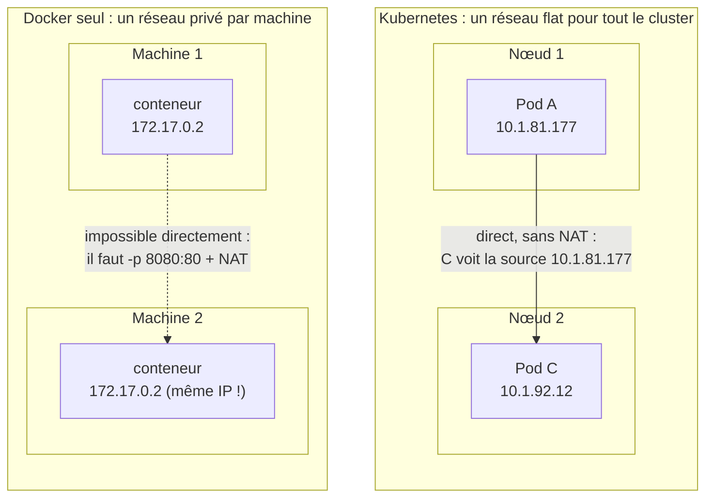
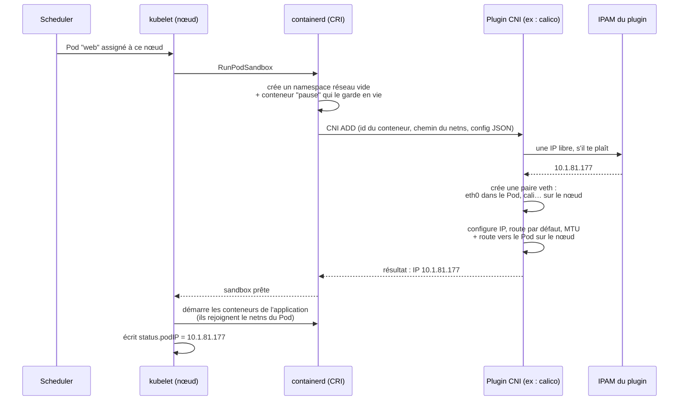
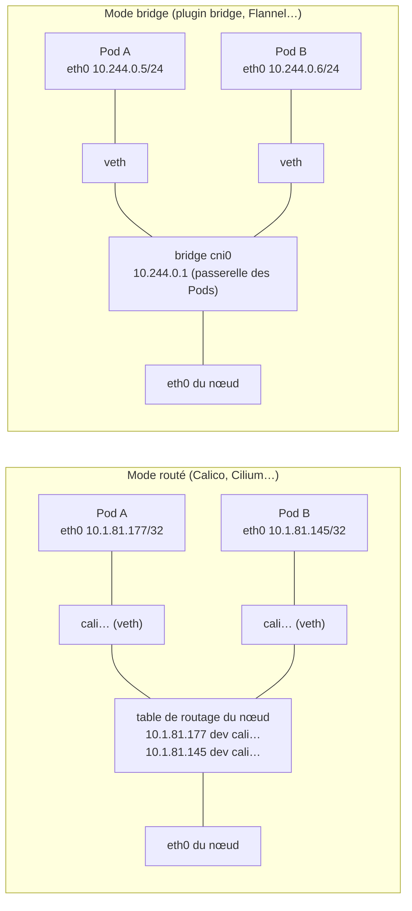
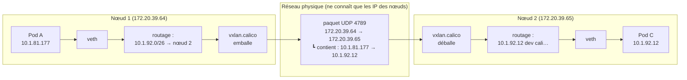
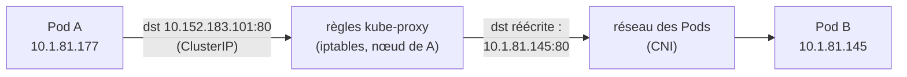

# TP8 - Réseau Kubernetes : Services, DNS et Connectivité

## Objectifs du TP

Ce TP vous permettra de maîtriser le réseau dans Kubernetes de manière approfondie et pratique. Vous apprendrez :

- Le modèle réseau Kubernetes et ses principes fondamentaux
- Les différents types de Services et leurs cas d'usage
- Le DNS Kubernetes et la découverte de services
- Les NetworkPolicies pour sécuriser les communications
- Le débogage réseau avec les outils appropriés
- L'implémentation d'architectures réseau complexes

**Durée estimée :** 6-8 heures
**Niveau :** Intermédiaire à Avancé

## Prérequis

- Avoir complété le TP1 (bases Kubernetes) et TP2 (manifests)
- Cluster Kubernetes fonctionnel (**minikube** ou **kubeadm**)
- kubectl installé et configuré
- Notions de réseau (IP, ports, DNS)

**Note pour kubeadm :** Les concepts réseau (Services, Ingress, Network Policies) sont identiques. Pour l'Ingress Controller, consultez le [guide kubeadm](../docs/KUBEADM_SETUP.md#113-ingress-controller-nginx-ingress).

## Table des matières

- [Partie 1 : Le modèle réseau Kubernetes](#partie-1--le-modèle-réseau-kubernetes)
- [Partie 2 : Services et types d'exposition](#partie-2--services-et-types-dexposition)
- [Partie 3 : DNS et Service Discovery](#partie-3--dns-et-service-discovery)
- [Partie 4 : NetworkPolicies et sécurité réseau](#partie-4--networkpolicies-et-sécurité-réseau)
- [Partie 5 : Débogage réseau](#partie-5--débogage-réseau)
- [Partie 6 : Architectures réseau avancées](#partie-6--architectures-réseau-avancées)
- [Exercices pratiques](#exercices-pratiques)

---

## Partie 1 : Le modèle réseau Kubernetes

> 💡 Cette partie répond à trois questions qu'on se pose tous en arrivant sur Kubernetes : **pourquoi le réseau des Pods n'est-il pas « intégré » à Kubernetes ? À quoi sert un CNI ? Que veut dire « réseau flat » ?** Tous les exemples de sortie ci-dessous viennent d'un vrai cluster (microk8s avec Calico en VXLAN). Sur votre cluster, les adresses et les noms d'interfaces seront différents, mais les mécanismes sont les mêmes.

### 1.1 Le problème à résoudre : pourquoi le réseau Docker ne suffit pas

Sur une machine avec Docker, chaque conteneur reçoit une IP privée (par exemple `172.17.0.2`) sur un bridge `docker0` **local à la machine**. Pour le joindre depuis l'extérieur, on publie un port : `docker run -p 8080:80`. Docker fait alors du **NAT** : le trafic arrivant sur `IP-machine:8080` est réécrit vers `172.17.0.2:80`.

Sur une seule machine, ça marche. Sur un cluster de 50 machines, c'est ingérable :

| Problème | Conséquence |
|---|---|
| Chaque machine a son propre `172.17.0.0/16` | Deux conteneurs sur deux machines peuvent avoir **la même IP** : impossible de les adresser directement |
| Il faut publier un port par conteneur | Conflits de ports (deux nginx ne peuvent pas prendre tous les deux le port 8080 d'un même hôte), et il faut un registre central « quel service est sur quel port de quelle machine » |
| Le NAT réécrit les adresses | Le serveur voit l'IP de la **machine**, pas celle du conteneur qui l'appelle : impossible de filtrer ou de tracer par application |
| L'IP d'un conteneur n'a de sens que sur sa machine | Chaque application doit connaître la topologie physique pour joindre les autres |

Kubernetes a fait un choix radical pour supprimer tout ça : **chaque Pod a une vraie IP, joignable telle quelle depuis n'importe quel autre Pod du cluster**.

### 1.2 Le modèle réseau Kubernetes : un réseau « flat »

Kubernetes impose trois règles à tout cluster :

1. **Chaque Pod a sa propre adresse IP**, unique dans tout le cluster. Les conteneurs d'un même Pod partagent cette IP (même namespace réseau) et se parlent via `localhost`.
2. **Tout Pod peut joindre tout autre Pod, sur n'importe quel nœud, sans NAT** : l'IP source vue par le destinataire est l'IP réelle de l'appelant.
3. **Les agents d'un nœud** (kubelet, démons système) **peuvent joindre tous les Pods de ce nœud**.

#### Que veut dire « flat » ?

« Flat » (plat) signifie : **un seul espace d'adressage IP pour tous les Pods, sans traduction d'adresse entre eux**. Du point de vue d'un Pod, le cluster est un seul grand réseau où chaque autre Pod est joignable par son IP, comme si tous étaient branchés sur le même switch géant.



⚠️ Trois contresens fréquents sur « flat » :

| « Flat » ne veut PAS dire… | En réalité |
|---|---|
| …que tous les Pods sont sur le même réseau Ethernet (niveau 2) | C'est plat **au niveau IP** (niveau 3). Physiquement, les paquets entre nœuds sont routés ou encapsulés (voir 1.6). Les Pods ne « voient » juste pas ces détails. |
| …qu'il n'y a aucune sécurité | Par défaut, oui, tout le monde peut parler à tout le monde. C'est justement pour ça que les **NetworkPolicies** existent (Partie 4). |
| …qu'il n'y a jamais de NAT | Pas de NAT **entre Pods**. Mais il y en a pour sortir du cluster (le Pod sort avec l'IP du nœud) et pour les Services (la ClusterIP est traduite vers l'IP d'un Pod, voir 1.7). |

#### Trois plages d'adresses à ne pas confondre

Un cluster manipule trois réseaux distincts :

| Réseau | Exemple (microk8s) | Qui attribue les adresses ? | Existe-t-il sur une interface ? |
|---|---|---|---|
| **Réseau des nœuds** | `172.20.39.64` | Votre infrastructure (DHCP, cloud, admin) | Oui, `eth0` des machines |
| **Réseau des Pods** (*cluster CIDR*) | `10.1.0.0/16` | Le **plugin CNI** (son IPAM) | Oui, `eth0` dans chaque Pod |
| **Réseau des Services** (*service CIDR*) | `10.152.183.0/24` | L'**API server** (à la création du Service) | **Non, nulle part** (voir 1.7) |

```bash
# IP des nœuds
kubectl get nodes -o wide

# IP des Pods
kubectl get pods -A -o wide

# IP des Services
kubectl get svc -A
```

### 1.3 Pourquoi le réseau des Pods n'est pas « natif » dans Kubernetes

C'est la question la plus déroutante : Kubernetes **exige** que chaque Pod ait une IP joignable partout, mais **ne contient aucun code pour le faire**. Aucun composant de Kubernetes (API server, scheduler, kubelet, kube-proxy) ne crée d'interface réseau pour les Pods ni ne transporte leurs paquets d'un nœud à l'autre. Sans plugin réseau installé, les nœuds restent `NotReady` et les Pods bloqués en `ContainerCreating`.

C'est un **choix délibéré**, pour trois raisons :

1. **Il n'existe pas de « bonne » solution universelle.** Relier les Pods de plusieurs machines dépend entièrement de l'infrastructure :
   - dans un **cloud** (AWS, GCP, Azure), le réseau du fournisseur sait déjà router des IP, il suffit de lui en demander pour les Pods ;
   - dans un **datacenter**, on peut annoncer les routes des Pods aux routeurs physiques (BGP) ;
   - sur des **machines quelconques** sans contrôle du réseau (VM de formation, laptop), il faut encapsuler les paquets dans un tunnel.

   Coder une seule de ces approches dans Kubernetes aurait exclu les autres.
2. **Séparer le « quoi » du « comment ».** Kubernetes définit le **contrat** (les 3 règles de 1.2) ; des projets spécialisés rivalisent sur l'**implémentation** (performance, chiffrement, observabilité, sécurité). C'est le même principe que pour les autres interfaces de Kubernetes :

   | Interface | Ce que Kubernetes délègue | Exemples d'implémentations |
   |---|---|---|
   | **CRI** (Container Runtime Interface) | Lancer les conteneurs | containerd, CRI-O |
   | **CNI** (Container Network Interface) | Brancher les Pods au réseau | Calico, Cilium, Flannel, kindnet |
   | **CSI** (Container Storage Interface) | Fournir des volumes | EBS, Ceph, NFS, hostpath |

3. **Faire évoluer le réseau sans toucher à Kubernetes.** Cilium a pu remplacer iptables par eBPF sans qu'on modifie une ligne de Kubernetes.

> 💡 **Ce qui est natif, en revanche** : l'objet **Service** et son implémentation par défaut **kube-proxy** (voir 1.7), l'objet **NetworkPolicy** (seulement l'API : l'application des règles dépend du CNI, voir 1.8), et le **DNS** du cluster (CoreDNS, installé comme addon). Autrement dit, Kubernetes gère nativement **comment trouver** un Pod. Il ne gère pas **comment un paquet l'atteint**.

### 1.4 CNI : le contrat entre le runtime et le plugin réseau

**CNI** (Container Network Interface) est une spécification très simple, issue de la CNCF : un plugin CNI est **un exécutable** que le runtime de conteneurs appelle avec une commande (`ADD`, `DEL`, `CHECK`) et une configuration JSON. C'est tout. Pas de démon imposé, pas d'API réseau.

Sur chaque nœud, deux emplacements comptent :

| Emplacement | Contenu |
|---|---|
| `/etc/cni/net.d/` | La **configuration** : quel(s) plugin(s) appeler, avec quels paramètres (le premier fichier par ordre alphabétique gagne) |
| `/opt/cni/bin/` | Les **exécutables** des plugins (`calico`, `bridge`, `portmap`, `host-local`…) |

> Sur microk8s, ces chemins sont sous `/var/snap/microk8s/current/args/cni-network/` et `/var/snap/microk8s/current/opt/cni/bin/`. Sur minikube : `minikube ssh`, puis les chemins standard.

Exemple réel de configuration (Calico sur microk8s, extrait) :

```json
{
  "name": "k8s-pod-network",
  "cniVersion": "0.3.1",
  "plugins": [
    {
      "type": "calico",
      "ipam": { "type": "calico-ipam" },
      "policy": { "type": "k8s" }
    },
    { "type": "portmap", "snat": true, "capabilities": {"portMappings": true} },
    { "type": "bandwidth", "capabilities": {"bandwidth": true} }
  ]
}
```

On y lit une **chaîne** de plugins : `calico` crée l'interface et, avec `calico-ipam`, choisit l'IP ; `portmap` gère les `hostPort` ; `bandwidth` applique les limites de débit.

#### Ce qui se passe à la création d'un Pod



Deux conséquences pratiques :
- **Le conteneur `pause`** détient le namespace réseau du Pod. C'est pour ça qu'un conteneur applicatif peut redémarrer sans que le Pod change d'IP.
- Si le plugin CNI est absent ou en échec, le Pod reste en `ContainerCreating` avec un événement `FailedCreatePodSandBox` : c'est **toujours** un problème CNI, jamais un problème d'application.

### 1.5 Sur un nœud : namespaces réseau et paires veth

Chaque Pod vit dans son propre **namespace réseau** Linux : il a ses propres interfaces, sa propre table de routage, ses propres règles de pare-feu. Pour le relier au nœud, le plugin CNI crée une **paire veth**, un « câble virtuel » à deux bouts : un bout (`eth0`) dans le Pod, l'autre sur le nœud.

Il existe ensuite deux grandes façons de relier ces bouts côté nœud :



- **Bridge** : les veth sont branchées sur un switch virtuel (`cni0`). Les Pods d'un même nœud sont sur le même sous-réseau et se voient au niveau Ethernet.
- **Routé** : pas de bridge. Chaque Pod a une IP en `/32` (un sous-réseau d'une seule adresse), et le nœud a **une route par Pod**. Tout le trafic passe par la pile IP du nœud, ce qui facilite l'application des NetworkPolicies.

Voici ce qu'on observe réellement dans un Pod sous Calico :

```bash
$ kubectl exec pod-a -- ip addr show eth0
3: eth0@if30: <BROADCAST,MULTICAST,UP,LOWER_UP> mtu 1450 ...
    inet 10.1.81.177/32 scope global eth0

$ kubectl exec pod-a -- ip route
default via 169.254.1.1 dev eth0
169.254.1.1 dev eth0 scope link
```

- `eth0@if30` : l'autre bout de la paire veth est l'interface n°30 **du nœud**.
- `/32` : le Pod est seul sur son « sous-réseau ».
- `169.254.1.1` est une **passerelle qui n'existe pas** : aucune machine n'a cette IP. Calico fait répondre le bout veth côté nœud à toutes les requêtes ARP (*proxy ARP*), donc tout paquet sortant du Pod arrive au nœud, qui route.

Et côté nœud :

```bash
$ ip route | grep 10.1.81
blackhole 10.1.81.128/26 proto 80
10.1.81.145 dev cali8a379606243 scope link
10.1.81.177 dev calic59fce0c6d6 scope link
```

Une route `/32` par Pod, et un **bloc `/26`** (64 adresses) réservé à ce nœud par l'IPAM de Calico. La route `blackhole` jette tout paquet destiné à une IP du bloc qui n'est attribuée à aucun Pod.

### 1.6 Entre les nœuds : overlay, routage natif ou réseau du cloud

Sur un nœud, c'est simple. Le vrai travail du CNI, c'est de faire qu'un paquet pour `10.1.92.12` (Pod sur le nœud 2) parte du nœud 1 et arrive au bon endroit, alors que le réseau physique entre les machines **ne connaît pas** les IP des Pods. Il existe trois stratégies (dans les schémas, le nœud 2 et ses adresses sont illustratifs : le cluster de test n'a qu'un nœud) :

| Stratégie | Principe | Avantages | Inconvénients | Exemples |
|---|---|---|---|---|
| **Overlay (encapsulation)** | Le paquet du Pod est emballé dans un paquet UDP (VXLAN, port 4789) ou IP (IP-in-IP) adressé **au nœud** destinataire, qui le déballe | Fonctionne sur **n'importe quel réseau** où les nœuds se joignent | En-têtes en plus → **MTU réduite** et un peu de CPU | Flannel (VXLAN), Calico (VXLAN/IPIP), Cilium (VXLAN/Geneve) |
| **Routage natif** | Chaque nœud annonce « le bloc `10.1.81.128/26` est chez moi » (BGP) ou installe des routes directes | Pas d'encapsulation, performance maximale, IP des Pods visibles du réseau | Il faut contrôler le réseau (routeurs BGP) ou que les nœuds soient sur le même segment L2 | Calico (BGP), Flannel (host-gw), kindnet |
| **Réseau du cloud** | Les Pods reçoivent de **vraies IP du VPC** du fournisseur | Pas d'overlay, Pods joignables depuis tout le VPC | Lié au fournisseur, IP du VPC consommées rapidement | AWS VPC CNI, Azure CNI, GKE (VPC-native) |

Le trajet d'un paquet en overlay VXLAN :



Le Pod A a envoyé un paquet `10.1.81.177 → 10.1.92.12` et le Pod C reçoit exactement ce paquet. L'emballage est invisible pour eux : c'est ce qui rend le réseau « flat » du point de vue des Pods.

> 🔎 Sur le cluster de test, Calico est en `vxlanMode: Always`, avec une interface `vxlan.calico` sur le port UDP **4789** (le port standard VXLAN). C'est pour ça que les pare-feu entre nœuds doivent laisser passer ce port. Un oubli classique qui donne « les Pods d'un même nœud se parlent, ceux de deux nœuds différents non ».

### 1.7 Ce que le CNI ne fait pas : les Services et kube-proxy

Le CNI relie des **IP de Pods**. Mais les Pods sont éphémères : leur IP change à chaque recréation. D'où les **Services** (Partie 2), avec une IP stable, la **ClusterIP**.

Or la ClusterIP **n'est portée par aucune interface**, sur aucune machine. C'est une adresse virtuelle. C'est **kube-proxy** (composant natif de Kubernetes, un par nœud) qui écrit des règles dans le noyau (iptables, IPVS ou nftables) : « tout paquet TCP/UDP à destination de `10.152.183.101:80` → réécrire la destination vers l'IP d'un des Pods du Service ». C'est du **DNAT** (NAT de destination), appliqué **sur le nœud de l'appelant**, avant même que le paquet quitte la machine.



| Composant | Rôle | Natif Kubernetes ? |
|---|---|---|
| Plugin **CNI** | IP des Pods, interfaces, transport entre nœuds | ❌ plugin à installer |
| **kube-proxy** | Traduire ClusterIP / NodePort vers les IP de Pods | ✅ (remplaçable : Cilium le fait en eBPF) |
| **CoreDNS** | Traduire `backend-svc.default.svc.cluster.local` → ClusterIP | ✅ addon standard |
| Application des **NetworkPolicies** | Filtrer le trafic entre Pods | ❌ faite par le CNI, s'il en est capable |

### 1.8 Choisir (ou identifier) son plugin CNI

| Plugin | Transport entre nœuds | NetworkPolicies | À retenir |
|--------|----------------------|-----------------|-----------|
| **Calico** | BGP, VXLAN ou IP-in-IP | ✅ (et des politiques étendues via ses propres CRD) | Le plus répandu on-premise ; défaut de microk8s |
| **Cilium** | Routage natif ou VXLAN/Geneve, datapath **eBPF** | ✅ jusqu'au niveau 7 (HTTP) | Peut remplacer kube-proxy ; observabilité avec Hubble ; base de GKE Dataplane V2 |
| **Flannel** | VXLAN ou host-gw | ❌ **aucune** | Très simple ; souvent combiné à Calico pour les policies (= **Canal**) |
| **kindnet** | Routes directes entre nœuds | ⚠️ absent des anciennes versions, ajouté récemment : vérifiez la vôtre | CNI de kind et de minikube multi-nœuds |
| **bridge** (plugin de référence) | Aucun (un seul nœud) | ❌ | Défaut de minikube mono-nœud avec le runtime docker |
| **Weave Net** | Mesh chiffrable | ✅ | ⚠️ **Plus maintenu par son éditeur** : Weaveworks a fermé et le dépôt est archivé depuis juin 2024. À éviter sur un nouveau cluster |

> ⚠️ **Piège majeur** : un objet NetworkPolicy est **toujours accepté** par l'API server, même si le CNI ne sait pas l'appliquer. Avec Flannel ou bridge (et kindnet dans ses anciennes versions), `kubectl apply` répond `created`… et **rien n'est filtré**, sans aucun message d'erreur. Pour la Partie 4, démarrez minikube avec un CNI qui applique les policies : `minikube start --cni=calico`.

**Quel CNI utilise minikube ?** Il le choisit selon la configuration :

| Configuration minikube | CNI par défaut |
|---|---|
| Plusieurs nœuds (`--nodes 2`…) | kindnet |
| Driver docker/podman + runtime **containerd** ou **CRI-O** | kindnet |
| Runtime **docker**, Kubernetes ≥ 1.24, un seul nœud | bridge |
| Option `--cni=calico` / `--cni=cilium` / `--cni=flannel` | celui demandé |

**🔍 Identifier le CNI de votre cluster :**

```bash
# Les pods du plugin réseau tournent en général en DaemonSet dans kube-system
kubectl get pods -n kube-system -o wide | grep -E 'calico|cilium|flannel|kindnet|weave'
kubectl get daemonsets -n kube-system

# La configuration CNI sur le nœud (minikube : se connecter d'abord au nœud)
minikube ssh -- ls /etc/cni/net.d/
minikube ssh -- sudo cat /etc/cni/net.d/*.conflist

# microk8s :
ls /var/snap/microk8s/current/args/cni-network/
```

### 1.9 Exercices pratiques : observer le réseau pour de vrai

**Exercice 1.1 : Visualiser l'adressage IP**

```bash
# Créer plusieurs pods
kubectl create deployment web --image=nginx:alpine --replicas=3

# Voir les IPs des pods et leur nœud
kubectl get pods -o wide

# Voir les détails réseau d'un pod
kubectl describe pod <pod-name> | grep IP
```

**Questions :**
- Quelle est la plage d'adresses IP utilisée pour les Pods ? Est-elle différente de celle des nœuds (`kubectl get nodes -o wide`) ?
- Supprimez un Pod (`kubectl delete pod <pod-name>`) : le Pod recréé par le Deployment a-t-il la même IP ? Qu'est-ce que ça implique pour une application qui voudrait joindre ce Pod ? (Réponse : Partie 2.)

**Exercice 1.2 : Communication inter-pods sans NAT**

```bash
# Créer deux pods
kubectl run pod-a --image=nginx:alpine
kubectl run pod-b --image=nginx:alpine
kubectl wait --for=condition=ready pod/pod-a pod/pod-b --timeout=120s

# Récupérer les deux IP
POD_A_IP=$(kubectl get pod pod-a -o jsonpath='{.status.podIP}')
POD_B_IP=$(kubectl get pod pod-b -o jsonpath='{.status.podIP}')
echo "pod-a=$POD_A_IP  pod-b=$POD_B_IP"
```

> 🎯 **Avant de lancer la commande suivante, prédis :** pod-a envoie une requête HTTP à pod-b. Dans le journal d'accès de nginx sur pod-b, quelle IP source apparaîtra : celle de pod-a, celle du nœud, ou une autre ?

```bash
kubectl exec pod-a -- wget -qO- http://$POD_B_IP > /dev/null
kubectl logs pod-b | tail -1
```

<details>
<summary>💡 Vérifie ta prédiction</summary>

**L'IP de pod-a.** Exemple réel :

```
10.1.81.177 - - [23/Sep/2026:08:51:23 +0000] "GET / HTTP/1.1" 200 896 "-" "Wget" "-"
```

C'est la règle n°2 du modèle : **pas de NAT entre Pods**. Le paquet arrive avec son adresse d'origine intacte. C'est ce qui permet aux NetworkPolicies (Partie 4) de filtrer « qui parle à qui » : si le nœud réécrivait la source, tous les Pods d'un nœud se ressembleraient.

Allez plus loin : exposez pod-b derrière un Service (`kubectl expose pod pod-b --port=80`) et refaites l'appel via `http://pod-b`. La source vue par pod-b est **toujours** l'IP de pod-a : kube-proxy réécrit la **destination** (ClusterIP → IP du Pod), pas la source.

</details>

**Exercice 1.3 : Regarder dans le Pod**

> 🎯 **Avant de lancer la commande suivante, prédis :** la MTU d'une interface Ethernet classique est 1500 octets. Quelle MTU aura `eth0` dans le Pod ?

```bash
kubectl exec pod-a -- cat /sys/class/net/eth0/mtu
kubectl exec pod-a -- ip addr show eth0
kubectl exec pod-a -- ip route
```

<details>
<summary>💡 Vérifie ta prédiction</summary>

Ça dépend du CNI, et c'est justement l'intérêt. Sur le cluster de test (Calico en VXLAN), **1450**, pas 1500.

L'encapsulation VXLAN (voir 1.6) ajoute **50 octets** d'en-têtes (Ethernet + IP + UDP + VXLAN) à chaque paquet. Pour que le paquet emballé tienne dans les 1500 octets du réseau physique, le CNI réduit la MTU des Pods à 1500 − 50 = 1450.

Si vous trouvez 1500, votre CNI n'encapsule pas (bridge sur un seul nœud, routage natif, kindnet…) : relisez `ip route` pour comprendre comment votre Pod sort.

Pourquoi c'est important : si la MTU des Pods est mal réglée (plus grande que ce que l'overlay peut transporter), les **petites** requêtes passent mais les **grosses** réponses se perdent. C'est le fameux « le ping marche, curl reste bloqué », l'un des bugs réseau les plus difficiles à diagnostiquer en production.

Regardez aussi `ip route` : avec Calico, la passerelle `169.254.1.1` n'existe sur aucune machine (proxy ARP, voir 1.5). Avec un CNI en mode bridge, vous verrez une vraie passerelle (par exemple `10.244.0.1`, l'IP du bridge `cni0`).

</details>

**Exercice 1.4 : La ClusterIP, une adresse qui n'existe pas**

```bash
kubectl expose pod pod-b --port=80 --name=pod-b-svc
SVC_IP=$(kubectl get svc pod-b-svc -o jsonpath='{.spec.clusterIP}')
echo "ClusterIP=$SVC_IP"

# Un ping vers un Pod fonctionne
kubectl exec pod-a -- ping -c 2 $POD_B_IP
```

> 🎯 **Avant de lancer la commande suivante, prédis :** le Service répond en HTTP sur sa ClusterIP. Un `ping` vers cette même ClusterIP va-t-il répondre ?

```bash
kubectl exec pod-a -- ping -c 2 -W 2 $SVC_IP
kubectl exec pod-a -- wget -qO- -T 3 http://$SVC_IP | head -4
```

<details>
<summary>💡 Vérifie ta prédiction</summary>

**Non** (avec kube-proxy en mode iptables, le mode par défaut) : `100% packet loss`, alors que le `wget` sur la même IP répond.

La ClusterIP n'est configurée sur aucune interface : aucune machine ne « possède » cette adresse, donc personne ne répond au ping (ICMP). Elle n'existe que sous forme de règles kube-proxy qui ne traduisent que les **ports TCP/UDP déclarés** dans le Service (ici 80/TCP). Un ping n'a pas de port : aucune règle ne le traduit, il part dans le vide.

**Leçon de débogage** : « le ping de la ClusterIP ne répond pas » ne prouve **rien** sur la santé d'un Service. Testez toujours avec le vrai protocole (`wget`, `curl`, `nc -zv IP PORT`).

(En mode IPVS, kube-proxy pose les ClusterIP sur une interface factice `kube-ipvs0`, et le ping répond. Même constat : le ping ne dit rien sur le service lui-même.)

</details>

**Nettoyage :**

```bash
kubectl delete pod pod-a pod-b
kubectl delete svc pod-b-svc
kubectl delete svc pod-b --ignore-not-found   # si vous avez fait « Allez plus loin » de l'exercice 1.2
kubectl delete deployment web
```

**Pour aller plus loin (sur le nœud) :** `minikube ssh`, puis `ip link | grep -E 'veth|cali|cni'` et `ip route` : retrouvez le bout côté nœud de la veth de pod-a (le numéro après `@if` dans le Pod est l'index de l'interface sur le nœud) et la route qui mène à son IP.

---

## Partie 2 : Services et types d'exposition

### 2.1 Pourquoi les Services ?

Les Pods sont **éphémères** : ils peuvent être créés, détruits, et leurs IPs changent. Les Services fournissent :

- **Abstraction stable** : Une IP et un DNS qui ne changent pas
- **Load balancing** : Distribution du trafic entre plusieurs Pods
- **Service discovery** : Découverte automatique via DNS

### 2.2 Service ClusterIP (par défaut)

Expose le Service sur une IP interne au cluster.

**Cas d'usage :**
- Communication entre microservices
- Bases de données internes
- APIs backend

**Exemple complet :**

```yaml
# deployment-backend.yaml
apiVersion: apps/v1
kind: Deployment
metadata:
  name: backend
  labels:
    app: backend
spec:
  replicas: 3
  selector:
    matchLabels:
      app: backend
  template:
    metadata:
      labels:
        app: backend
    spec:
      containers:
      - name: backend
        image: nginx:alpine
        ports:
        - containerPort: 80
---
# service-backend.yaml
apiVersion: v1
kind: Service
metadata:
  name: backend-svc
spec:
  type: ClusterIP
  selector:
    app: backend
  ports:
  - protocol: TCP
    port: 80        # Port du Service
    targetPort: 80  # Port du conteneur
```

**Déploiement et test :**

```bash
# Créer les ressources
kubectl apply -f deployment-backend.yaml

# Vérifier le service
kubectl get svc backend-svc
# NAME          TYPE        CLUSTER-IP     EXTERNAL-IP   PORT(S)
# backend-svc   ClusterIP   10.96.123.45   <none>        80/TCP

# Tester depuis un pod temporaire
kubectl run tmp --image=busybox --rm -it -- wget -qO- http://backend-svc

# Tester avec le FQDN complet
kubectl run tmp --image=busybox --rm -it -- wget -qO- http://backend-svc.default.svc.cluster.local
```

### 2.3 Service NodePort

Expose le Service sur un port statique de chaque nœud.

**Cas d'usage :**
- Développement et tests
- Accès externe sans load balancer cloud
- Applications nécessitant un port spécifique

**Exemple :**

```yaml
apiVersion: v1
kind: Service
metadata:
  name: web-nodeport
spec:
  type: NodePort
  selector:
    app: web
  ports:
  - protocol: TCP
    port: 80          # Port du Service (interne)
    targetPort: 80    # Port du conteneur
    nodePort: 30080   # Port sur chaque nœud (30000-32767)
```

**Accès :**

```bash
# Créer le deployment et service
kubectl create deployment web --image=nginx:alpine
kubectl apply -f service-nodeport.yaml

# Obtenir l'IP du nœud
NODE_IP=$(kubectl get nodes -o jsonpath='{.items[0].status.addresses[?(@.type=="InternalIP")].address}')

# Accéder au service (si minikube)
minikube service web-nodeport --url

# Ou directement avec curl
curl http://$NODE_IP:30080
```

### 2.4 Service LoadBalancer

Expose le Service via un load balancer cloud (AWS ELB, GCP LB, etc.).

**Cas d'usage :**
- Production sur cloud provider
- Applications exposées publiquement
- Haute disponibilité

**Exemple :**

```yaml
apiVersion: v1
kind: Service
metadata:
  name: web-lb
spec:
  type: LoadBalancer
  selector:
    app: web
  ports:
  - protocol: TCP
    port: 80
    targetPort: 80
```

**Note pour minikube :**

```bash
# Sur minikube, utiliser le tunnel pour simuler un LoadBalancer
minikube tunnel

# Dans un autre terminal
kubectl get svc web-lb
# EXTERNAL-IP passera de <pending> à une IP
```

### 2.5 Service ExternalName

Crée un alias DNS vers un service externe.

**Cas d'usage :**
- Intégration avec services externes
- Migration progressive vers Kubernetes
- Abstraction des dépendances externes

**Exemple :**

```yaml
apiVersion: v1
kind: Service
metadata:
  name: external-db
spec:
  type: ExternalName
  externalName: database.example.com
```

**Utilisation :**

```bash
# Les pods peuvent maintenant utiliser "external-db" au lieu de "database.example.com"
kubectl run tmp --image=busybox --rm -it -- nslookup external-db
```

### 2.6 Headless Service

Service sans IP de cluster (ClusterIP: None), pour un accès direct aux IPs des Pods.

**Cas d'usage :**
- StatefulSets et bases de données
- Communication P2P entre Pods
- Service discovery personnalisé

**Exemple :**

```yaml
apiVersion: v1
kind: Service
metadata:
  name: db-headless
spec:
  clusterIP: None
  selector:
    app: database
  ports:
  - port: 3306
```

**Test :**

```bash
# Créer des pods avec le label app=database — le nom du deployment doit être
# "database" (pas "db") : kubectl create deployment étiquette les pods
# app=<nom-du-deployment>, et le Service ci-dessus sélectionne app: database.
kubectl create deployment database --image=mysql:8 --replicas=3

# L'image mysql officielle refuse de démarrer sans mot de passe root : les 3
# pods partent en CrashLoopBackOff jusqu'à cette commande, qui déclenche un
# nouveau rollout avec la variable définie.
kubectl set env deployment/database MYSQL_ROOT_PASSWORD=secret

# Créer le headless service
kubectl apply -f headless-service.yaml

# Attendre que les 3 pods soient prêts avant le test DNS, sinon nslookup peut
# ne renvoyer qu'une partie des IPs (pods pas encore Ready) ou aucune (rollout
# du set env pas encore terminé)
kubectl rollout status deployment/database --timeout=120s

# Faire un DNS lookup
kubectl run tmp --image=busybox --rm -it -- nslookup db-headless
# Retourne les IPs de tous les Pods, pas une seule IP de service
```

### 2.7 Endpoints et EndpointSlices

Les Services utilisent des **Endpoints** pour suivre les IPs des Pods.

```bash
# Voir les endpoints d'un service
kubectl get endpoints backend-svc

# Voir les détails
kubectl describe endpoints backend-svc

# Depuis Kubernetes 1.21, utiliser EndpointSlices (plus scalable)
kubectl get endpointslices
```

**Créer un Service avec Endpoints manuels (pour services externes) :**

```yaml
# Service sans selector
apiVersion: v1
kind: Service
metadata:
  name: external-api
spec:
  ports:
  - protocol: TCP
    port: 80
    targetPort: 80
---
# Endpoints manuels
apiVersion: v1
kind: Endpoints
metadata:
  name: external-api
subsets:
- addresses:
  - ip: 192.168.1.100
  - ip: 192.168.1.101
  ports:
  - port: 80
```

### 2.8 Session Affinity

Diriger toujours le même client vers le même Pod.

```yaml
apiVersion: v1
kind: Service
metadata:
  name: sticky-service
spec:
  selector:
    app: web
  sessionAffinity: ClientIP
  sessionAffinityConfig:
    clientIP:
      timeoutSeconds: 3600
  ports:
  - port: 80
```

---

## Partie 3 : DNS et Service Discovery

### 3.1 DNS dans Kubernetes

Kubernetes inclut un serveur DNS (CoreDNS par défaut) qui crée automatiquement des enregistrements pour les Services et Pods.

**Architecture DNS :**

```
┌─────────────────────────────────────────────┐
│              Pod Application                 │
│                                              │
│  Requête DNS: backend-svc.default.svc.cluster.local
│                     │                        │
└─────────────────────┼─────────────────────────┘
                      │
                      ▼
           ┌─────────────────┐
           │    CoreDNS      │
           │ (kube-system)   │
           └─────────────────┘
                      │
        ┌─────────────┼─────────────┐
        ▼             ▼             ▼
   Service IP    Endpoints     Pod IPs
```

### 3.2 Format DNS des Services

**Format complet (FQDN) :**

```
<service-name>.<namespace>.svc.<cluster-domain>
```

**Exemples :**

```bash
# Service "backend-svc" dans namespace "default"
backend-svc.default.svc.cluster.local

# Service "api" dans namespace "production"
api.production.svc.cluster.local
```

**Formes courtes (depuis un Pod) :**

```bash
# Même namespace
backend-svc

# Autre namespace (il faut le namespace)
api.production

# FQDN complet fonctionne partout
api.production.svc.cluster.local
```

### 3.3 DNS pour les Pods

Les Pods obtiennent aussi des enregistrements DNS.

**Format :**

```
<pod-ip-address>.<namespace>.pod.<cluster-domain>
```

**Exemple :**

```bash
# Pod avec IP 10.244.1.5 dans namespace default
10-244-1-5.default.pod.cluster.local
```

**Pour les Pods d'un Headless Service :**

```
<pod-name>.<headless-service-name>.<namespace>.svc.<cluster-domain>
```

### 3.4 Exercices pratiques DNS

**Exercice 3.1 : Résolution DNS entre namespaces**

```bash
# Créer deux namespaces
kubectl create namespace frontend
kubectl create namespace backend

# Créer un service dans backend
kubectl create deployment api -n backend --image=nginx:alpine
kubectl expose deployment api -n backend --port=80

# Créer un pod dans frontend
kubectl run test -n frontend --image=busybox --rm -it -- sh

# Dans le pod, tester les différentes formes DNS
wget -qO- http://api.backend
wget -qO- http://api.backend.svc
wget -qO- http://api.backend.svc.cluster.local

# Tenter d'accéder avec juste le nom (devrait échouer - namespace différent)
wget -qO- http://api  # ERREUR
```

**Exercice 3.2 : Debug DNS**

```bash
# Tester la résolution DNS
kubectl run dnsutils --image=registry.k8s.io/e2e-test-images/jessie-dnsutils:1.3 --rm -it -- sh

# Dans le pod
nslookup kubernetes.default
nslookup backend-svc.default.svc.cluster.local
host backend-svc.default.svc.cluster.local

# Voir la configuration DNS du pod
cat /etc/resolv.conf
```

**Sortie attendue (/etc/resolv.conf) :**

```
nameserver 10.96.0.10
search default.svc.cluster.local svc.cluster.local cluster.local
options ndots:5
```

### 3.5 Configuration DNS des Pods

Personnaliser la configuration DNS d'un Pod :

```yaml
apiVersion: v1
kind: Pod
metadata:
  name: custom-dns
spec:
  containers:
  - name: app
    image: nginx:alpine
  dnsPolicy: "None"
  dnsConfig:
    nameservers:
      - 8.8.8.8
    searches:
      - custom.local
    options:
      - name: ndots
        value: "2"
```

**Politiques DNS disponibles :**

- `ClusterFirst` (défaut) : Utilise CoreDNS du cluster
- `Default` : Hérite du nœud
- `ClusterFirstWithHostNet` : Pour pods avec hostNetwork
- `None` : Configuration manuelle

---

## Partie 4 : NetworkPolicies et sécurité réseau

### 4.1 Principe des NetworkPolicies

Par défaut, **tous les Pods peuvent communiquer avec tous les Pods**. Les NetworkPolicies permettent de restreindre ce trafic.

**⚠️ Important :** Les NetworkPolicies nécessitent un plugin CNI qui les applique (Calico, Cilium…). **Flannel et le plugin bridge ne les appliquent PAS**, et l'API server accepte quand même l'objet sans aucune erreur : voir le piège décrit en [1.8](#18-choisir-ou-identifier-son-plugin-cni). Sur minikube : `minikube start --cni=calico`.

**Vérifier le support :**

```bash
# Voir le plugin CNI
kubectl get pods -n kube-system | grep -E 'calico|cilium|flannel|kindnet'
```

### 4.2 Comportement par défaut

```yaml
# NetworkPolicy qui deny tout le trafic ingress
apiVersion: networking.k8s.io/v1
kind: NetworkPolicy
metadata:
  name: deny-all-ingress
  namespace: production
spec:
  podSelector: {}  # S'applique à tous les pods du namespace
  policyTypes:
  - Ingress
```

```yaml
# NetworkPolicy qui deny tout le trafic egress
apiVersion: networking.k8s.io/v1
kind: NetworkPolicy
metadata:
  name: deny-all-egress
  namespace: production
spec:
  podSelector: {}
  policyTypes:
  - Egress
```

### 4.3 Allow depuis des Pods spécifiques

```yaml
apiVersion: networking.k8s.io/v1
kind: NetworkPolicy
metadata:
  name: allow-from-frontend
  namespace: production
spec:
  podSelector:
    matchLabels:
      app: backend
  policyTypes:
  - Ingress
  ingress:
  - from:
    - podSelector:
        matchLabels:
          app: frontend
    ports:
    - protocol: TCP
      port: 8080
```

**Schéma :**

```
┌──────────────┐
│ Pod frontend │
│ (app=frontend)
└──────┬───────┘
       │ ✅ AUTORISÉ sur port 8080
       ▼
┌──────────────┐
│ Pod backend  │
│ (app=backend)│
└──────────────┘
       ▲
       │ ❌ REFUSÉ
┌──────┴───────┐
│  Autre Pod   │
└──────────────┘
```

### 4.4 Allow depuis un Namespace spécifique

```yaml
apiVersion: networking.k8s.io/v1
kind: NetworkPolicy
metadata:
  name: allow-from-admin-ns
  namespace: production
spec:
  podSelector:
    matchLabels:
      app: api
  policyTypes:
  - Ingress
  ingress:
  - from:
    - namespaceSelector:
        matchLabels:
          name: admin
    ports:
    - protocol: TCP
      port: 80
```

**⚠️ N'oubliez pas de labelliser le namespace :**

```bash
kubectl label namespace admin name=admin
```

### 4.5 Règles Egress

Contrôler le trafic sortant des Pods :

```yaml
apiVersion: networking.k8s.io/v1
kind: NetworkPolicy
metadata:
  name: allow-dns-and-api
  namespace: production
spec:
  podSelector:
    matchLabels:
      app: web
  policyTypes:
  - Egress
  egress:
  # Autoriser DNS
  - to:
    - namespaceSelector:
        matchLabels:
          name: kube-system
    ports:
    - protocol: UDP
      port: 53
  # Autoriser l'API backend
  - to:
    - podSelector:
        matchLabels:
          app: api
    ports:
    - protocol: TCP
      port: 8080
```

### 4.6 Utilisation d'ipBlock

Autoriser/bloquer des plages d'IPs :

```yaml
apiVersion: networking.k8s.io/v1
kind: NetworkPolicy
metadata:
  name: allow-from-cidr
spec:
  podSelector:
    matchLabels:
      app: public-api
  policyTypes:
  - Ingress
  ingress:
  - from:
    - ipBlock:
        cidr: 192.168.1.0/24
        except:
        - 192.168.1.5/32
    ports:
    - protocol: TCP
      port: 443
```

### 4.7 Exemple complet : Architecture 3-tiers

```yaml
---
# Frontend peut accéder au Backend
apiVersion: networking.k8s.io/v1
kind: NetworkPolicy
metadata:
  name: frontend-to-backend
  namespace: app
spec:
  podSelector:
    matchLabels:
      tier: backend
  policyTypes:
  - Ingress
  ingress:
  - from:
    - podSelector:
        matchLabels:
          tier: frontend
    ports:
    - protocol: TCP
      port: 8080
---
# Backend peut accéder à la Database
apiVersion: networking.k8s.io/v1
kind: NetworkPolicy
metadata:
  name: backend-to-database
  namespace: app
spec:
  podSelector:
    matchLabels:
      tier: database
  policyTypes:
  - Ingress
  ingress:
  - from:
    - podSelector:
        matchLabels:
          tier: backend
    ports:
    - protocol: TCP
      port: 5432
---
# Database : allow egress pour DNS uniquement
apiVersion: networking.k8s.io/v1
kind: NetworkPolicy
metadata:
  name: database-egress
  namespace: app
spec:
  podSelector:
    matchLabels:
      tier: database
  policyTypes:
  - Egress
  egress:
  - to:
    - namespaceSelector:
        matchLabels:
          name: kube-system
    ports:
    - protocol: UDP
      port: 53
```

**Schéma de l'architecture :**

```
Internet
   │
   ▼
┌──────────────┐
│  Frontend    │  (tier=frontend)
│  Pods        │
└──────┬───────┘
       │ port 8080 ✅
       ▼
┌──────────────┐
│  Backend     │  (tier=backend)
│  Pods        │
└──────┬───────┘
       │ port 5432 ✅
       ▼
┌──────────────┐
│  Database    │  (tier=database)
│  Pods        │  (egress limité au DNS)
└──────────────┘
```

---

## Partie 5 : Débogage réseau

### 5.1 Outils de débogage

**Créer un pod de debug avec tous les outils :**

```yaml
apiVersion: v1
kind: Pod
metadata:
  name: netshoot
spec:
  containers:
  - name: netshoot
    image: nicolaka/netshoot
    command: ['sh', '-c', 'sleep 3600']
```

**Outils disponibles dans netshoot :**
- `curl`, `wget` : Tests HTTP
- `ping`, `traceroute` : Tests ICMP
- `nslookup`, `dig`, `host` : DNS
- `netstat`, `ss` : Connexions réseau
- `tcpdump` : Capture de paquets
- `nmap` : Scan de ports

### 5.2 Tests de connectivité

**Test HTTP :**

```bash
kubectl exec netshoot -- curl -v http://backend-svc
kubectl exec netshoot -- wget -O- --timeout=5 http://backend-svc
```

**Test DNS :**

```bash
kubectl exec netshoot -- nslookup backend-svc
kubectl exec netshoot -- dig backend-svc.default.svc.cluster.local
kubectl exec netshoot -- host backend-svc
```

**Test de port :**

```bash
# Tester si un port est ouvert
kubectl exec netshoot -- nc -zv backend-svc 80

# Scanner les ports
kubectl exec netshoot -- nmap -p 1-1000 <pod-ip>
```

**Test ICMP :**

```bash
kubectl exec netshoot -- ping -c 3 <pod-ip>
```

### 5.3 Diagnostic des Services

```bash
# Vérifier que le service existe
kubectl get svc backend-svc

# Vérifier les endpoints
kubectl get endpoints backend-svc
kubectl describe endpoints backend-svc

# Vérifier les labels
kubectl get pods --show-labels
kubectl get pods -l app=backend

# Voir les détails du service
kubectl describe svc backend-svc
```

**Problèmes courants :**

| Problème | Cause probable | Solution |
|----------|----------------|----------|
| Endpoints vide | Selector ne matche aucun Pod | Vérifier labels et selector |
| Service timeout | NetworkPolicy bloque | Vérifier NetworkPolicies |
| DNS ne résout pas | CoreDNS en erreur | Vérifier pods kube-system |
| Connection refused | Port incorrect | Vérifier targetPort vs containerPort |

### 5.4 Debug NetworkPolicies

```bash
# Lister toutes les NetworkPolicies
kubectl get networkpolicies --all-namespaces

# Voir les détails
kubectl describe networkpolicy deny-all-ingress

# Tester la connectivité
kubectl run test --image=busybox --rm -it -- wget --timeout=2 http://<pod-ip>
# Si timeout = NetworkPolicy bloque probablement
```

**Méthodologie de debug :**

1. **Vérifier que le plugin CNI supporte NetworkPolicies**
2. **Tester sans NetworkPolicy** (supprimer temporairement)
3. **Vérifier les labels** des Pods et Namespaces
4. **Tester étape par étape** (ingress puis egress)
5. **Utiliser les logs** des pods CNI

### 5.5 Capture de paquets avec tcpdump

```bash
# Dans un pod netshoot
kubectl exec -it netshoot -- tcpdump -i any port 80

# Capturer et sauvegarder
kubectl exec netshoot -- tcpdump -i any -w /tmp/capture.pcap

# Copier le fichier localement
kubectl cp netshoot:/tmp/capture.pcap ./capture.pcap

# Analyser avec Wireshark
wireshark capture.pcap
```

### 5.6 Vérifier CoreDNS

```bash
# Status des pods CoreDNS
kubectl get pods -n kube-system -l k8s-app=kube-dns

# Logs CoreDNS
kubectl logs -n kube-system -l k8s-app=kube-dns

# ConfigMap CoreDNS
kubectl get configmap coredns -n kube-system -o yaml
```

---

## Partie 6 : Architectures réseau avancées

### 6.1 Architecture microservices sécurisée

```yaml
---
# Namespace avec NetworkPolicies par défaut
apiVersion: v1
kind: Namespace
metadata:
  name: secure-app
---
# Deny all ingress par défaut
apiVersion: networking.k8s.io/v1
kind: NetworkPolicy
metadata:
  name: default-deny-ingress
  namespace: secure-app
spec:
  podSelector: {}
  policyTypes:
  - Ingress
---
# Frontend Deployment
apiVersion: apps/v1
kind: Deployment
metadata:
  name: frontend
  namespace: secure-app
spec:
  replicas: 2
  selector:
    matchLabels:
      app: frontend
      tier: frontend
  template:
    metadata:
      labels:
        app: frontend
        tier: frontend
    spec:
      containers:
      - name: frontend
        image: nginx:alpine
        ports:
        - containerPort: 80
---
# Frontend Service
apiVersion: v1
kind: Service
metadata:
  name: frontend
  namespace: secure-app
spec:
  type: NodePort
  selector:
    app: frontend
  ports:
  - port: 80
    nodePort: 30080
---
# Allow ingress to frontend from anywhere
apiVersion: networking.k8s.io/v1
kind: NetworkPolicy
metadata:
  name: allow-frontend-ingress
  namespace: secure-app
spec:
  podSelector:
    matchLabels:
      tier: frontend
  policyTypes:
  - Ingress
  ingress:
  - ports:
    - protocol: TCP
      port: 80
---
# Backend Deployment
apiVersion: apps/v1
kind: Deployment
metadata:
  name: backend
  namespace: secure-app
spec:
  replicas: 3
  selector:
    matchLabels:
      app: backend
      tier: backend
  template:
    metadata:
      labels:
        app: backend
        tier: backend
    spec:
      containers:
      - name: backend
        image: nginx:alpine
        ports:
        - containerPort: 8080
---
# Backend Service (ClusterIP)
apiVersion: v1
kind: Service
metadata:
  name: backend
  namespace: secure-app
spec:
  type: ClusterIP
  selector:
    app: backend
  ports:
  - port: 8080
    targetPort: 8080
---
# Allow backend ingress from frontend only
apiVersion: networking.k8s.io/v1
kind: NetworkPolicy
metadata:
  name: allow-backend-from-frontend
  namespace: secure-app
spec:
  podSelector:
    matchLabels:
      tier: backend
  policyTypes:
  - Ingress
  ingress:
  - from:
    - podSelector:
        matchLabels:
          tier: frontend
    ports:
    - protocol: TCP
      port: 8080
---
# Database Secret
apiVersion: v1
kind: Secret
metadata:
  name: database-credentials
  namespace: secure-app
type: Opaque
stringData:
  password: "secret"
---
# Database StatefulSet
apiVersion: apps/v1
kind: StatefulSet
metadata:
  name: database
  namespace: secure-app
spec:
  serviceName: database-headless
  replicas: 1
  selector:
    matchLabels:
      app: database
      tier: database
  template:
    metadata:
      labels:
        app: database
        tier: database
    spec:
      securityContext:
        runAsNonRoot: true
        runAsUser: 70
        fsGroup: 70
        seccompProfile:
          type: RuntimeDefault
      containers:
      - name: postgres
        image: postgres:15-alpine
        ports:
        - containerPort: 5432
        env:
        - name: POSTGRES_PASSWORD
          valueFrom:
            secretKeyRef:
              name: database-credentials
              key: password
        securityContext:
          allowPrivilegeEscalation: false
          readOnlyRootFilesystem: true
          runAsNonRoot: true
          runAsUser: 70
          capabilities:
            drop:
            - ALL
        volumeMounts:
        - name: tmp
          mountPath: /tmp
        - name: run
          mountPath: /var/run/postgresql
        - name: data
          mountPath: /var/lib/postgresql/data
      volumes:
      - name: tmp
        emptyDir: {}
      - name: run
        emptyDir: {}
      - name: data
        emptyDir: {}
---
# Database Headless Service
apiVersion: v1
kind: Service
metadata:
  name: database-headless
  namespace: secure-app
spec:
  clusterIP: None
  selector:
    app: database
  ports:
  - port: 5432
---
# Allow database access from backend only
apiVersion: networking.k8s.io/v1
kind: NetworkPolicy
metadata:
  name: allow-database-from-backend
  namespace: secure-app
spec:
  podSelector:
    matchLabels:
      tier: database
  policyTypes:
  - Ingress
  - Egress
  ingress:
  - from:
    - podSelector:
        matchLabels:
          tier: backend
    ports:
    - protocol: TCP
      port: 5432
  egress:
  # Allow DNS
  - to:
    - namespaceSelector:
        matchLabels:
          name: kube-system
    ports:
    - protocol: UDP
      port: 53
```

### 6.2 Multi-tenancy avec isolation réseau

```yaml
---
# Namespace Tenant A
apiVersion: v1
kind: Namespace
metadata:
  name: tenant-a
  labels:
    tenant: a
---
# Namespace Tenant B
apiVersion: v1
kind: Namespace
metadata:
  name: tenant-b
  labels:
    tenant: b
---
# Deny cross-tenant traffic pour Tenant A
apiVersion: networking.k8s.io/v1
kind: NetworkPolicy
metadata:
  name: deny-other-tenants
  namespace: tenant-a
spec:
  podSelector: {}
  policyTypes:
  - Ingress
  ingress:
  - from:
    - namespaceSelector:
        matchLabels:
          tenant: a
---
# Deny cross-tenant traffic pour Tenant B
apiVersion: networking.k8s.io/v1
kind: NetworkPolicy
metadata:
  name: deny-other-tenants
  namespace: tenant-b
spec:
  podSelector: {}
  policyTypes:
  - Ingress
  ingress:
  - from:
    - namespaceSelector:
        matchLabels:
          tenant: b
```

### 6.3 Monitoring avec Service Mesh (aperçu)

Pour des architectures encore plus avancées, considérer un **Service Mesh** comme :

- **Istio** : Fonctionnalités complètes (mTLS, tracing, policies)
- **Linkerd** : Léger et simple
- **Consul Connect** : Integration HashiCorp

**Avantages :**
- mTLS automatique entre services
- Observabilité avancée (tracing distribué)
- Traffic management (canary, circuit breaker)
- Retry et timeout automatiques

---

## Exercices pratiques

### Exercice 1 : Déploiement multi-tiers

**Objectif :** Créer une architecture 3-tiers avec Services appropriés

1. Créer un namespace `my-app`
2. Déployer :
   - **Frontend** : nginx (3 replicas) → NodePort
   - **Backend** : nginx (2 replicas) → ClusterIP
   - **Database** : postgres (1 replica) → Headless Service
3. Configurer les Services
4. Tester la communication entre les tiers

**Vérifications :**
- Frontend accessible depuis l'extérieur
- Backend accessible depuis Frontend
- Database accessible depuis Backend uniquement

### Exercice 2 : NetworkPolicies progressives

**Objectif :** Sécuriser l'exercice 1 avec NetworkPolicies

1. Appliquer une politique "deny all" par défaut
2. Autoriser l'ingress vers Frontend depuis l'extérieur
3. Autoriser Frontend → Backend
4. Autoriser Backend → Database
5. Autoriser DNS pour tous les Pods
6. Tester que les restrictions fonctionnent

### Exercice 3 : Service Discovery

**Objectif :** Maîtriser le DNS Kubernetes

1. Créer 2 namespaces : `ns-a` et `ns-b`
2. Déployer un service dans chaque namespace
3. Tester les différentes formes DNS
4. Configurer un ExternalName pour un service externe
5. Vérifier la résolution DNS avec dig/nslookup

### Exercice 4 : Debug réseau

**Objectif :** Diagnostiquer et résoudre des problèmes réseau

**Scénarios à résoudre :**

1. Service sans Endpoints
2. DNS qui ne résout pas
3. NetworkPolicy qui bloque le trafic
4. Mauvais targetPort configuré

**Outils à utiliser :**
- kubectl describe
- kubectl logs
- Pod netshoot
- tcpdump

### Exercice 5 : Load balancing et Session Affinity

**Objectif :** Comprendre le load balancing des Services

1. Créer un Deployment avec 5 replicas
2. Créer un Service standard (round-robin)
3. Générer du trafic et observer la distribution
4. Activer sessionAffinity
5. Observer le changement de comportement

---

## Résumé des concepts clés

### Types de Services

| Type | Cas d'usage | Accessible depuis |
|------|-------------|-------------------|
| ClusterIP | Communication interne | Cluster uniquement |
| NodePort | Dev/test, accès externe simple | Extérieur via NodeIP:NodePort |
| LoadBalancer | Production cloud | Extérieur via IP publique |
| ExternalName | Alias DNS vers externe | Cluster (résolution DNS) |
| Headless | StatefulSet, accès direct Pods | Cluster (retourne IPs des Pods) |

### NetworkPolicy : Sélecteurs

```yaml
# Sélectionner des Pods
podSelector:
  matchLabels:
    app: backend

# Sélectionner des Namespaces
namespaceSelector:
  matchLabels:
    env: production

# Sélectionner des IPs
ipBlock:
  cidr: 192.168.1.0/24
  except:
  - 192.168.1.5/32
```

### DNS Kubernetes

```
# Format complet
<service>.<namespace>.svc.<cluster-domain>

# Exemples
backend.default.svc.cluster.local
api.production.svc.cluster.local

# Forme courte (même namespace)
backend

# Avec namespace
backend.default
```

### Commandes essentielles

```bash
# Services
kubectl get svc
kubectl describe svc <name>
kubectl get endpoints <name>

# NetworkPolicies
kubectl get networkpolicies
kubectl describe networkpolicy <name>

# DNS Debug
kubectl run tmp --image=busybox --rm -it -- nslookup <service>

# Connectivité
kubectl exec <pod> -- curl http://<service>
kubectl exec <pod> -- nc -zv <host> <port>
```

---

## Ressources complémentaires

### Documentation officielle

- [Services](https://kubernetes.io/docs/concepts/services-networking/service/)
- [DNS for Services and Pods](https://kubernetes.io/docs/concepts/services-networking/dns-pod-service/)
- [Network Policies](https://kubernetes.io/docs/concepts/services-networking/network-policies/)
- [Ingress](https://kubernetes.io/docs/concepts/services-networking/ingress/)
- [Gateway API](https://gateway-api.sigs.k8s.io/) — successeur de l'Ingress (stable K8s 1.31)

### Outils et plugins

- [Calico](https://www.projectcalico.org/) - NetworkPolicy et networking
- [Cilium](https://cilium.io/) - eBPF-based networking (recommandé pour nouveaux clusters)
- [CoreDNS](https://coredns.io/) - DNS server

### Guides avancés

- [Network Policy Recipes](https://github.com/ahmetb/kubernetes-network-policy-recipes)
- [Debugging DNS Resolution](https://kubernetes.io/docs/tasks/administer-cluster/dns-debugging-resolution/)
- [Gateway API — Guide de migration depuis Ingress](https://gateway-api.sigs.k8s.io/guides/migrating-from-ingress/)
- [Service Mesh Comparison](https://servicemesh.es/)

---

## Partie 7 : Gateway API — Le futur du réseau Kubernetes (K8s 1.31+)

La **Gateway API** est le successeur standardisé de l'Ingress, stable depuis Kubernetes 1.31. Elle résout les limitations de l'Ingress en proposant une hiérarchie d'objets claire.

### 7.1 Modèle mental : Ingress vs Gateway API

```
INGRESS (ancien modèle)            GATEWAY API (nouveau modèle)
─────────────────────────          ──────────────────────────────────────────
                                   GatewayClass  (admin infra : type de LB)
Ingress Controller                      │
    │                                   ▼
    └── Ingress                    Gateway  (admin cluster : point d'entrée)
         (routes HTTP/HTTPS)            │
                                        ▼
                                   HTTPRoute  (équipe app : règles de routage)
                                   TCPRoute   (idem pour TCP)
                                   TLSRoute   (idem pour TLS)
```

### 7.2 Concepts clés

**GatewayClass** — Définit le type de contrôleur (nginx, envoy, istio, etc.) :
```yaml
apiVersion: gateway.networking.k8s.io/v1
kind: GatewayClass
metadata:
  name: nginx
spec:
  controllerName: gateway.nginx.org/nginx-gateway-controller
```

**Gateway** — Point d'entrée avec les listeners (ports, protocoles, TLS) :
```yaml
apiVersion: gateway.networking.k8s.io/v1
kind: Gateway
metadata:
  name: prod-gateway
spec:
  gatewayClassName: nginx
  listeners:
  - name: https
    protocol: HTTPS
    port: 443
    tls:
      certificateRefs:
      - name: tls-cert
    allowedRoutes:
      namespaces:
        from: All  # Accepte des routes de tous les namespaces
```

**HTTPRoute** — Règles de routage (peut être géré par chaque équipe applicative) :
```yaml
apiVersion: gateway.networking.k8s.io/v1
kind: HTTPRoute
metadata:
  name: api-routes
  namespace: team-a  # L'équipe A gère ses propres routes
spec:
  parentRefs:
  - name: prod-gateway
    namespace: infra       # Pointe vers le Gateway de l'infra
  hostnames: ["api.example.com"]
  rules:
  - matches:
    - path:
        type: PathPrefix
        value: /v2
      headers:
      - name: X-API-Version
        value: "2"
    backendRefs:
    - name: api-v2-service
      port: 8080
      weight: 100
  - matches:
    - path:
        type: PathPrefix
        value: /v2
    backendRefs:
    - name: api-v1-service
      port: 8080
      weight: 100
```

### 7.3 Exercice : Implémenter un canary avec Gateway API

Un **canary deployment** avec la Gateway API est plus propre et portable qu'avec des annotations Ingress.

**Scénario :** Vous avez `api-v1` en production. Vous déployez `api-v2` et voulez lui envoyer 10% du trafic.

```yaml
# canary-httproute.yaml
apiVersion: gateway.networking.k8s.io/v1
kind: HTTPRoute
metadata:
  name: api-canary
spec:
  parentRefs:
  - name: prod-gateway
  hostnames: ["api.local"]
  rules:
  - matches:
    - path:
        type: PathPrefix
        value: /
    backendRefs:
    - name: api-v1-service
      port: 8080
      weight: 90   # 90% du trafic vers v1
    - name: api-v2-service
      port: 8080
      weight: 10   # 10% vers v2 (canary)
```

**Questions de réflexion :**
- Quelle est la différence entre ce canary et celui basé sur des annotations Ingress NGINX ?
- Qui devrait avoir le droit de modifier l'objet `Gateway` vs l'objet `HTTPRoute` ?
- Pourquoi les `weight` sont-ils plus flexibles que le canary par pourcentage d'Ingress ?
- Recherchez : quelles implémentations (contrôleurs) supportent la Gateway API aujourd'hui ?

---

## Prochaines étapes

Après avoir maîtrisé ce TP, vous pouvez explorer :

1. **Gateway API** — Implémentez des scénarios multi-équipes et multi-tenants
2. **Ingress Controllers** (TP6) pour approfondir avec Helm et ArgoCD
3. **Service Mesh** (Istio, Linkerd) pour mTLS et observabilité — complémentaire à la Gateway API
4. **Cilium** — CNI eBPF avec NetworkPolicies L7 et Gateway API intégrée
5. **Multi-cluster networking** avec Cilium Cluster Mesh ou Submariner

---

**🎉 Félicitations !** Vous maîtrisez maintenant le réseau Kubernetes !

N'hésitez pas à expérimenter avec différentes architectures et à pratiquer le débogage réseau. Le réseau est un aspect fondamental de Kubernetes, et cette maîtrise vous sera précieuse dans vos déploiements en production.
