# TP10 - Projet de Synthèse : Application TaskFlow avec Auto-scaling et Monitoring

## 🎯 Objectifs du TP

Ce TP de synthèse vous permet de mettre en pratique **toutes les notions importantes** vues dans les TPs précédents :

- ✅ **Deployments** : Déploiement d'une stack applicative complète multi-tiers
- ✅ **HPA (HorizontalPodAutoscaler)** : Auto-scaling basé sur les métriques CPU/mémoire
- ✅ **initContainers** : Attendre qu'une dépendance (la base) soit réellement prête avant de démarrer
- ✅ **Services** : ClusterIP, LoadBalancer pour l'exposition
- ✅ **Volumes (PVC)** : Persistance des données (PostgreSQL, Prometheus)
- ✅ **ConfigMaps/Secrets** : Configuration externalisée
- ✅ **Monitoring** : Prometheus + Grafana pour observer le comportement
- ✅ **Load Testing** : Générateur de charge pour tester l'autoscaling
- ✅ **RBAC** : ServiceAccounts pour Prometheus

À la fin de ce TP, vous aurez déployé une **application web complète** avec auto-scaling et monitoring en temps réel.

**Durée estimée :** 3-4 heures
**Niveau :** Synthèse (tous les TPs précédents)

## 📋 Prérequis

- Avoir complété les TP1 à TP9 (ou au minimum TP1, TP2, TP3, TP4)
- Cluster Kubernetes fonctionnel (**minikube** ou **kubeadm**)
- **Minimum 4 Go de RAM** disponibles pour le cluster
- kubectl installé et configuré
- Metrics Server installé (pour HPA)

## 🏗️ Architecture de l'application TaskFlow

### Vue d'ensemble

TaskFlow est une application web de gestion de tâches (Todo List). Elle fait tourner **7 composants** dans un seul namespace `taskflow`, avec deux portes d'entrée depuis l'extérieur : l'application elle-même (frontend) et le tableau de bord de supervision (Grafana).

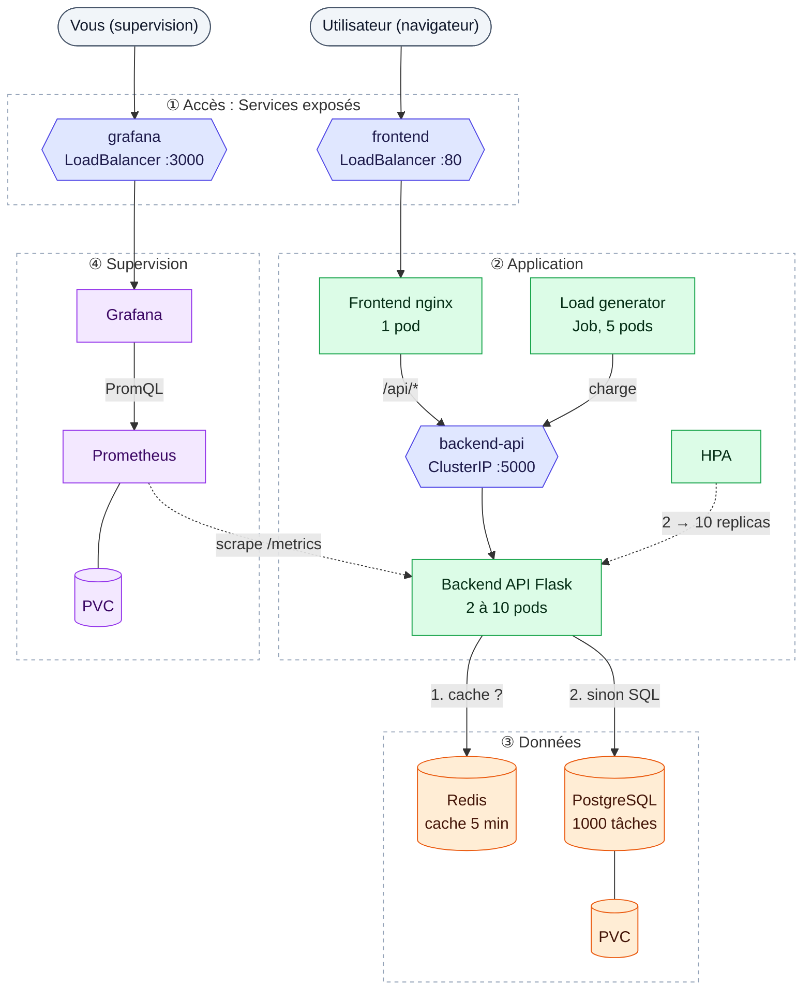

**Comment lire ce schéma :**
- **Couleurs** : 🟦 Services (adresses stables) · 🟩 application · 🟧 données · 🟪 supervision. Tout vit dans le namespace `taskflow`.
- **Flèches pleines** : le **trafic applicatif**, ce qu'une requête traverse.
- **Flèches pointillées** : le **pilotage** (HPA) et la **supervision** (Prometheus). Ils observent les pods, ils ne sont jamais sur le chemin des requêtes.
- D'où le HPA et Prometheus tirent-ils leurs chiffres ? Ce sont deux circuits différents, détaillés plus bas dans « Deux boucles à ne pas confondre ».

### Composants de l'application

| Composant | Rôle | Service | Pods | Stockage | Vu au |
|-----------|------|---------|------|----------|-------|
| **Frontend** | Sert la page HTML/JS et relaie `/api/*` vers le backend | LoadBalancer `:80` | 1 | - | TP8 (Services) |
| **Backend API** | API REST Flask : lit les tâches, calcule les stats | ClusterIP `:5000` | **2 à 10 (HPA)** | - | TP4 (HPA) |
| **PostgreSQL** | Base de données, chargée avec 1000 tâches au premier démarrage | ClusterIP `:5432` | 1 | PVC | TP3 (volumes) |
| **Redis** | Cache des réponses de l'API (5 minutes) | ClusterIP `:6379` | 1 | - | TP2 |
| **Prometheus** | Collecte et stocke les métriques | ClusterIP `:9090` | 1 | PVC | TP4 (monitoring) |
| **Grafana** | Tableaux de bord | LoadBalancer `:3000` | 1 | - | TP4 (monitoring) |
| **Load Generator** | Simule du trafic pour déclencher l'autoscaling | - (Job) | 5 | - | TP2 (Jobs) |

### Le trajet d'une requête

Quand vous ouvrez la liste des tâches, voici ce qui se passe réellement (vérifié sur cluster) :

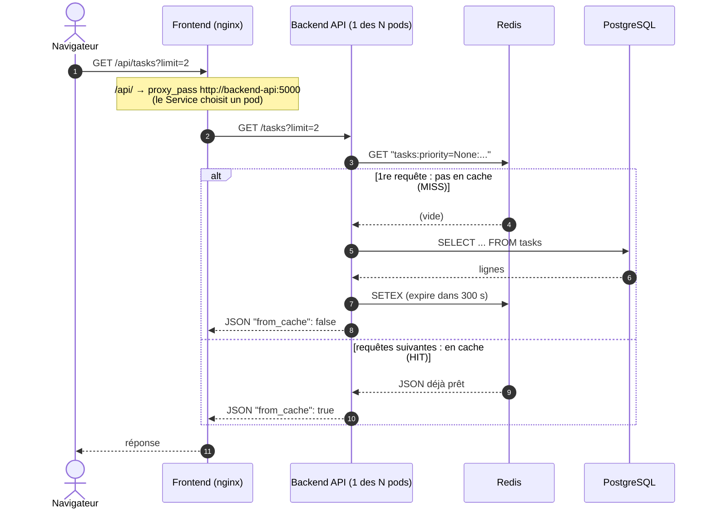

Le champ `from_cache` de la réponse vous dit quel chemin a été pris. Vous le vérifierez vous-même en 8.2.

### Deux boucles à ne pas confondre : autoscaling et monitoring

C'est la confusion la plus fréquente sur ce TP : **le HPA n'utilise pas Prometheus**, et **Grafana ne pilote rien**. Il y a deux circuits de métriques complètement indépendants :

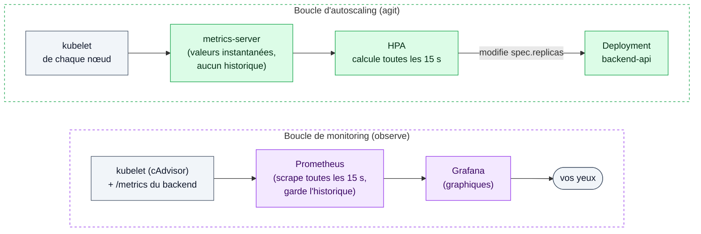

| | Boucle d'autoscaling | Boucle de monitoring |
|---|---|---|
| Source | metrics-server (API `metrics.k8s.io`) | Prometheus |
| Historique | Aucun : juste « maintenant » | Oui, stocké sur le PVC |
| Qui l'utilise | Le HPA, `kubectl top` | Grafana, vous |
| Si elle tombe en panne | **Plus d'autoscaling** (`<unknown>` dans `kubectl get hpa`) | L'application et l'autoscaling continuent, vous êtes juste aveugle |

C'est pour ça que la Partie 1 vérifie metrics-server avant tout : sans lui, le HPA ne peut rien faire, même si Prometheus et Grafana fonctionnent parfaitement.

### Le parcours du TP

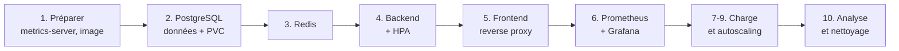

On construit **de bas en haut** : d'abord ce dont les autres dépendent (la base), puis ce qui l'utilise (le backend), puis ce qui est exposé (le frontend). La supervision vient en dernier, pour observer une application qui tourne déjà.

## 🚀 Partie 1 : Préparation de l'environnement

### 1.1 Vérifier Metrics Server

Le HPA nécessite Metrics Server pour obtenir les métriques CPU/mémoire :

```bash
# Vérifier si Metrics Server est installé
kubectl get deployment metrics-server -n kube-system
```

**Si non installé (minikube)** :
```bash
minikube addons enable metrics-server
```

**Si non installé (kubeadm)** :
```bash
kubectl apply -f https://github.com/kubernetes-sigs/metrics-server/releases/latest/download/components.yaml
```

Attendre que Metrics Server soit prêt :
```bash
kubectl wait --for=condition=available --timeout=300s deployment/metrics-server -n kube-system
```

Vérifier que les métriques sont disponibles :
```bash
kubectl top nodes
kubectl top pods -A
```

### 1.2 Créer le namespace du projet

```bash
kubectl create namespace taskflow
kubectl config set-context --current --namespace=taskflow
```

### 1.3 Vérifier les ressources disponibles

```bash
# Vérifier la RAM disponible
kubectl top nodes

# Minimum recommandé : 4 Go de RAM libre
```

### 1.4 Construire l'image Docker Backend (REQUIS)

**IMPORTANT** : Le deployment backend utilise maintenant une image Docker construite localement avec toutes les dépendances pré-installées.

**Avant de déployer l'application**, vous devez construire l'image :

```bash
cd tp10

# Construire l'image backend avec le script automatisé
./build-image.sh
```

Le script `build-image.sh` effectue les opérations suivantes :
1. ✅ Détecte automatiquement si Minikube est disponible et démarré
2. ✅ Configure l'environnement Docker approprié (Minikube ou Docker local)
3. ✅ Construit l'image `taskflow-backend:latest` avec le Dockerfile
4. ✅ Rend l'image disponible directement dans Minikube

**Vérifier que l'image est construite** :
```bash
# Configurer le shell pour utiliser Docker de Minikube
eval $(minikube docker-env)

# Lister les images disponibles
docker images | grep taskflow-backend
```

**Avantages de cette approche** :
- ✅ **Démarrage instantané** des pods (dépendances déjà installées)
- ✅ **Pas d'installation à la volée** : pas de `pip install` au démarrage
- ✅ **Image optimisée** : ~250 MB avec toutes les dépendances
- ✅ **Sécurité renforcée** : utilisateur non-root (UID 1000) pré-configuré
- ✅ **Conforme aux bonnes pratiques de production**

**Structure des fichiers** :
```
tp10/
├── Dockerfile                   # Définition de l'image backend
├── app.py                       # Code Python de l'API backend
├── requirements.txt             # Dépendances Python
├── build-image.sh               # Script de build automatisé
└── 09b-backend-deployment.yaml   # Utilise taskflow-backend:latest
```

**Configuration du Deployment** :
Le fichier `09b-backend-deployment.yaml` est configuré pour utiliser l'image locale :
```yaml
apiVersion: apps/v1
kind: Deployment
metadata:
  name: backend-api
  namespace: taskflow
  labels:
    app: backend-api
    tier: application
spec:
  replicas: 2
  selector:
    matchLabels:
      app: backend-api
  template:
    metadata:
      labels:
        app: backend-api
        tier: application
      annotations:
        prometheus.io/scrape: "true"
        prometheus.io/port: "5000"
        prometheus.io/path: "/metrics"
    spec:
      securityContext:
        runAsNonRoot: true
        runAsUser: 1000
        fsGroup: 1000
        seccompProfile:
          type: RuntimeDefault

      containers:
      - name: api
        image: taskflow-backend:latest
        imagePullPolicy: Never
        workingDir: /app
        ports:
        - containerPort: 5000
          name: http
        securityContext:
          allowPrivilegeEscalation: false
          readOnlyRootFilesystem: true
          runAsNonRoot: true
          runAsUser: 1000
          capabilities:
            drop:
            - ALL
        env:
        - name: DATABASE_USER
          valueFrom:
            secretKeyRef:
              name: postgres-secret
              key: POSTGRES_USER
        - name: DATABASE_PASSWORD
          valueFrom:
            secretKeyRef:
              name: postgres-secret
              key: POSTGRES_PASSWORD
        envFrom:
        - configMapRef:
            name: backend-config
        volumeMounts:
        - name: app-code
          mountPath: /app
        - name: home
          mountPath: /home/appuser
        - name: tmp
          mountPath: /tmp
        resources:
          requests:
            memory: "128Mi"
            cpu: "100m"
          limits:
            memory: "256Mi"
            cpu: "500m"
        livenessProbe:
          httpGet:
            path: /health
            port: 5000
          initialDelaySeconds: 30
          periodSeconds: 10
        readinessProbe:
          httpGet:
            path: /ready
            port: 5000
          initialDelaySeconds: 15
          periodSeconds: 5

      volumes:
      - name: app-code
        configMap:
          name: backend-app-code
      - name: home
        emptyDir: {}
      - name: tmp
        emptyDir: {}
```

## 📦 Partie 2 : Déploiement de la base de données PostgreSQL avec initContainer

### 2.1 Comprendre l'objectif

PostgreSQL doit démarrer **avec une table `tasks` déjà remplie de 1000 tâches**, pour que l'application ait quelque chose à afficher et que le test de charge travaille sur des données réalistes.

On n'écrit pas de code pour ça : on utilise une convention de l'**image officielle `postgres`**. Au **tout premier démarrage** (répertoire de données vide), son script d'entrée exécute automatiquement tous les fichiers `.sql` et `.sh` qu'il trouve dans `/docker-entrypoint-initdb.d/`. Il suffit donc de monter notre script SQL à cet endroit, depuis une ConfigMap :

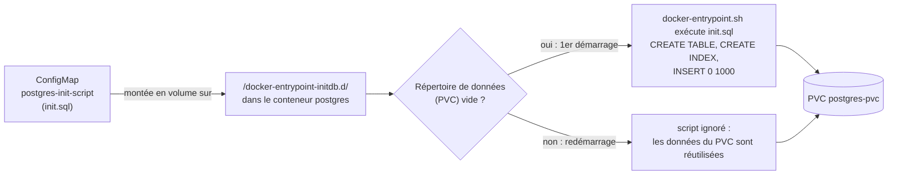

> ⚠️ **Conséquence à retenir** : modifier `init.sql` puis redémarrer le pod **ne change rien** tant que le PVC contient déjà une base. Le script ne tourne qu'une fois dans la vie du volume. Pour le rejouer, il faut supprimer le PVC (et donc les données).

Et l'**initContainer** ? Il n'est pas là. Un initContainer sert à préparer ou attendre quelque chose **avant** qu'un conteneur démarre. Ici, c'est le **backend** qui a besoin d'attendre que la base soit prête : c'est donc dans le Deployment du backend que vous le trouverez (section 4.2).

### 2.2 ConfigMap pour le script d'initialisation

Créer `01-postgres-init-script.yaml` :

```yaml
apiVersion: v1
kind: ConfigMap
metadata:
  name: postgres-init-script
  namespace: taskflow
data:
  init.sql: |
    -- Créer la table tasks
    CREATE TABLE IF NOT EXISTS tasks (
        id SERIAL PRIMARY KEY,
        title VARCHAR(255) NOT NULL,
        description TEXT,
        completed BOOLEAN DEFAULT FALSE,
        priority VARCHAR(20) DEFAULT 'medium',
        created_at TIMESTAMP DEFAULT CURRENT_TIMESTAMP,
        updated_at TIMESTAMP DEFAULT CURRENT_TIMESTAMP
    );

    -- Créer un index pour les performances
    CREATE INDEX IF NOT EXISTS idx_tasks_completed ON tasks(completed);
    CREATE INDEX IF NOT EXISTS idx_tasks_priority ON tasks(priority);

    -- Générer 1000 tâches de test
    INSERT INTO tasks (title, description, completed, priority)
    SELECT
        'Task ' || generate_series,
        'Description for task ' || generate_series,
        (random() > 0.7)::boolean,  -- 30% de tâches complétées
        CASE
            WHEN random() < 0.2 THEN 'low'
            WHEN random() < 0.7 THEN 'medium'
            ELSE 'high'
        END
    FROM generate_series(1, 1000);

    -- Afficher les statistiques
    SELECT
        COUNT(*) as total_tasks,
        SUM(CASE WHEN completed THEN 1 ELSE 0 END) as completed_tasks,
        SUM(CASE WHEN NOT completed THEN 1 ELSE 0 END) as pending_tasks
    FROM tasks;
```

Appliquer :
```bash
kubectl apply -f 01-postgres-init-script.yaml
```

### 2.3 Secret pour les credentials PostgreSQL

Créer `02-postgres-secret.yaml` :

```yaml
apiVersion: v1
kind: Secret
metadata:
  name: postgres-secret
  namespace: taskflow
type: Opaque
stringData:
  POSTGRES_USER: taskflow
  POSTGRES_PASSWORD: taskflow2024
  POSTGRES_DB: taskflow_db
```

Appliquer :
```bash
kubectl apply -f 02-postgres-secret.yaml
```

### 2.4 PersistentVolumeClaim pour PostgreSQL

Créer `03-postgres-pvc.yaml` :

```yaml
apiVersion: v1
kind: PersistentVolumeClaim
metadata:
  name: postgres-pvc
  namespace: taskflow
spec:
  accessModes:
    - ReadWriteOnce
  resources:
    requests:
      storage: 2Gi
  storageClassName: standard
```

Appliquer :
```bash
kubectl apply -f 03-postgres-pvc.yaml
```

### 2.5 Deployment PostgreSQL avec initContainer

Créer `04-postgres-deployment.yaml` :

```yaml
apiVersion: apps/v1
kind: Deployment
metadata:
  name: postgres
  namespace: taskflow
  labels:
    app: postgres
    tier: database
spec:
  replicas: 1
  selector:
    matchLabels:
      app: postgres
  strategy:
    type: Recreate
  template:
    metadata:
      labels:
        app: postgres
        tier: database
    spec:
      securityContext:
        runAsNonRoot: true
        runAsUser: 70
        fsGroup: 70
        seccompProfile:
          type: RuntimeDefault

      containers:
      - name: postgres
        image: postgres:17-alpine
        ports:
        - containerPort: 5432
          name: postgres
        securityContext:
          allowPrivilegeEscalation: false
          readOnlyRootFilesystem: true
          runAsNonRoot: true
          runAsUser: 70
          capabilities:
            drop:
            - ALL
        envFrom:
        - secretRef:
            name: postgres-secret
        env:
        # PGDATA doit pointer vers un sous-répertoire pour permettre l'initialisation
        - name: PGDATA
          value: /var/lib/postgresql/data/pgdata
        volumeMounts:
        - name: postgres-storage
          mountPath: /var/lib/postgresql/data
          # Note: subPath removed to allow fsGroup to work correctly
        - name: init-script
          mountPath: /docker-entrypoint-initdb.d
        - name: tmp
          mountPath: /tmp
        - name: run
          mountPath: /var/run/postgresql
        resources:
          requests:
            memory: "256Mi"
            cpu: "250m"
          limits:
            memory: "512Mi"
            cpu: "500m"
        livenessProbe:
          exec:
            command:
            - pg_isready
            - -U
            - taskflow
            # -d explicite : sans lui, pg_isready cible par défaut une base
            # nommée comme l'utilisateur ("taskflow"), qui n'existe pas - la
            # vraie base est "taskflow_db" (POSTGRES_DB dans le Secret).
            # pg_isready traite quand même un rejet "database does not
            # exist" comme "serveur accepte les connexions" (il ne teste que
            # l'atteignabilité du serveur, pas l'auth complète), donc le pod
            # passait Ready malgré tout - mais ça spamme les logs en continu.
            - -d
            - taskflow_db
          initialDelaySeconds: 30
          periodSeconds: 10
        readinessProbe:
          exec:
            command:
            - pg_isready
            - -U
            - taskflow
            - -d
            - taskflow_db
          initialDelaySeconds: 5
          periodSeconds: 5

      volumes:
      - name: postgres-storage
        persistentVolumeClaim:
          claimName: postgres-pvc
      - name: init-script
        configMap:
          name: postgres-init-script
      - name: tmp
        emptyDir: {}
      - name: run
        emptyDir: {}
```

**Points clés à comprendre** :
- La ConfigMap `postgres-init-script` est montée sur `/docker-entrypoint-initdb.d/` : l'image `postgres` exécute `init.sql` **au premier démarrage uniquement** (voir 2.1)
- Les **1000 tâches** sont créées à ce moment-là
- Le **PVC** garantit la persistance des données : aux démarrages suivants, le script n'est pas rejoué
- La `readinessProbe` (`pg_isready`) empêche le Service d'envoyer du trafic avant que la base accepte les connexions

**⚠️ Important sur `replicas: 1` et `strategy: Recreate`** :

**Pourquoi une seule replica ?**
- PostgreSQL est une base de données **stateful** (avec état)
- Plusieurs replicas écrivant sur le **même PVC** causeraient une **corruption de données**
- PostgreSQL ne supporte pas nativement l'écriture multi-master
- Pour la haute disponibilité, il faut configurer une réplication PostgreSQL complexe (streaming replication, patroni, etc.)

**Pourquoi `strategy: Recreate` ?**
- `Recreate` **arrête** l'ancien pod **avant** de démarrer le nouveau
- Évite que 2 pods PostgreSQL tentent d'accéder au même PVC simultanément
- Garantit qu'un seul pod écrit dans la base à la fois
- Alternative : `RollingUpdate` causerait des erreurs car le nouveau pod ne pourrait pas démarrer tant que l'ancien utilise le volume

**Pour la production** :
- ✅ PostgreSQL en `replicas: 1` avec PVC pour un TP/dev
- ✅ Pour la production : utiliser un **StatefulSet** avec réplication PostgreSQL
- ✅ Ou utiliser un service managé (AWS RDS, Google Cloud SQL, Azure Database)
- ❌ Ne JAMAIS mettre `replicas: 2+` avec un Deployment + PVC unique

Appliquer :
```bash
kubectl apply -f 04-postgres-deployment.yaml
```

### 2.6 Service PostgreSQL

Créer `05-postgres-service.yaml` :

```yaml
apiVersion: v1
kind: Service
metadata:
  name: postgres
  namespace: taskflow
  labels:
    app: postgres
spec:
  type: ClusterIP
  ports:
  - port: 5432
    targetPort: 5432
    protocol: TCP
    name: postgres
  selector:
    app: postgres
```

Appliquer :
```bash
kubectl apply -f 05-postgres-service.yaml
```

### 2.7 Vérifier le déploiement PostgreSQL

```bash
# Voir le déploiement
kubectl get deployment postgres

# Voir le pod
kubectl get pods -l app=postgres

# Voir l'exécution du script d'initialisation dans les logs
kubectl logs -l app=postgres -c postgres | grep -A5 "docker-entrypoint-initdb.d"
# Attendu :
# /usr/local/bin/docker-entrypoint.sh: running /docker-entrypoint-initdb.d/init.sql
# CREATE TABLE
# CREATE INDEX
# CREATE INDEX
# INSERT 0 1000

# Se connecter à PostgreSQL et vérifier les données
kubectl exec -it deployment/postgres -- psql -U taskflow -d taskflow_db -c "SELECT COUNT(*) FROM tasks;"
```

Vous devriez voir **1000 tâches** dans la base de données !

## 📦 Partie 3 : Déploiement de Redis (Cache)

### 3.1 Deployment Redis

Créer `06-redis-deployment.yaml` :

```yaml
apiVersion: apps/v1
kind: Deployment
metadata:
  name: redis
  namespace: taskflow
  labels:
    app: redis
    tier: cache
spec:
  replicas: 1
  selector:
    matchLabels:
      app: redis
  template:
    metadata:
      labels:
        app: redis
        tier: cache
    spec:
      securityContext:
        runAsNonRoot: true
        runAsUser: 999
        fsGroup: 999
        seccompProfile:
          type: RuntimeDefault

      containers:
      - name: redis
        image: redis:7.4-alpine
        ports:
        - containerPort: 6379
          name: redis
        command:
        - redis-server
        - --maxmemory
        - "128mb"
        - --maxmemory-policy
        - "allkeys-lru"
        securityContext:
          allowPrivilegeEscalation: false
          readOnlyRootFilesystem: true
          runAsNonRoot: true
          runAsUser: 999
          capabilities:
            drop:
            - ALL
        volumeMounts:
        - name: data
          mountPath: /data
        resources:
          requests:
            memory: "64Mi"
            cpu: "100m"
          limits:
            memory: "128Mi"
            cpu: "200m"
        livenessProbe:
          tcpSocket:
            port: 6379
          initialDelaySeconds: 15
          periodSeconds: 10
        readinessProbe:
          exec:
            command:
            - redis-cli
            - ping
          initialDelaySeconds: 5
          periodSeconds: 5

      volumes:
      - name: data
        emptyDir: {}
```

Appliquer :
```bash
kubectl apply -f 06-redis-deployment.yaml
```

### 3.2 Service Redis

Créer `07-redis-service.yaml` :

```yaml
apiVersion: v1
kind: Service
metadata:
  name: redis
  namespace: taskflow
  labels:
    app: redis
spec:
  type: ClusterIP
  ports:
  - port: 6379
    targetPort: 6379
    protocol: TCP
    name: redis
  selector:
    app: redis
```

Appliquer :
```bash
kubectl apply -f 07-redis-service.yaml
```

## 🔧 Partie 4 : Backend API avec HPA (Auto-scaling)

### 4.1 ConfigMap pour la configuration API

Créer `08-backend-config.yaml` :

```yaml
apiVersion: v1
kind: ConfigMap
metadata:
  name: backend-config
  namespace: taskflow
data:
  DATABASE_HOST: postgres
  DATABASE_PORT: "5432"
  DATABASE_NAME: taskflow_db
  REDIS_HOST: redis
  REDIS_PORT: "6379"
  CACHE_TTL: "300"
  LOG_LEVEL: "INFO"
```

Appliquer :
```bash
kubectl apply -f 08-backend-config.yaml
```

### 4.2 Deployment Backend API

Créer `09b-backend-deployment.yaml` :

```yaml
apiVersion: apps/v1
kind: Deployment
metadata:
  name: backend-api
  namespace: taskflow
  labels:
    app: backend-api
    tier: application
spec:
  replicas: 2
  selector:
    matchLabels:
      app: backend-api
  template:
    metadata:
      labels:
        app: backend-api
        tier: application
      annotations:
        prometheus.io/scrape: "true"
        prometheus.io/port: "5000"
        prometheus.io/path: "/metrics"
    spec:
      securityContext:
        runAsNonRoot: true
        runAsUser: 1000
        fsGroup: 1000
        seccompProfile:
          type: RuntimeDefault

      # Attente active de PostgreSQL : sans elle, les pods backend démarrent
      # souvent avant la base (Deployments appliqués en même temps, PostgreSQL
      # met plusieurs secondes à exécuter init.sql), échouent leur readiness et
      # redémarrent. Le conteneur "api" ne démarre qu'une fois cet init terminé.
      initContainers:
      - name: wait-for-postgres
        image: postgres:17-alpine   # même image que la base : fournit pg_isready
        command:
        - sh
        - -c
        - |
          until pg_isready -h "$DATABASE_HOST" -p "$DATABASE_PORT" -U "$DATABASE_USER" -d "$DATABASE_NAME"; do
            echo "PostgreSQL pas encore prêt, nouvel essai dans 2 s..."
            sleep 2
          done
          echo "PostgreSQL prêt, démarrage de l'API."
        env:
        - name: DATABASE_USER
          valueFrom:
            secretKeyRef:
              name: postgres-secret
              key: POSTGRES_USER
        envFrom:
        - configMapRef:
            name: backend-config
        securityContext:
          allowPrivilegeEscalation: false
          readOnlyRootFilesystem: true
          runAsNonRoot: true
          runAsUser: 70
          capabilities:
            drop:
            - ALL
        resources:
          requests:
            memory: "16Mi"
            cpu: "10m"
          limits:
            memory: "32Mi"
            cpu: "50m"

      containers:
      - name: api
        image: taskflow-backend:latest
        imagePullPolicy: Never
        workingDir: /app
        ports:
        - containerPort: 5000
          name: http
        securityContext:
          allowPrivilegeEscalation: false
          readOnlyRootFilesystem: true
          runAsNonRoot: true
          runAsUser: 1000
          capabilities:
            drop:
            - ALL
        env:
        - name: DATABASE_USER
          valueFrom:
            secretKeyRef:
              name: postgres-secret
              key: POSTGRES_USER
        - name: DATABASE_PASSWORD
          valueFrom:
            secretKeyRef:
              name: postgres-secret
              key: POSTGRES_PASSWORD
        envFrom:
        - configMapRef:
            name: backend-config
        volumeMounts:
        - name: app-code
          mountPath: /app
        - name: home
          mountPath: /home/appuser
        - name: tmp
          mountPath: /tmp
        resources:
          requests:
            memory: "128Mi"
            cpu: "100m"
          limits:
            memory: "256Mi"
            cpu: "500m"
        livenessProbe:
          httpGet:
            path: /health
            port: 5000
          initialDelaySeconds: 30
          periodSeconds: 10
        readinessProbe:
          httpGet:
            path: /ready
            port: 5000
          initialDelaySeconds: 15
          periodSeconds: 5

      volumes:
      - name: app-code
        configMap:
          name: backend-app-code
      - name: home
        emptyDir: {}
      - name: tmp
        emptyDir: {}
```

**Trois choses à comprendre dans ce Deployment :**

**1. L'initContainer `wait-for-postgres`.** Tous les Deployments sont appliqués à peu près en même temps, mais PostgreSQL met plusieurs secondes à démarrer (et plus encore la première fois, pendant qu'il exécute `init.sql`). Sans précaution, l'API démarrerait avant la base, échouerait ses premières connexions et redémarrerait. L'initContainer boucle sur `pg_isready` jusqu'à ce que la base réponde, et Kubernetes ne lance le conteneur `api` **qu'après sa réussite** :

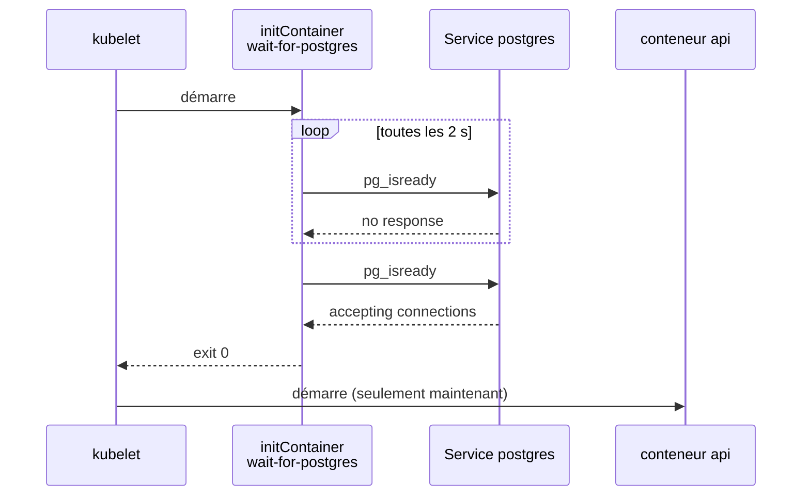

Sur notre cluster de test, avec tout appliqué d'un coup, les logs de l'initContainer montraient 5 échecs (environ 10 secondes) avant `accepting connections`, puis l'API démarrait sans aucun redémarrage. C'est l'équivalent Kubernetes du `depends_on` de Docker Compose, en mieux : il attend que le service **réponde**, pas seulement qu'il soit lancé (voir la fiche du TP7).

**2. D'où vient le code de l'API ?** Pas de l'image, en réalité :

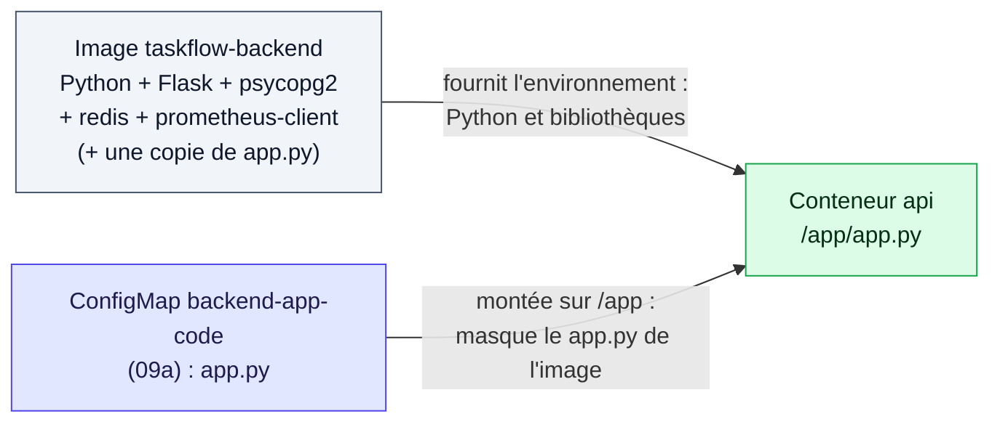

L'image fournit les **dépendances** ; la ConfigMap fournit le **code**, monté par-dessus `/app`. Avantage pour la formation : modifier le code se fait avec `kubectl apply -f 09a-backend-app-code.yaml` puis `kubectl rollout restart deployment/backend-api`, sans reconstruire d'image. En production, on ferait l'inverse (code dans l'image, versionné par son tag).

**3. Les `requests`.** `requests.cpu: 100m` n'est pas qu'une réservation : c'est la **référence** du HPA. « 50 % de CPU » veut dire 50 % de 100m, soit 50 millicœurs, **pas** 50 % d'un cœur (voir 4.4). Sans `requests`, le HPA ne peut pas calculer de pourcentage et affiche `<unknown>`.

Appliquer (la ConfigMap du code doit être créée **avant** le Deployment qui la monte) :
```bash
kubectl apply -f 09a-backend-app-code.yaml
kubectl apply -f 09b-backend-deployment.yaml
```

### 4.3 Service Backend API

Créer `10-backend-service.yaml` :

```yaml
apiVersion: v1
kind: Service
metadata:
  name: backend-api
  namespace: taskflow
  labels:
    app: backend-api
spec:
  type: ClusterIP
  ports:
  - port: 5000
    targetPort: 5000
    protocol: TCP
    name: http
  selector:
    app: backend-api
```

Appliquer :
```bash
kubectl apply -f 10-backend-service.yaml
```

### 4.4 HorizontalPodAutoscaler (HPA)

Le HPA (HorizontalPodAutoscaler) ajuste le nombre de pods du backend pour que la consommation **moyenne** reste proche d'une cible. Ce n'est pas de la magie : c'est une boucle de contrôle qui refait le même calcul toutes les 15 secondes.

Créer `11-backend-hpa.yaml` :

```yaml
apiVersion: autoscaling/v2
kind: HorizontalPodAutoscaler
metadata:
  name: backend-api-hpa
  namespace: taskflow
spec:
  scaleTargetRef:
    apiVersion: apps/v1
    kind: Deployment
    name: backend-api
  minReplicas: 2
  maxReplicas: 10
  metrics:
  - type: Resource
    resource:
      name: cpu
      target:
        type: Utilization
        averageUtilization: 50
  - type: Resource
    resource:
      name: memory
      target:
        type: Utilization
        averageUtilization: 70
  behavior:
    scaleDown:
      stabilizationWindowSeconds: 60
      policies:
      - type: Percent
        value: 50
        periodSeconds: 60
    scaleUp:
      stabilizationWindowSeconds: 0
      policies:
      - type: Percent
        value: 100
        periodSeconds: 15
      - type: Pods
        value: 4
        periodSeconds: 15
      selectPolicy: Max
```

#### Comment le HPA décide

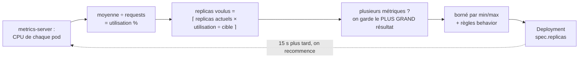

**Exemple chiffré** avec ce TP (requests CPU = `100m`, cible = 50 %) :

| Situation | Calcul | Résultat |
|---|---|---|
| Au repos : 2 pods à 2m de CPU chacun | 2m ÷ 100m = 2 % → ⌈2 × 2 ÷ 50⌉ = 1 | **2** (on ne descend pas sous `minReplicas`) |
| Sous charge : 2 pods à 200m chacun | 200m ÷ 100m = 200 % → ⌈2 × 200 ÷ 50⌉ = 8 | **8** (mais `behavior` limite le saut, voir ci-dessous) |
| 8 pods à 60m chacun | 60 % → ⌈8 × 60 ÷ 50⌉ = ⌈9,6⌉ | **10** |
| Charge arrêtée : 10 pods à 2m | 2 % → ⌈10 × 2 ÷ 50⌉ = 1 | **2**, mais progressivement (`scaleDown`) |

La mémoire (cible 70 %) est calculée de la même façon, et le HPA retient la métrique qui demande **le plus** de pods. Un écart de moins de 10 % autour de la cible est ignoré, pour éviter les oscillations.

#### Les paramètres

| Paramètre | Valeur | Effet |
|---|---|---|
| `minReplicas` | 2 | Jamais moins de 2 pods : si l'un tombe, l'autre répond |
| `maxReplicas` | 10 | Plafond : protège le cluster d'une charge anormale |
| CPU `averageUtilization` | 50 % | Cible : 50 % des `requests`, soit 50m par pod |
| Mémoire `averageUtilization` | 70 % | Cible : 70 % de 128Mi |
| `scaleUp.stabilizationWindowSeconds` | 0 | Réagit immédiatement à une hausse |
| `scaleUp.policies` | +100 % **ou** +4 pods / 15 s, `selectPolicy: Max` | À chaque tour, on peut ajouter le plus grand des deux : doubler, ou +4 |
| `scaleDown.stabilizationWindowSeconds` | 60 | Avant de réduire, attend que la baisse dure 60 s |
| `scaleDown.policies` | −50 % / 60 s | Retire au plus la moitié des pods par minute |

**Pourquoi monter vite et descendre lentement ?** Manquer de pods pendant un pic coûte des erreurs aux utilisateurs ; garder quelques pods de trop pendant une minute ne coûte qu'un peu de ressources. Et une charge qui baisse une seconde peut remonter la suivante : la fenêtre de 60 s évite de supprimer des pods pour les recréer aussitôt.

Appliquer :
```bash
kubectl apply -f 11-backend-hpa.yaml
```

Vérifier le HPA :
```bash
# Voir l'état du HPA
kubectl get hpa backend-api-hpa

# Observer en temps réel (watch mode)
kubectl get hpa backend-api-hpa -w
```

## 🌐 Partie 5 : Frontend et Exposition

**📌 Note importante sur l'architecture Frontend/Backend** :

Le frontend est une application HTML/JavaScript statique servie par Nginx. Lorsqu'un utilisateur accède au frontend depuis son navigateur, le JavaScript s'exécute **côté client** (dans le navigateur).

**Problème** : Les URLs internes Kubernetes (comme `http://backend-api.taskflow.svc.cluster.local:5000`) ne sont pas accessibles depuis le navigateur du client car :
- Le navigateur ne peut pas résoudre les DNS `.svc.cluster.local` (internes à Kubernetes)
- Le navigateur ne peut pas atteindre les IPs internes du cluster

**Solution** : Nous configurons **Nginx comme reverse proxy**. Le frontend utilise une URL relative (`/api`) et Nginx redirige les requêtes vers le service backend interne.

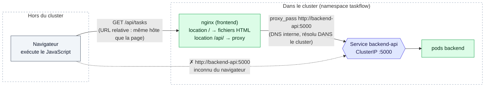

Le navigateur ne parle **qu'à nginx**, à la même adresse que la page. C'est nginx, qui tourne dans le cluster, qui sait résoudre `backend-api`.

### 5.1 Configuration Nginx avec Reverse Proxy

Créer `12b-frontend-nginx-config.yaml` :

```yaml
apiVersion: v1
kind: ConfigMap
metadata:
  name: frontend-nginx-config
  namespace: taskflow
  labels:
    app: frontend
data:
  nginx.conf: |
    # Configuration Nginx optimisée pour Alpine avec reverse proxy vers backend API

    # Utilisateur nginx (UID 101 pour nginx:alpine)
    user nginx;

    # Nombre de workers (auto = nombre de CPU)
    worker_processes auto;

    # Fichier PID (dans /var/run qui est un emptyDir)
    pid /var/run/nginx.pid;

    # Gestion des événements
    events {
        worker_connections 1024;
    }

    # Configuration HTTP
    http {
        # Types MIME
        include /etc/nginx/mime.types;
        default_type application/octet-stream;

        # Logging (vers stdout/stderr pour Kubernetes)
        access_log /dev/stdout;
        error_log /dev/stderr warn;

        # Performance
        sendfile on;
        tcp_nopush on;
        tcp_nodelay on;
        keepalive_timeout 65;
        types_hash_max_size 2048;

        # Gzip compression
        gzip on;
        gzip_vary on;
        gzip_min_length 1000;
        gzip_types text/plain text/css application/json application/javascript text/xml application/xml text/javascript;

        # Serveur principal
        server {
            listen 80;
            server_name _;

            # Root directory (ConfigMap monté)
            root /usr/share/nginx/html;
            index index.html;

            # Frontend - Servir l'application HTML/JS
            location / {
                try_files $uri $uri/ /index.html;

                # Headers de sécurité
                add_header X-Content-Type-Options "nosniff" always;
                add_header X-Frame-Options "SAMEORIGIN" always;
                add_header X-XSS-Protection "1; mode=block" always;
            }

            # API Backend - Reverse proxy vers le service backend-api
            location /api/ {
                # Supprimer le préfixe /api avant de transférer
                rewrite ^/api/(.*) /$1 break;

                # Proxy vers le service Kubernetes backend-api
                proxy_pass http://backend-api:5000;

                # Headers de proxy standards
                proxy_set_header Host $host;
                proxy_set_header X-Real-IP $remote_addr;
                proxy_set_header X-Forwarded-For $proxy_add_x_forwarded_for;
                proxy_set_header X-Forwarded-Proto $scheme;

                # Timeouts
                proxy_connect_timeout 30s;
                proxy_send_timeout 30s;
                proxy_read_timeout 30s;

                # Buffers
                proxy_buffering on;
                proxy_buffer_size 4k;
                proxy_buffers 8 4k;
                proxy_busy_buffers_size 8k;
            }

            # Health check endpoint
            location /health {
                access_log off;
                return 200 "healthy\n";
                add_header Content-Type text/plain;
            }
        }
    }
```

**Explication de la configuration** :
- `location /` : Sert les fichiers statiques du frontend (HTML/CSS/JS)
- `location /api/` : Reverse proxy vers le backend
  - `rewrite ^/api/(.*) /$1 break` : Supprime le préfixe `/api` (ex: `/api/tasks` → `/tasks`)
  - `proxy_pass http://backend-api:5000` : Redirige vers le service backend interne
  - Headers de proxy pour préserver l'information du client

Appliquer :
```bash
kubectl apply -f 12b-frontend-nginx-config.yaml
```

### 5.2 ConfigMap pour le Frontend HTML

Créer `12a-frontend-config.yaml` :

```yaml
apiVersion: v1
kind: ConfigMap
metadata:
  name: frontend-html
  namespace: taskflow
data:
  index.html: |
    <!DOCTYPE html>
    <html lang="fr">
    <head>
        <meta charset="UTF-8">
        <meta name="viewport" content="width=device-width, initial-scale=1.0">
        <title>TaskFlow - Gestion de Tâches</title>
        <style>
            * { margin: 0; padding: 0; box-sizing: border-box; }
            body {
                font-family: 'Segoe UI', Tahoma, Geneva, Verdana, sans-serif;
                background: linear-gradient(135deg, #667eea 0%, #764ba2 100%);
                min-height: 100vh;
                padding: 20px;
            }
            .container {
                max-width: 1200px;
                margin: 0 auto;
                background: white;
                border-radius: 15px;
                box-shadow: 0 20px 60px rgba(0,0,0,0.3);
                overflow: hidden;
            }
            header {
                background: linear-gradient(135deg, #667eea 0%, #764ba2 100%);
                color: white;
                padding: 30px;
                text-align: center;
            }
            h1 { font-size: 2.5em; margin-bottom: 10px; }
            .stats {
                display: flex;
                justify-content: space-around;
                padding: 20px;
                background: #f8f9fa;
                border-bottom: 1px solid #dee2e6;
            }
            .stat-box {
                text-align: center;
                padding: 15px;
            }
            .stat-number {
                font-size: 2em;
                font-weight: bold;
                color: #667eea;
            }
            .stat-label {
                color: #6c757d;
                margin-top: 5px;
            }
            .tasks {
                padding: 20px;
                max-height: 600px;
                overflow-y: auto;
            }
            .task {
                background: white;
                border: 1px solid #dee2e6;
                border-radius: 8px;
                padding: 15px;
                margin-bottom: 10px;
                display: flex;
                justify-content: space-between;
                align-items: center;
                transition: all 0.3s;
            }
            .task:hover {
                box-shadow: 0 4px 12px rgba(0,0,0,0.1);
                transform: translateY(-2px);
            }
            .task.completed {
                opacity: 0.6;
                text-decoration: line-through;
            }
            .priority {
                display: inline-block;
                padding: 4px 12px;
                border-radius: 12px;
                font-size: 0.85em;
                font-weight: bold;
                margin-left: 10px;
            }
            .priority-high { background: #dc3545; color: white; }
            .priority-medium { background: #ffc107; color: black; }
            .priority-low { background: #28a745; color: white; }
            .loading {
                text-align: center;
                padding: 40px;
                font-size: 1.2em;
                color: #6c757d;
            }
            .error {
                background: #f8d7da;
                color: #721c24;
                padding: 20px;
                margin: 20px;
                border-radius: 8px;
                border: 1px solid #f5c6cb;
            }
            .controls {
                padding: 20px;
                background: #f8f9fa;
                border-top: 1px solid #dee2e6;
                text-align: center;
            }
            button {
                background: linear-gradient(135deg, #667eea 0%, #764ba2 100%);
                color: white;
                border: none;
                padding: 12px 30px;
                border-radius: 25px;
                font-size: 1em;
                cursor: pointer;
                margin: 5px;
                transition: transform 0.2s;
            }
            button:hover {
                transform: scale(1.05);
            }
            button:active {
                transform: scale(0.95);
            }
        </style>
    </head>
    <body>
        <div class="container">
            <header>
                <h1>📋 TaskFlow</h1>
                <p>Projet de Synthèse Kubernetes - Auto-scaling et Monitoring</p>
            </header>

            <div class="stats" id="stats">
                <div class="stat-box">
                    <div class="stat-number" id="totalTasks">-</div>
                    <div class="stat-label">Total Tâches</div>
                </div>
                <div class="stat-box">
                    <div class="stat-number" id="completedTasks">-</div>
                    <div class="stat-label">Complétées</div>
                </div>
                <div class="stat-box">
                    <div class="stat-number" id="pendingTasks">-</div>
                    <div class="stat-label">En cours</div>
                </div>
            </div>

            <div class="controls">
                <button onclick="loadTasks()">🔄 Rafraîchir</button>
                <button onclick="loadTasks('high')">🔴 Priorité Haute</button>
                <button onclick="loadTasks('medium')">🟡 Priorité Moyenne</button>
                <button onclick="loadTasks('low')">🟢 Priorité Basse</button>
            </div>

            <div class="tasks" id="tasksList">
                <div class="loading">Chargement des tâches...</div>
            </div>
        </div>

        <script>
            // Utiliser une URL relative car Nginx proxie /api vers le backend
            const API_URL = '/api';

            async function loadTasks(priority = null) {
                const tasksList = document.getElementById('tasksList');
                tasksList.innerHTML = '<div class="loading">Chargement...</div>';

                try {
                    const url = priority ? API_URL + '/tasks?priority=' + priority : API_URL + '/tasks';
                    const response = await fetch(url);

                    if (!response.ok) {
                        throw new Error('HTTP ' + response.status);
                    }

                    const data = await response.json();
                    displayTasks(data.tasks);
                    updateStats(data.stats);
                } catch (error) {
                    tasksList.innerHTML = '<div class="error"><strong>Erreur de connexion à l\'API</strong><br>' + error.message + '<br><small>Vérifiez que le backend est déployé et accessible</small></div>';
                }
            }

            function displayTasks(tasks) {
                const tasksList = document.getElementById('tasksList');

                if (!tasks || tasks.length === 0) {
                    tasksList.innerHTML = '<div class="loading">Aucune tâche trouvée</div>';
                    return;
                }

                tasksList.innerHTML = tasks.map(task =>
                    '<div class="task ' + (task.completed ? 'completed' : '') + '">' +
                        '<div>' +
                            '<strong>' + task.title + '</strong>' +
                            '<span class="priority priority-' + task.priority + '">' + task.priority + '</span>' +
                            '<div style="color: #6c757d; margin-top: 5px; font-size: 0.9em;">' +
                                task.description +
                            '</div>' +
                        '</div>' +
                        '<div>' + (task.completed ? '✅' : '⏳') + '</div>' +
                    '</div>'
                ).join('');
            }

            function updateStats(stats) {
                if (stats) {
                    document.getElementById('totalTasks').textContent = stats.total || 0;
                    document.getElementById('completedTasks').textContent = stats.completed || 0;
                    document.getElementById('pendingTasks').textContent = stats.pending || 0;
                }
            }

            // Charger les tâches au démarrage
            loadTasks();

            // Auto-refresh toutes les 30 secondes
            setInterval(function() { loadTasks(); }, 30000);
        </script>
    </body>
    </html>
```

Appliquer :
```bash
kubectl apply -f 12a-frontend-config.yaml
```

### 5.3 Deployment Frontend

Créer `13-frontend-deployment.yaml` :

```yaml
apiVersion: apps/v1
kind: Deployment
metadata:
  name: frontend
  namespace: taskflow
  labels:
    app: frontend
    tier: presentation
spec:
  replicas: 1
  selector:
    matchLabels:
      app: frontend
  template:
    metadata:
      labels:
        app: frontend
        tier: presentation
    spec:
      securityContext:
        runAsNonRoot: true
        runAsUser: 101
        fsGroup: 101
        seccompProfile:
          type: RuntimeDefault
        # nginx écoute sur le port 80 en non-root sans aucune capability :
        # containerd (microk8s, minikube récent) refuse ce bind sans ce sysctl
        # "safe" -> CrashLoopBackOff sur "bind() to 0.0.0.0:80 failed (13)".
        sysctls:
        - name: net.ipv4.ip_unprivileged_port_start
          value: "0"

      containers:
      - name: nginx
        image: telemachlearning/nginx:1.29-alpine
        ports:
        - containerPort: 80
          name: http
        securityContext:
          allowPrivilegeEscalation: false
          readOnlyRootFilesystem: true
          runAsNonRoot: true
          runAsUser: 101
          capabilities:
            drop:
            - ALL
        volumeMounts:
        - name: html
          mountPath: /usr/share/nginx/html
        - name: nginx-config
          mountPath: /etc/nginx/nginx.conf
          subPath: nginx.conf
        - name: cache
          mountPath: /var/cache/nginx
        - name: run
          mountPath: /var/run
        - name: tmp
          mountPath: /tmp
        resources:
          requests:
            memory: "32Mi"
            cpu: "50m"
          limits:
            memory: "64Mi"
            cpu: "100m"

      volumes:
      - name: html
        configMap:
          name: frontend-html
      - name: nginx-config
        configMap:
          name: frontend-nginx-config
      - name: cache
        emptyDir: {}
      - name: run
        emptyDir: {}
      - name: tmp
        emptyDir: {}
```

**Points importants** :
- Le volume `nginx-config` monte la configuration Nginx personnalisée avec le reverse proxy
- Les volumes `emptyDir` sont nécessaires car `readOnlyRootFilesystem: true` est activé pour la sécurité
- Le securityContext suit les meilleures pratiques Kubernetes (voir `.claude/SECURITY.md`)

Appliquer :
```bash
kubectl apply -f 13-frontend-deployment.yaml
```

### 5.4 Service Frontend (LoadBalancer)

Créer `14-frontend-service.yaml` :

```yaml
apiVersion: v1
kind: Service
metadata:
  name: frontend
  namespace: taskflow
  labels:
    app: frontend
spec:
  type: LoadBalancer
  ports:
  - port: 80
    targetPort: 80
    protocol: TCP
    name: http
  selector:
    app: frontend
```

Appliquer :
```bash
kubectl apply -f 14-frontend-service.yaml
```

Obtenir l'URL du frontend :
```bash
# Minikube
minikube service frontend -n taskflow --url

# Kubeadm (NodePort)
kubectl get svc frontend -n taskflow
```

## 📊 Partie 6 : Monitoring avec Prometheus et Grafana

### 6.1 Déployer Prometheus

Nous allons utiliser une configuration simplifiée de Prometheus pour ce TP. Prometheus fonctionne en **pull** : c'est lui qui va chercher (*scrape*) les métriques toutes les 15 secondes, personne ne les lui envoie. Notre configuration a deux sources (deux *jobs*) :

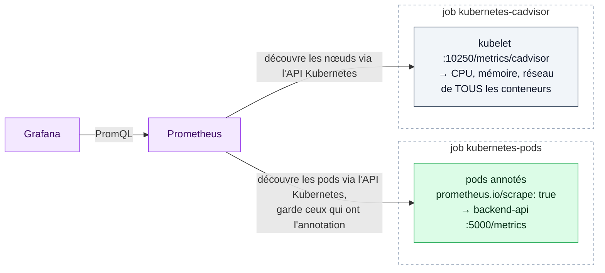

| Job | Ce qu'il récupère | Exemples de métriques |
|---|---|---|
| `kubernetes-pods` | Les métriques **de l'application**, exposées par le code Flask sur `/metrics` | `http_requests_total`, `cache_hits_total`, `tasks_total` |
| `kubernetes-cadvisor` | Les métriques **des conteneurs**, mesurées par le kubelet | `container_cpu_usage_seconds_total`, `container_memory_usage_bytes` |

La découverte automatique explique le **RBAC** de la section 6.2 : pour lister les pods et les nœuds, Prometheus doit en avoir le droit.

Créer `15-prometheus-config.yaml` :

```yaml
apiVersion: v1
kind: ConfigMap
metadata:
  name: prometheus-config
  namespace: taskflow
data:
  prometheus.yml: |
    global:
      scrape_interval: 15s
      evaluation_interval: 15s

    scrape_configs:
      - job_name: 'kubernetes-pods'
        kubernetes_sd_configs:
        - role: pod
          namespaces:
            names:
            - taskflow
        relabel_configs:
        # Ne garder que les pods avec l'annotation prometheus.io/scrape=true
        - source_labels: [__meta_kubernetes_pod_annotation_prometheus_io_scrape]
          action: keep
          regex: true
        # Utiliser le port spécifié dans l'annotation prometheus.io/port
        - source_labels: [__meta_kubernetes_pod_annotation_prometheus_io_port]
          action: replace
          target_label: __address__
          regex: (.+)
          replacement: ${1}
        # Utiliser le chemin spécifié dans l'annotation prometheus.io/path (défaut: /metrics)
        - source_labels: [__meta_kubernetes_pod_annotation_prometheus_io_path]
          action: replace
          target_label: __metrics_path__
          regex: (.+)
        # Ajouter le nom du pod comme label
        - source_labels: [__meta_kubernetes_pod_name]
          target_label: pod
        # Ajouter le label app du pod
        - source_labels: [__meta_kubernetes_pod_label_app]
          target_label: app
        # Ajouter le namespace comme label
        - source_labels: [__meta_kubernetes_namespace]
          target_label: namespace
        # Corriger l'adresse avec l'IP du pod et le port annoté
        - source_labels: [__meta_kubernetes_pod_ip, __meta_kubernetes_pod_annotation_prometheus_io_port]
          action: replace
          regex: ([^:]+)(?::\d+)?;(\d+)
          replacement: $1:$2
          target_label: __address__

      # Job pour collecter les métriques cAdvisor (métriques container_*)
      - job_name: 'kubernetes-cadvisor'
        scheme: https
        tls_config:
          ca_file: /var/run/secrets/kubernetes.io/serviceaccount/ca.crt
          insecure_skip_verify: true
        bearer_token_file: /var/run/secrets/kubernetes.io/serviceaccount/token
        kubernetes_sd_configs:
        - role: node
        relabel_configs:
        # Scraper l'endpoint /metrics/cadvisor du kubelet
        - source_labels: [__address__]
          regex: '(.*):10250'
          replacement: '${1}:10250'
          target_label: __address__
        # Le kubelet expose /metrics/cadvisor directement sur son port 10250.
        # La version précédente demandait /api/v1/nodes/<node>/proxy/metrics/cadvisor
        # — un chemin de l'APISERVER — à une adresse qui est celle du KUBELET :
        # celui-ci répondait 404, le job ne remontait aucune métrique. Passer par
        # l'apiserver aurait en plus exigé `nodes/proxy` dans le ClusterRole.
        - target_label: __metrics_path__
          replacement: /metrics/cadvisor
        # Ajouter le nom du node comme label
        - source_labels: [__meta_kubernetes_node_name]
          target_label: node
```

Appliquer :
```bash
kubectl apply -f 15-prometheus-config.yaml
```

### 6.2 RBAC pour Prometheus

Créer `16-prometheus-rbac.yaml` :

```yaml
apiVersion: v1
kind: ServiceAccount
metadata:
  name: prometheus
  namespace: taskflow
---
apiVersion: rbac.authorization.k8s.io/v1
kind: ClusterRole
metadata:
  name: prometheus
rules:
- apiGroups: [""]
  resources:
  - nodes
  # Pas de `nodes/proxy` : il autorise le proxy vers N'IMPORTE QUEL endpoint du
  # kubelet, pas seulement /metrics — d'où KSV-0047 (escalade de privilèges).
  # Le job cadvisor scrape le kubelet en direct, `nodes/metrics` suffit.
  - nodes/metrics
  - services
  - endpoints
  - pods
  verbs: ["get", "list", "watch"]
- apiGroups:
  - extensions
  resources:
  - ingresses
  verbs: ["get", "list", "watch"]
---
apiVersion: rbac.authorization.k8s.io/v1
kind: ClusterRoleBinding
metadata:
  name: prometheus
roleRef:
  apiGroup: rbac.authorization.k8s.io
  kind: ClusterRole
  name: prometheus
subjects:
- kind: ServiceAccount
  name: prometheus
  namespace: taskflow
```

Appliquer :
```bash
kubectl apply -f 16-prometheus-rbac.yaml
```

### 6.3 PVC pour Prometheus

Créer `17-prometheus-pvc.yaml` :

```yaml
apiVersion: v1
kind: PersistentVolumeClaim
metadata:
  name: prometheus-pvc
  namespace: taskflow
spec:
  accessModes:
    - ReadWriteOnce
  resources:
    requests:
      storage: 5Gi
  storageClassName: standard
```

Appliquer :
```bash
kubectl apply -f 17-prometheus-pvc.yaml
```

### 6.4 Deployment Prometheus

Créer `18-prometheus-deployment.yaml` :

```yaml
apiVersion: apps/v1
kind: Deployment
metadata:
  name: prometheus
  namespace: taskflow
  labels:
    app: prometheus
spec:
  replicas: 1
  selector:
    matchLabels:
      app: prometheus
  template:
    metadata:
      labels:
        app: prometheus
    spec:
      serviceAccountName: prometheus
      securityContext:
        runAsNonRoot: true
        runAsUser: 65534
        fsGroup: 65534
        seccompProfile:
          type: RuntimeDefault

      containers:
      - name: prometheus
        # Tag roulant v3 : les CVE de Prometheus sont dans son binaire Go, qu'un
        # tag de patch fige (mesuré : 87 CVE HIGH/CRITICAL sur v2.48.0, 0 sur v3).
        image: prom/prometheus:v3
        args:
        - '--config.file=/etc/prometheus/prometheus.yml'
        - '--storage.tsdb.path=/prometheus'
        - '--storage.tsdb.retention.time=7d'
        ports:
        - containerPort: 9090
          name: http
        securityContext:
          allowPrivilegeEscalation: false
          readOnlyRootFilesystem: true
          runAsNonRoot: true
          runAsUser: 65534
          capabilities:
            drop:
            - ALL
        volumeMounts:
        - name: config
          mountPath: /etc/prometheus
        - name: storage
          mountPath: /prometheus
        - name: tmp
          mountPath: /tmp
        resources:
          requests:
            memory: "512Mi"
            cpu: "250m"
          limits:
            memory: "1Gi"
            cpu: "500m"

      volumes:
      - name: config
        configMap:
          name: prometheus-config
      - name: storage
        persistentVolumeClaim:
          claimName: prometheus-pvc
      - name: tmp
        emptyDir: {}
```

Appliquer :
```bash
kubectl apply -f 18-prometheus-deployment.yaml
```

### 6.5 Service Prometheus

Créer `19-prometheus-service.yaml` :

```yaml
apiVersion: v1
kind: Service
metadata:
  name: prometheus
  namespace: taskflow
  labels:
    app: prometheus
spec:
  type: ClusterIP
  ports:
  - port: 9090
    targetPort: 9090
    protocol: TCP
    name: http
  selector:
    app: prometheus
```

Appliquer :
```bash
kubectl apply -f 19-prometheus-service.yaml
```

### 6.6 Déployer Grafana

Créer `20b-grafana-deployment.yaml` :

```yaml
apiVersion: v1
kind: Secret
metadata:
  name: grafana-secret
  namespace: taskflow
type: Opaque
stringData:
  GF_SECURITY_ADMIN_PASSWORD: admin2024
---
apiVersion: apps/v1
kind: Deployment
metadata:
  name: grafana
  namespace: taskflow
  labels:
    app: grafana
spec:
  replicas: 1
  selector:
    matchLabels:
      app: grafana
  template:
    metadata:
      labels:
        app: grafana
    spec:
      securityContext:
        runAsNonRoot: true
        runAsUser: 472
        fsGroup: 472
        seccompProfile:
          type: RuntimeDefault

      containers:
      - name: grafana
        image: grafana/grafana:13.2.1
        ports:
        - containerPort: 3000
          name: http
        securityContext:
          allowPrivilegeEscalation: false
          readOnlyRootFilesystem: true
          runAsNonRoot: true
          runAsUser: 472
          capabilities:
            drop:
            - ALL
        env:
        - name: GF_SECURITY_ADMIN_USER
          value: admin
        - name: GF_SECURITY_ADMIN_PASSWORD
          valueFrom:
            secretKeyRef:
              name: grafana-secret
              key: GF_SECURITY_ADMIN_PASSWORD
        - name: GF_SERVER_ROOT_URL
          value: "%(protocol)s://%(domain)s:%(http_port)s/"
        - name: GF_PATHS_DATA
          value: /var/lib/grafana
        - name: GF_PATHS_LOGS
          value: /var/log/grafana
        - name: GF_PATHS_PLUGINS
          value: /var/lib/grafana/plugins
        - name: GF_PATHS_PROVISIONING
          value: /etc/grafana/provisioning
        resources:
          requests:
            memory: "256Mi"
            cpu: "100m"
          limits:
            memory: "512Mi"
            cpu: "200m"
        volumeMounts:
        - name: grafana-storage
          mountPath: /var/lib/grafana
        - name: grafana-logs
          mountPath: /var/log/grafana
        - name: tmp
          mountPath: /tmp
        - name: grafana-datasources
          mountPath: /etc/grafana/provisioning/datasources
          readOnly: true
        - name: grafana-dashboard-provider
          mountPath: /etc/grafana/provisioning/dashboards
          readOnly: true
        - name: grafana-dashboards
          mountPath: /var/lib/grafana/dashboards
          readOnly: true

      volumes:
      - name: grafana-storage
        emptyDir: {}
      - name: grafana-logs
        emptyDir: {}
      - name: tmp
        emptyDir: {}
      - name: grafana-datasources
        configMap:
          name: grafana-datasources
      - name: grafana-dashboard-provider
        configMap:
          name: grafana-dashboard-provider
      - name: grafana-dashboards
        configMap:
          name: grafana-dashboards
```

Appliquer (les ConfigMaps de provisioning doivent exister **avant** le Deployment) :
```bash
kubectl apply -f 20a-grafana-datasource.yaml
kubectl apply -f 24-grafana-dashboard-configmap.yaml
kubectl apply -f 25-grafana-dashboard-provider.yaml
kubectl apply -f 20b-grafana-deployment.yaml
```

### 6.7 Service Grafana (LoadBalancer)

Créer `21-grafana-service.yaml` :

```yaml
apiVersion: v1
kind: Service
metadata:
  name: grafana
  namespace: taskflow
  labels:
    app: grafana
spec:
  type: LoadBalancer
  ports:
  - port: 3000
    targetPort: 3000
    protocol: TCP
    name: http
  selector:
    app: grafana
```

Appliquer :
```bash
kubectl apply -f 21-grafana-service.yaml
```

Obtenir l'URL de Grafana :
```bash
# Minikube
minikube service grafana -n taskflow --url

# Kubeadm
kubectl get svc grafana -n taskflow
```

**Credentials par défaut** :
- Username: `admin`
- Password: `admin2024`

## 🚀 Partie 7 : Load Generator (Générateur de Charge)

### 7.1 Comprendre l'objectif

Le Load Generator va **simuler du trafic** vers l'API Backend pour :
- Augmenter l'utilisation CPU/mémoire des pods
- **Déclencher l'autoscaling** du HPA
- Observer le comportement en temps réel dans Grafana

Le Job lance **5 pods en parallèle** (`parallelism: 5`). Chacun enchaîne en boucle des appels à l'API, dont `/stress?duration=2` qui fait travailler le CPU pendant 2 secondes. Il appelle directement le Service `backend-api` (pas le frontend) : on teste le backend, pas nginx.

> 💡 Remarquez que `/tasks` sera servi **par Redis** après le premier appel (5 minutes de cache) : c'est surtout `/stress`, une boucle de calcul de 2 secondes, qui fait monter le CPU. Le cache est justement là pour que les lectures répétées ne coûtent presque rien.

### 7.2 Job Load Generator

Créer `22-load-generator.yaml` :

```yaml
apiVersion: batch/v1
kind: Job
metadata:
  name: load-generator
  namespace: taskflow
spec:
  parallelism: 5
  completions: 5
  template:
    metadata:
      labels:
        app: load-generator
    spec:
      restartPolicy: Never
      securityContext:
        runAsNonRoot: true
        runAsUser: 1000
        fsGroup: 1000
        seccompProfile:
          type: RuntimeDefault

      containers:
      - name: load-generator
        image: busybox:1.36
        command:
        - /bin/sh
        - -c
        - |
          echo "Starting load generator..."
          API_URL="http://backend-api.taskflow.svc.cluster.local:5000"

          # Boucle infinie de requêtes
          while true; do
            # GET /tasks
            wget -q -O- $API_URL/tasks > /dev/null 2>&1

            # GET /tasks?priority=high
            wget -q -O- $API_URL/tasks?priority=high > /dev/null 2>&1

            # GET /tasks?completed=false
            wget -q -O- $API_URL/tasks?completed=false > /dev/null 2>&1

            # GET /stats
            wget -q -O- $API_URL/stats > /dev/null 2>&1

            # GET /stress (charge CPU)
            wget -q -O- $API_URL/stress?duration=2 > /dev/null 2>&1

            # Petite pause
            sleep 0.1
          done
        securityContext:
          allowPrivilegeEscalation: false
          readOnlyRootFilesystem: true
          runAsNonRoot: true
          runAsUser: 1000
          capabilities:
            drop:
            - ALL
        volumeMounts:
        - name: tmp
          mountPath: /tmp
        resources:
          requests:
            memory: "32Mi"
            cpu: "100m"
          limits:
            memory: "64Mi"
            cpu: "200m"

      volumes:
      - name: tmp
        emptyDir: {}
```

**Ne PAS appliquer tout de suite** ! Nous allons d'abord tout vérifier.

## ✅ Partie 8 : Vérification et Tests

### 8.1 Vérifier tous les composants

```bash
# Voir tous les déploiements
kubectl get deployments -n taskflow

# Voir tous les pods
kubectl get pods -n taskflow

# Voir tous les services
kubectl get svc -n taskflow

# Voir le HPA
kubectl get hpa -n taskflow

# Voir les PVC
kubectl get pvc -n taskflow
```

Tous les pods doivent être en état **Running** :
- `postgres-xxx`
- `redis-xxx`
- `backend-api-xxx` (2 replicas initialement)
- `frontend-xxx`
- `prometheus-xxx`
- `grafana-xxx`

### 8.2 Tester l'API Backend

```bash
# Port-forward pour tester localement
kubectl port-forward -n taskflow svc/backend-api 5000:5000 &

# Tester l'API
curl http://localhost:5000/health
curl http://localhost:5000/tasks | jq '.tasks | length'
curl http://localhost:5000/stats

# Arrêter le port-forward
pkill -f "kubectl.*port-forward.*backend-api"
```

Vous devriez voir **1000 tâches** dans la base de données.

**Vérifier le cache Redis** (toujours avec le port-forward actif) :

```bash
for i in 1 2 3; do curl -s "http://localhost:5000/tasks?limit=2" | jq '.from_cache'; done
# Attendu :
# false   ← 1er appel : lu dans PostgreSQL, puis mis en cache
# true    ← servi par Redis
# true

# Les compteurs exposés à Prometheus le confirment
curl -s http://localhost:5000/metrics | grep -E "^cache_(hits|misses)_total"
```

### 8.3 Accéder au Frontend

```bash
# Minikube
minikube service frontend -n taskflow

# Kubeadm
kubectl get svc frontend -n taskflow
# Puis naviguer vers http://<NODE-IP>:<NODE-PORT>
```

Vous devriez voir l'interface web avec les 1000 tâches.

### 8.4 Configurer Grafana

> **✨ NOUVEAU** : La datasource Prometheus est maintenant **configurée automatiquement** grâce au provisioning Kubernetes !
>
> Un script de test est disponible pour vérifier la circulation des métriques :
> ```bash
> ./test-metrics-flow.sh
> ```
>
> **Documentation complète** : Voir [METRICS.md](METRICS.md) pour plus de détails.

1. Accéder à Grafana :
```bash
minikube service grafana -n taskflow
# Ou kubectl port-forward svc/grafana 3000:3000 -n taskflow
```

2. Se connecter :
   - Username: `admin`
   - Password: `admin2024`

3. **Vérifier la datasource Prometheus (déjà configurée)** :
   - Aller dans **Configuration** → **Data Sources** (⚙️)
   - Vous devriez voir **Prometheus** déjà configuré avec :
     - URL: `http://prometheus.taskflow.svc.cluster.local:9090`
     - Status: ✅ **"Data source is working"**
   - ℹ️ La datasource est provisionée automatiquement au démarrage de Grafana

4. **Accéder au dashboard pré-configuré (déjà disponible)** :
   - Aller dans **Dashboards** → **Browse**
   - Cliquer sur **"TaskFlow - Overview & Auto-scaling"**
   - 🎉 **Le dashboard est déjà configuré avec toutes les métriques importantes !**

**Contenu du dashboard pré-configuré** :
- 📊 **Vue d'ensemble** : État des pods (Running, Backend Pods HPA, PostgreSQL, Redis)
- 🚀 **Auto-scaling Backend API** : Évolution du nombre de pods, CPU, mémoire
- 💻 **Métriques CPU** : Usage CPU détaillé par pod (backend, postgres, redis)
- 🧠 **Métriques Mémoire** : Usage mémoire détaillé par pod
- 🗄️ **Base de données PostgreSQL** : État et ressources
- ⚡ **Cache Redis** : État et ressources
- 📡 **Métriques Réseau** : Trafic entrant/sortant

**Personnalisation (optionnel)** :
Si vous souhaitez créer vos propres dashboards ou panels :
```promql
# Pods actifs
up{job="kubernetes-pods"}

# Utilisation CPU
rate(container_cpu_usage_seconds_total[5m])

# Utilisation mémoire
container_memory_usage_bytes

# Nombre de replicas backend
count(up{job="kubernetes-pods", app="backend-api"} == 1)
```

### 8.5 Observer le HPA (avant charge)

```bash
# Voir l'état actuel du HPA
kubectl get hpa backend-api-hpa -n taskflow

# Devrait afficher quelque chose comme :
# NAME               REFERENCE                TARGETS         MINPODS   MAXPODS   REPLICAS
# backend-api-hpa    Deployment/backend-api   5%/50%, 12%/70%   2         10        2
```

Les 2 métriques affichées sont :
- `5%/50%` : CPU actuel / cible (5% sur 50%)
- `12%/70%` : Memory actuel / cible (12% sur 70%)

## 🔥 Partie 9 : Test de l'Auto-scaling

### 9.1 Lancer le Load Generator

```bash
# Déployer le générateur de charge
kubectl apply -f 22-load-generator.yaml

# Vérifier qu'il tourne
kubectl get jobs -n taskflow
kubectl get pods -n taskflow -l app=load-generator
```

Vous devriez voir **5 pods** de load-generator en état Running.

### 9.2 Observer l'autoscaling en temps réel

**Terminal 1** : Observer le HPA
```bash
watch -n 2 'kubectl get hpa backend-api-hpa -n taskflow'
```

**Terminal 2** : Observer les pods
```bash
watch -n 2 'kubectl get pods -n taskflow -l app=backend-api'
```

**Terminal 3** : Observer les métriques
```bash
watch -n 5 'kubectl top pods -n taskflow -l app=backend-api'
```

### 9.3 Ce que vous devriez observer

Voici un déroulé **réellement mesuré** sur un cluster de test (un nœud, 8 CPU). Les durées varieront chez vous selon la puissance de la machine, mais les **étapes** et leur logique seront les mêmes.

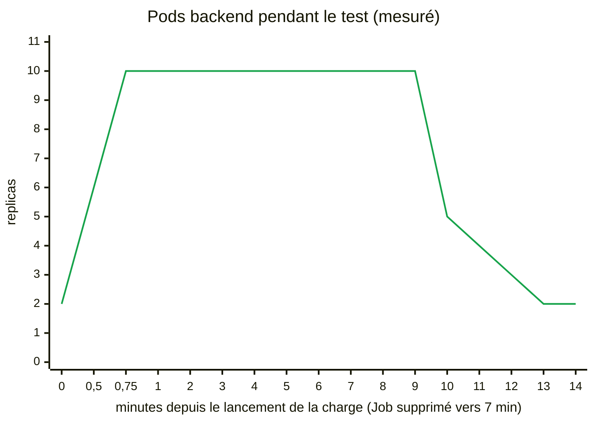

| Moment | Replicas | CPU moyen (cible 50 %) | Ce qui se passe |
|---|---|---|---|
| Avant la charge | 2 | 2 % | Repos : `minReplicas` s'applique |
| + 30 s | **2 → 6** | 217 % | Le HPA voit la charge. Il voudrait ⌈2 × 217 ÷ 50⌉ = 9 pods, mais `scaleUp` limite chaque pas au plus grand de « +100 % » (+2) et « +4 pods » : **+4** |
| + 45 s | **6 → 10** | ~380 % | 15 s plus tard, nouveau pas : le calcul demande encore plus, on atteint `maxReplicas` |
| + 1 à 7 min | **10** (plafond) | **~170 à 200 %** | ⚠️ Pas de stabilisation à 50 % : la demande dépasse ce que 10 pods peuvent absorber. Le HPA voudrait plus de pods, `maxReplicas` l'en empêche |
| Suppression du Job | 10 | reste haut ~1 min | Les pods du Job mettent un moment à s'arrêter, la charge continue pendant ce temps |
| + 1 min après | 10 | **2 %** | La charge est vraiment finie. `scaleDown` attend 60 s (`stabilizationWindowSeconds`) pour être sûr que la baisse dure |
| + 2 min 30 | **10 → 5** | 2 % | Premier pas de descente : −50 % |
| puis chaque minute | **5 → 4 → 3 → 2** | 2 % | Descente pas à pas, une étape par minute (`periodSeconds: 60`) |
| ≈ + 5 min 30 | **2** | 2 % | Retour à `minReplicas` |

**Ce qu'il faut en retenir :**
- **Monter prend moins d'une minute, descendre en prend plus de cinq.** C'est exactement ce que demande la section `behavior` (voir 4.4).
- **Rester collé à `maxReplicas` avec un CPU au-dessus de la cible est un signal d'alerte en production.** L'autoscaling a atteint sa limite : il faut augmenter `maxReplicas`, donner plus de CPU à chaque pod, ou rendre l'application moins gourmande. Regardez `kubectl describe hpa backend-api-hpa -n taskflow` : la condition `ScalingLimited` le dit explicitement.
- Les événements du HPA racontent toute l'histoire, avec l'heure et la raison de chaque changement :

```bash
kubectl get events -n taskflow --field-selector involvedObject.kind=HorizontalPodAutoscaler \
  -o custom-columns=HEURE:.lastTimestamp,MESSAGE:.message --sort-by=.lastTimestamp
# Exemple réel :
# 10:04:08   New size: 6; reason: cpu resource utilization (percentage of request) above target
# 10:04:23   New size: 10; reason: cpu resource utilization (percentage of request) above target
# 10:13:39   New size: 5; reason: All metrics below target
# 10:14:39   New size: 4; reason: All metrics below target
# 10:15:39   New size: 3; reason: All metrics below target
# 10:16:39   New size: 2; reason: All metrics below target
```

**Arrêter la charge :**
```bash
kubectl delete job load-generator -n taskflow
```

### 9.4 Observer dans Grafana

Ouvrir le **dashboard pré-configuré "TaskFlow - Overview & Auto-scaling"** dans Grafana.

Pendant le test, observer en temps réel :

**Section "Auto-scaling Backend API"** :
1. 📈 **Nombre de Pods Backend (évolution)** : Passe de 2 à 10 pods en moins d'une minute
2. 🔥 **CPU Usage - Backend Pods** : Dépasse largement le seuil de 50 % et y reste tant que la charge dure (le HPA est plafonné à 10 pods)
3. 🧠 **Memory Usage - Backend Pods** : Augmente progressivement

**Section "Vue d'ensemble"** :
- Le **Backend Pods (HPA)** panel change de couleur (vert → jaune → rouge selon le nombre)
- Les métriques sont rafraîchies toutes les 10 secondes

**Section "Métriques CPU/Mémoire"** :
- Voir tous les pods individuellement avec leur consommation
- Observer l'ajout de nouveaux pods en temps réel

**Timeline attendue** :
- **0-1 min** : CPU qui explose, 2 → 6 → 10 pods
- **Pendant la charge** : 10 pods, CPU toujours au-dessus de la cible
- **Après arrêt du load generator** : ~1 min de charge résiduelle, 60 s de stabilisation, puis 10 → 5 → 4 → 3 → 2 (≈ 5 min 30 au total)

## 📊 Partie 10 : Analyse et Nettoyage

### 10.1 Analyser les logs

```bash
# Logs du HPA (events)
kubectl describe hpa backend-api-hpa -n taskflow

# Logs des pods backend
kubectl logs -n taskflow -l app=backend-api --tail=100

# Events du namespace
kubectl get events -n taskflow --sort-by='.lastTimestamp'
```

### 10.2 Questions de réflexion

1. **Combien de temps le HPA a-t-il mis pour scaler de 2 à 10 pods ?**
2. **Pourquoi le scale-down est-il plus lent que le scale-up ?**
3. **Quelle est l'utilisation CPU moyenne par pod pendant la charge ?**
4. **Combien de requêtes par seconde l'API peut-elle gérer avec 10 pods ?**

### 10.3 Nettoyer les ressources

```bash
# Option 1 : Supprimer tout le namespace (tout effacer)
kubectl delete namespace taskflow

# Option 2 : Supprimer ressource par ressource
kubectl delete -f 22-load-generator.yaml
kubectl delete -f 21-grafana-service.yaml
kubectl delete -f 20b-grafana-deployment.yaml
kubectl delete -f 25-grafana-dashboard-provider.yaml
kubectl delete -f 24-grafana-dashboard-configmap.yaml
kubectl delete -f 20a-grafana-datasource.yaml
kubectl delete -f 19-prometheus-service.yaml
kubectl delete -f 18-prometheus-deployment.yaml
kubectl delete -f 17-prometheus-pvc.yaml
kubectl delete -f 16-prometheus-rbac.yaml
kubectl delete -f 15-prometheus-config.yaml
kubectl delete -f 14-frontend-service.yaml
kubectl delete -f 13-frontend-deployment.yaml
kubectl delete -f 12b-frontend-nginx-config.yaml
kubectl delete -f 12a-frontend-config.yaml
kubectl delete -f 11-backend-hpa.yaml
kubectl delete -f 10-backend-service.yaml
kubectl delete -f 09b-backend-deployment.yaml
kubectl delete -f 09a-backend-app-code.yaml
kubectl delete -f 08-backend-config.yaml
kubectl delete -f 07-redis-service.yaml
kubectl delete -f 06-redis-deployment.yaml
kubectl delete -f 05-postgres-service.yaml
kubectl delete -f 04-postgres-deployment.yaml
kubectl delete -f 03-postgres-pvc.yaml
kubectl delete -f 02-postgres-secret.yaml
kubectl delete -f 01-postgres-init-script.yaml
```

## 🎓 Concepts clés appris

### 1. initContainers
- S'exécutent **avant** les conteneurs principaux, un par un, et doivent réussir (`exit 0`)
- Ici : `wait-for-postgres` retient l'API tant que la base ne répond pas à `pg_isready`
- À distinguer du chargement des données, fait par l'image `postgres` elle-même via `/docker-entrypoint-initdb.d/` (au premier démarrage seulement)

### 2. HorizontalPodAutoscaler (HPA)
- Scale automatiquement basé sur CPU/mémoire
- Paramètres importants : `minReplicas`, `maxReplicas`, `targetAverageUtilization`
- Comportements : `scaleUp` (rapide) vs `scaleDown` (lent et prudent)

### 3. LoadBalancer Services
- Exposent l'application à l'extérieur du cluster
- Sur Minikube : utiliser `minikube tunnel` ou `minikube service`
- Sur cloud providers : créent automatiquement un load balancer externe

### 4. Monitoring avec Prometheus
- **Prometheus** collecte les métriques (scraping)
- **Grafana** visualise les données
- RBAC nécessaire pour que Prometheus interroge l'API Kubernetes

### 5. PersistentVolumeClaim (PVC)
- Permettent la persistance des données
- PostgreSQL : stocke la base de données
- Prometheus : stocke les métriques historiques

### 6. ConfigMaps et Secrets
- **ConfigMap** : configuration non sensible (URLs, ports)
- **Secret** : données sensibles (passwords, tokens)
- Montés comme volumes ou variables d'environnement

## 📚 Exercices supplémentaires

### Exercice 1 : Modifier les seuils du HPA
Modifier `11-backend-hpa.yaml` pour scaler plus agressivement :
- CPU target: 30% (au lieu de 50%)
- MaxReplicas: 15 (au lieu de 10)

Observer la différence de comportement.

### Exercice 2 : Ajouter une NetworkPolicy
Créer une NetworkPolicy qui :
- Permet uniquement au frontend de contacter le backend
- Permet uniquement au backend de contacter PostgreSQL et Redis
- Bloque tout le reste

### Exercice 3 : Monitoring avancé
Ajouter au dashboard Grafana :
- Taux d'erreur HTTP (4xx, 5xx)
- Latence P50, P95, P99
- Nombre de connexions à PostgreSQL

### Exercice 4 : Haute disponibilité
Modifier pour avoir :
- 3 replicas de PostgreSQL (avec réplication)
- 3 replicas de Redis (Redis Cluster)
- PodDisruptionBudget pour garantir la disponibilité

## 🎯 Checklist de réussite

- [ ] Tous les pods sont en état Running
- [ ] La base de données contient 1000 tâches
- [ ] Les logs de `wait-for-postgres` montrent l'attente puis `accepting connections`
- [ ] Le 2e appel à `/api/tasks` répond `"from_cache": true`
- [ ] Le frontend est accessible via LoadBalancer
- [ ] Le HPA montre 2 replicas au repos
- [ ] Prometheus collecte les métriques
- [ ] Grafana affiche les dashboards
- [ ] Le load generator augmente la charge
- [ ] Le HPA scale de 2 à 10 pods en moins d'une minute
- [ ] Vous savez expliquer pourquoi le CPU reste au-dessus de 50 % à 10 pods
- [ ] Le scale-down fonctionne après arrêt de la charge

## 📖 Ressources

- [HPA Documentation](https://kubernetes.io/docs/tasks/run-application/horizontal-pod-autoscale/)
- [Init Containers](https://kubernetes.io/docs/concepts/workloads/pods/init-containers/)
- [Prometheus Operator](https://prometheus-operator.dev/)
- [Grafana Dashboards](https://grafana.com/grafana/dashboards/)

## 🎉 Conclusion

Félicitations ! Vous avez déployé une application complète avec :
- ✅ **Auto-scaling** intelligent basé sur les métriques réelles
- ✅ **Initialisation** automatique avec initContainers
- ✅ **Monitoring** en temps réel avec Prometheus et Grafana
- ✅ **Persistance** des données avec PVC
- ✅ **Exposition** sécurisée avec Services et LoadBalancer

Ce projet de synthèse démontre votre maîtrise de Kubernetes et des concepts avancés nécessaires pour déployer des applications en production.

**Prochaines étapes** :
- Ajouter un Ingress pour gérer le routage HTTP
- Implémenter un CI/CD avec ArgoCD (TP6)
- Ajouter des Network Policies (TP5, TP8)
- Déployer sur un cluster multi-nœuds (TP9)
